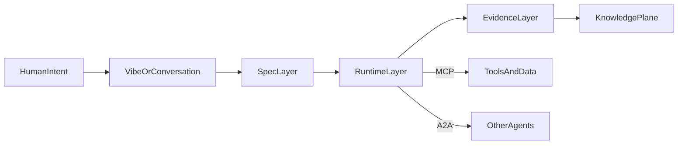

# 🚀🧭🧪🤖 SOTA: методы и агентные стеки 🤖🧪🧭🚀
### От vibe coding к spec/context/eval и от agent demos к durable orchestration

> 📅 Дата: 2026-04-13
> 🔬 Статус: Frontier research note
> 📎 Серия: [09-Stage9-Sovereign-Dev-Mesh](./09-stage9-sovereign-dev-mesh.md) · **[10]** · [11-Memory-Context-Task-Ledgers](./11-memory-context-and-task-ledgers.md)
> 📎 Внешняя опора: [Spec Kit](https://github.com/github/spec-kit) · [OpenSpec](https://github.com/Fission-AI/OpenSpec) · [Anthropic: Effective context engineering](https://www.anthropic.com/engineering/effective-context-engineering-for-ai-agents) · [OpenAI: New tools for building agents](https://openai.com/index/new-tools-for-building-agents/) · [Google A2A](https://developers.googleblog.com/en/a2a-a-new-era-of-agent-interoperability/)

---

## 🎯 Тезис

> Главный сдвиг 2025-2026 произошёл не в том, что появился “идеальный coding agent”, а в том, что индустрия начала разводить разные уровни агентной разработки по слоям.

Эти слои теперь выглядят так:

- `interaction mode`
- `spec layer`
- `runtime / orchestration layer`
- `protocol layer`
- `truth / evidence layer`

Пока всё это смешано в одно слово “агент”, система остаётся магическим шоу.

Когда слои разведены, становится видно:

- `vibe coding` полезен как интерфейс входа, но не как система управления delivery
- `spec-driven development` stabilizes intent
- `context engineering` управляет вниманием модели
- `test-oriented` и `evaluation-driven` подходы возвращают источник правды
- durable orchestration важнее, чем очередной roleplay-фреймворк

---

## 🗺️ 1 — Где реально сдвинулся frontier

### 📊 Было vs стало

| Слой | Раннее интуитивное мышление | Более зрелое понимание 2025-2026 |
|---|---|---|
| 🎙️ Вход | “Напиши хороший промпт” | `vibe coding` как быстрый conversational intake |
| 📄 Спецификация | “План в чате достаточен” | spec artifacts как исполнимые и ревизуемые объекты |
| 🧠 Контекст | “Засунь больше текста в окно” | curated context, just-in-time retrieval, compaction, notes |
| 🤖 Оркестрация | “Один умный агент сделает всё” | role split, durable workflows, handoffs, workcells |
| ✅ Истина | “Агент сказал, что сделал” | tests, evals, traces, evidence bundles, review gates |

### 💡 Инсайт

`Vibe coding` победил культурно, но frontier пошёл дальше:

- к `spec-driven development`
- к `context engineering`
- к `evaluation-driven control`
- к durable execution

То есть индустрия уходит от **prompt theater** к **artifact discipline**.

---

## 🎛️ 2 — Методологический слой

### 2.1 `Vibe coding`

`Vibe coding` хорошо работает, когда нужно:

- быстро исследовать пространство решений
- собрать первый прототип
- сократить friction между идеей и кодом

Но у него есть фундаментальные ограничения:

- слабая traceability
- склонность к architecture drift
- отсутствие устойчивого “что именно было задумано”
- плохая переносимость между агентами и сессиями

### 2.2 `Spec-driven development`

`Spec-driven development` меняет центр тяжести:

> не агент “придумывает по ходу”, а работа сначала получает форму через spec artifacts.

Сильные стороны:

- intent становится явным
- появляется replayable workflow
- снижается ambiguity между человеком и агентом
- можно строить gates по артефактам, а не по обещаниям

Слабые стороны:

- легко превратить в markdown-бюрократию
- для мелких задач может быть избыточным
- требует discipline around drift

### 2.3 `Context engineering`

Anthropic очень точно сформулировали новый центр тяжести:

> задача уже не в “идеальном prompt”, а в управлении всем набором токенов, который видит модель в конкретный момент.

`Context engineering` делает акцент на:

- минимальном, но high-signal контексте
- just-in-time retrieval вместо слепой загрузки всего
- compaction
- structured note-taking
- sub-agent architectures как способ локализовать search cost

Это особенно важно для long-horizon engineering tasks, где:

- context rot неизбежен
- attention budget ограничен
- “впихнуть всё” перестаёт работать

### 2.4 `Test-oriented` и `evaluation-driven` подходы

Здесь frontier ещё не полностью стабилизировался, но направление уже видно:

- обычный TDD недостаточен, если тесты сами создаёт агент
- test suites становятся не только oracle, но и каналом управления агентом
- evaluation loops становятся продуктовым и инженерным артефактом, а не offline benchmark exercise

Важный поворот:

> в агентной разработке надо проверять не только код, но и саму процедуру, по которой агент пришёл к этому коду.

Поэтому интересны:

- `TDAD`-подобные идеи вокруг test impact и routing
- `EDDOps`-подобная линия, где eval становится слоем управления
- `Test-Oriented Programming`, которая спрашивает не “есть ли тесты”, а “реально ли тесты улучшают управление качеством”

### 📊 Итог по методам

| Подход | Главная сила | Главная слабость | Правильная роль |
|---|---|---|---|
| `vibe coding` | скорость и low friction | нет устойчивого источника истины | intake / exploration |
| `spec-driven development` | нормализует intent | риск бумажного процесса | contract layer |
| `context engineering` | делает агента управляемым на длинной дистанции | требует постоянной гигиены | cognitive hygiene |
| `test-oriented / eval-driven` | возвращает truth layer | tooling ещё не до конца зрелый | evidence and control |

---

## 📄 3 — Spec ecosystems: где кто силён

Важно не смешивать разные классы систем.

`Spec Kit` и `OpenSpec` действительно живут в одном поле.

`BMAD` скорее имитирует software org через набор ролей и handoff artifacts.

`Agent OS` в этом note фигурирует только краем: это не полноценный orchestration runtime, а скорее слой стандартов и context governance. Подробно он разберётся в следующей заметке.

### 📊 Быстрое сравнение

| Система | Интуиция | Сила | Слабое место |
|---|---|---|---|
| `Spec Kit` | executable specs + фазы `constitution -> specify -> plan -> tasks -> implement` | сильная структура, большой ecosystem, удобен как общая рамка | может стать тяжеловесным на brownfield и маленьких изменениях |
| `OpenSpec` | fluid, iterative, brownfield-first | легче для живых кодовых баз, проще менять артефакты в процессе | меньше жёсткой дисциплины, сильнее зависит от зрелости команды |
| `BMAD` | много ролей и handoff между ними | полезен, если нужен process theater с разделением обязанностей | дорогой по контексту и легко имитирует бюрократию, а не производительность |

### 💡 Инсайт

Если смотреть честно, то frontier здесь не в “какой markdown шаблон красивее”.

Frontier в другом:

- сделать spec достаточным, но не тяжёлым
- обеспечить traceability до implementation и verification
- связать spec с task graph и evidence

---

## 🤖 4 — Runtime и orchestration stacks

Здесь видно важное разделение:

- есть фреймворки, которые помогают **агенту думать и передавать контроль**
- есть системы, которые помогают **workflow жить долго и переживать сбои**

Это не одно и то же.

### 📊 Основные стеки

| Стек | Модель управления | Где силён | Где слаб |
|---|---|---|---|
| `LangGraph` | explicit graph + checkpoints + state | когда нужен явный граф, циклы, HITL и контролируемый state | требует довольно много явного проектирования и обвязки |
| `OpenAI Agents SDK` | vendor-integrated agents, handoffs, guardrails, tracing | быстрый старт, интеграция инструментов и трассировка | сильно тянет в сторону экосистемы OpenAI |
| `Google ADK` | context-aware multi-agent + ecosystem alignment + A2A-trajectory | интересен как future-facing control plane вокруг Google stack | пока менее универсален как “общая стандартная база” |
| `LlamaIndex Workflows` | retrieval-heavy workflow orchestration | хорош для RAG и knowledge-intensive pipelines | слабее как общий delivery orchestrator |
| `CrewAI` | role-based crews | быстро собирать demos и process-y pipelines | тяжело превращать в надёжный long-horizon execution core |
| `AutoGen / AG2` | conversation-centric multi-agent loops | исследовательские и диалоговые multi-agent сценарии | часто слишком chat-centric для production delivery core |
| `Temporal` | durable workflow execution | лучший outer loop для long-running, retryable, observable delivery | это не “AI framework”, а execution substrate, поэтому нужен свой agent layer поверх |

### 🧠 Самый недооценённый тезис

Для серьёзной автономной разработки важнее не то, как красиво агенты переговариваются, а то:

- переживает ли workflow рестарты
- понятны ли step boundaries
- есть ли retries и compensations
- можно ли восстановить state без магии chat history

Поэтому durable engines типа `Temporal` стратегически важнее большинства “crew” и “multi-agent chat” фреймворков.

---

## 🔌 5 — Protocol layer: MCP и A2A

Именно здесь многие путаются и начинают сравнивать несравнимое.

`MCP` и `A2A` не конкурируют с runtime-фреймворками.

Они описывают другие уровни системы:

- `MCP` = agent ↔ tools / data / systems
- `A2A` = agent ↔ agent

### 🖼️ Карта слоёв

### 💡 Инсайт

Фреймворк может быть полезным без стандартного протокола.

Протокол может быть полезным без хорошего runtime.

А production system требует обоих, но на разных местах.

---

## ⚖️ 6 — Practical now vs frontier now

### 🟢 Что уже реально хорошо работает

| Паттерн | Почему это уже practical |
|---|---|
| `spec + tasks + implementation artifacts` | это уже можно внедрять в brownfield репо без революции |
| `context engineering` | это не research vanity, а ежедневная hygiene discipline |
| `git worktrees + isolated workcells` | самая дешёвая форма параллельной агентной разработки |
| `merge queue + preview env + evidence bundle` | уже даёт резкое улучшение delivery loop |
| `durable outer workflow` | убирает зависимость от хрупкой chat memory |

### 🔥 Что выглядит frontier и действительно полезно, но ещё не устоялось до конца

| Паттерн | Почему это frontier |
|---|---|
| `evaluation-driven orchestration` | eval начинает управлять системой, а не только измерять её задним числом |
| `semantic refinery` | merge превращается в фазу интеллектуального отбора, а не механического слияния |
| `A2A-native agent mesh` | протоколизированная делегация между разными агентами и vendor stacks |
| `self-improving context pipelines` | память, compaction и rules становятся эволюционирующими артефактами |
| `best-of-N builder selection` | система выбирает не просто “прошёл/не прошёл”, а лучший кандидат среди нескольких |

### 🔴 Что часто шумит сильнее, чем реально помогает

- roleplay-heavy multi-agent frameworks без durable state
- endless chat orchestration без clear contracts
- “autonomous software org” без evidence and rollback semantics
- тесты, написанные агентом, которые никто не оценивает как источник риска

---

## 🏁 7 — Что это значит для Autonomous Development Mesh

`Autonomous Development Mesh` не должен выбирать одного “победителя рынка”.

Он должен зафиксировать layered stance:

1. `vibe coding` оставить как быстрый вход для человека или lead-agent, но не как source of truth
2. `spec-driven` слой сделать обязательной нормализацией intent
3. `context engineering` превратить в системную дисциплину, а не в набор советов
4. durable orchestration ставить ниже agent frameworks и выше chat history
5. `MCP` и `A2A` развести как ортогональные protocol planes
6. truth layer строить вокруг evidence bundles, verification lattice и integration verdicts

### 📌 Жёсткий вывод

На сегодня strongest direction выглядит так:

> `vibe` как intake -> `spec` как контракт -> `context engineering` как attention control -> durable workflow как skeleton -> `tests/evals/evidence` как truth layer.

Это уже гораздо ближе к настоящему autonomous delivery, чем любой одиночный “AI framework”.

---

## 🔗 Knowledge Graph Links

- [08-Web2-First-MVP](./08-web2-first-mvp-roadmap.md) --constrains--> [This Note]
- [03-Agent-Roles-A2A-MCP](./03-agent-roles-a2a-and-mcp.md) --extends--> [Protocol split]
- [03-GAS-TOWN-ANALYSIS](../03-GAS-TOWN-ANALYSIS.md) --validates--> [Task-ledger plus swarm direction]
- [This Note] --requires--> [11-Memory-Context-Task-Ledgers]
