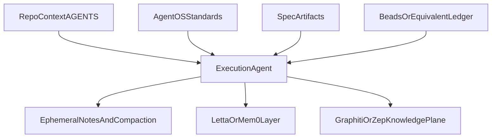

# 🧠📚🪝📿 SOTA: память, контекст и task truth 📿🪝📚🧠
### Почему `AGENTS.md`, `Agent OS`, `Beads`, `Letta`, `Mem0` и `Graphiti` нельзя складывать в одну корзину

> 📅 Дата: 2026-04-13
> 🔬 Статус: Frontier research note
> 📎 Серия: [10-SOTA-Methods-And-Agent-Stacks](./10-sota-methods-and-agent-stacks.md) · **[11]** · [12-Comparison-Matrix-And-Recommended-Stack](./12-comparison-matrix-and-recommended-stack.md)
> 📎 Внешняя опора: [AGENTS.md](https://agents.md/) · [Evaluating AGENTS.md](https://arxiv.org/abs/2602.11988) · [Agent OS](https://github.com/buildermethods/agent-os) · [Beads](https://github.com/gastownhall/beads) · [Letta](https://www.letta.com/) · [Graphiti](https://github.com/getzep/graphiti)

---

## 🎯 Тезис

> Главная путаница в ландшафте агентной разработки возникает тогда, когда разные типы памяти и контекста называют одним словом “memory”.

На практике здесь минимум шесть разных сущностей:

- `repo context`
- `standards memory`
- `spec memory`
- `task truth`
- `agent memory`
- `durable knowledge graph`

Пока они не разведены, система начинает делать плохие компромиссы:

- использовать `AGENTS.md` как вечную базу знаний
- пытаться сделать из `Beads` персональную память агента
- ждать от `Mem0` или `Letta`, что они заменят task ledger
- думать, что `Graphiti` автоматически решит orchestration

Это разные слои.

---

## 🗺️ 1 — Шесть слоёв памяти

| Слой | Что хранит | Типичное время жизни | Источник истины |
|---|---|---|---|
| `repo context` | build/test команды, локальные правила, gotchas | пока живёт кодовая база | repository docs |
| `standards memory` | coding standards и инженерные принципы | месяцы и годы | curated engineering guidance |
| `spec memory` | what/why/how по конкретному change | lifecycle конкретной фичи | spec artifacts |
| `task truth` | статусы, зависимости, handoff, progress | пока задача не закрыта и пока важна история | structured task ledger |
| `agent memory` | наблюдения, preferences, session carry-over | от сессий до долгой персонализации | memory subsystem |
| `durable knowledge graph` | решения, причины, ограничения, temporal facts | долго, поверх нескольких инициатив | knowledge plane |

### 💡 Инсайт

В нормальной системе:

- каждый слой имеет свою модель данных
- каждый слой имеет свою стоимость обновления
- каждый слой имеет свой retention policy

Если сделать один storage для всего, получится либо хаос, либо переусложнение.

---

## 📄 2 — Repository context: `AGENTS.md`

`AGENTS.md` возник как открытый, agent-facing формат:

- build and test instructions
- conventions
- project-specific guardrails
- локальные примечания, которые не хочется держать в `README`

### 🟢 Что здесь хорошо

- predictable place for agent instructions
- единый открытый формат, а не vendor-specific magic
- nested files позволяют давать локальные указания в монорепах
- снижает зависимость от одноразовых chat instructions

### 🔴 Что уже показали исследования

Работа `Evaluating AGENTS.md` за 2026 год дала неприятный, но полезный вывод:

> context files часто повышают стоимость и могут даже снижать success rate, если в них слишком много лишних требований.

То есть проблема не в самом формате, а в злоупотреблении форматом.

### 📌 Практическое правило

`AGENTS.md` должен содержать только:

- minimal non-inferable requirements
- точные команды
- реальные ограничения репозитория
- опасные edge cases

Он не должен пытаться быть:

- полной архитектурной энциклопедией
- ретроспективой всех прошлых решений
- заменой knowledge base

---

## 📚 3 — Standards memory: `Agent OS`

`Agent OS` полезно понимать не как “операционную систему агентов” в runtime-смысле, а как:

> систему для извлечения, хранения и инъекции кодовых стандартов и паттернов.

Судя по собственной формулировке проекта, его сильная сторона в четырёх вещах:

- `discover standards`
- `deploy standards`
- `shape spec`
- `index standards`

### 🟢 Где это ценно

- brownfield codebases, где реальные паттерны важнее абстрактных best practices
- команды, у которых знание о “как тут принято” размазано по людям
- агентные workflows, где нужно не просто выполнить задачу, а попасть в локальную культуру кода

### 🔴 Чего от него не надо ждать

`Agent OS` не заменяет:

- task ledger
- orchestration runtime
- long-horizon memory engine
- durable knowledge graph

### 💡 Правильная роль

`Agent OS` лучше всего понимать как:

> standards/context infrastructure, которая кормит spec layer и implementation layer релевантными нормами.

---

## 📋 4 — Spec memory: `Spec Kit` и `OpenSpec`

Это уже другой тип памяти.

Если `Agent OS` отвечает за “как у нас здесь принято строить”, то spec frameworks отвечают за:

> что именно мы сейчас собираемся менять, почему и через какие артефакты это отслеживается.

### `Spec Kit`

Сильная сторона:

- phase discipline
- executable spec chain
- ecosystem around process, QA, integrations, status, worktrees

Слабая сторона:

- на brownfield может стать тяжёлым
- риск markdown overproduction

### `OpenSpec`

Сильная сторона:

- fluid, iterative, brownfield-first workflow
- артефакты можно менять без жёсткого phase lock
- лучше подходит для “живого” evolution existing systems

Слабая сторона:

- меньше встроенной жёсткости
- выше требование к process maturity команды

### 📌 Важный вывод

Spec artifacts не должны жить вечно как глобальная память.

Они должны:

- быть truth layer для конкретного change
- затем либо архивироваться
- либо компилироваться в более durable knowledge artifacts

---

## 📿 5 — Task truth: `Beads`

`Beads` вообще не про “память” в бытовом смысле.

Это:

> distributed graph issue tracker for AI agents with structured, dependency-aware work state.

Его сильные свойства:

- task graph вместо markdown checklist
- claim/update/show как атомарные операции
- dependency-awareness
- persistence через Dolt
- пригодность для long-horizon coordination

### 🟢 Что `Beads` делает лучше многих memory systems

- переживает restart sessions
- даёт task-centric truth
- удерживает handoff history
- нормализует ownership and dependencies

### 🔴 Что `Beads` не должен делать

Не надо превращать его в:

- personal reflective memory агента
- user preference memory
- full semantic knowledge base
- architecture decision graph

### 💡 Правильная роль

`Beads` нужен там, где вопрос звучит так:

> что именно должно быть сделано, кем занято, что блокирует, и на каком шаге molecule сейчас находится?

Это не “общая память”.

Это **task truth substrate**.

---

## 🧠 6 — Agent memory: `Letta` и `Mem0`

Здесь уже начинается настоящий слой agent memory, но и тут есть разные философии.

### `Letta`

`Letta` ближе к memory-first agent runtime.

Акценты:

- persistent agents вместо stateless sessions
- memory tiers
- background memory subagents
- portability across models and devices

Это уже не просто библиотека хранения.

Это модель агента как сущности, которая:

- накапливает опыт
- учится
- переносит память между сессиями

### `Mem0`

`Mem0` ближе к memory layer as infrastructure.

Акценты:

- user/session/agent memory
- API-first integration
- лёгкость подключения к существующим agent frameworks
- personalization and recall

Это более прагматичный ответ на вопрос:

> как быстро добавить долгосрочную память в существующую агентную систему?

### 📊 Различие

| Система | Ближе к чему | Сильнее всего подходит |
|---|---|---|
| `Letta` | memory-native agent runtime | persistent personalized agents |
| `Mem0` | plug-in memory infrastructure | add-on memory for existing agents |

### 🔴 Общее ограничение

Ни `Letta`, ни `Mem0` не заменяют:

- task ledger
- spec layer
- orchestration runtime
- knowledge graph решений и фактов проекта

---

## 🌐 7 — Durable knowledge graph: `Graphiti` / `Zep`

Вот это уже другой класс систем.

`Graphiti` предлагает temporal context graph:

- entities
- facts / relationships
- validity windows
- provenance via episodes
- hybrid retrieval across semantic, keyword, and graph traversal

Это важно, потому что engineering knowledge редко статично.

Нам нужны ответы не только на вопрос:

- “что правда?”

Но и на вопрос:

- “что было правдой раньше?”
- “когда это перестало быть правдой?”
- “какой эпизод породил это знание?”

### 🟢 Где temporal graph реально лучше

- архитектурные ограничения, меняющиеся во времени
- история решений
- правила и исключения
- инциденты и learned constraints
- cross-project knowledge plane

### 🔴 Где он не лучший инструмент

- текущий task ownership
- краткоживущие procedural notes
- одноразовые session summaries

### 💡 Разведение `Graphiti` и `Zep`

`Graphiti`:

- open-source engine
- temporal context graph core

`Zep`:

- managed production infrastructure вокруг этого подхода

То есть это не просто open-source vs SaaS.

Это `engine` vs `managed context platform`.

---

## 🧪 8 — Где чаще всего происходит conceptual failure

### Ошибка 1

Пытаться сделать `AGENTS.md` “центральной памятью проекта”.

Следствие:

- context bloat
- instruction conflicts
- дорогие и слабополезные agent runs

### Ошибка 2

Путать `Beads` с памятью агента.

Следствие:

- task system начинает хранить reflection noise
- ownership truth смешивается с неструктурированным размышлением

### Ошибка 3

Пытаться решить orchestration через `Mem0` или `Letta`.

Следствие:

- в системе есть воспоминания, но нет execution discipline

### Ошибка 4

Ожидать, что knowledge graph заменит spec artifacts.

Следствие:

- теряется чёткая связь между текущим change и конкретным планом выполнения

---

## 🏁 9 — Что это значит для Autonomous Development Mesh

Для `Autonomous Development Mesh` правильная композиция выглядит не как один memory tool, а как layered memory architecture.

### Предварительная форма слоя

### Жёсткие выводы

1. `AGENTS.md` нужен, но должен быть минимальным и non-inferable.
2. `Agent OS` лучше трактовать как standards/context infrastructure, а не runtime.
3. `Spec Kit` / `OpenSpec` нужны для change-specific truth, а не для вечной памяти.
4. `Beads` belongs in the stack as task ledger, not as general memory.
5. `Letta` и `Mem0` решают agent memory, но не task truth.
6. `Graphiti/Zep` сильнее всего именно как durable temporal knowledge layer.

### 📌 Ключевой synthesis тезис

Правильный вопрос звучит не так:

> “какая лучшая память для агентов?”

А так:

> “какая память нужна на каждом уровне delivery system, и где должен жить источник истины для этого уровня?”

Именно этот вопрос открывает путь к внятному recommended stack.

---

## 🔗 Knowledge Graph Links

- [10-SOTA-Methods-And-Agent-Stacks](./10-sota-methods-and-agent-stacks.md) --requires--> [This Note]
- [07-Knowledge-Plane](./07-knowledge-plane-huly-github-dashboards-kb.md) --extends--> [Durable knowledge layer]
- [03-GAS-TOWN-ANALYSIS](../03-GAS-TOWN-ANALYSIS.md) --validates--> [Beads as task truth]
- [This Note] --enables--> [12-Comparison-Matrix-And-Recommended-Stack]
