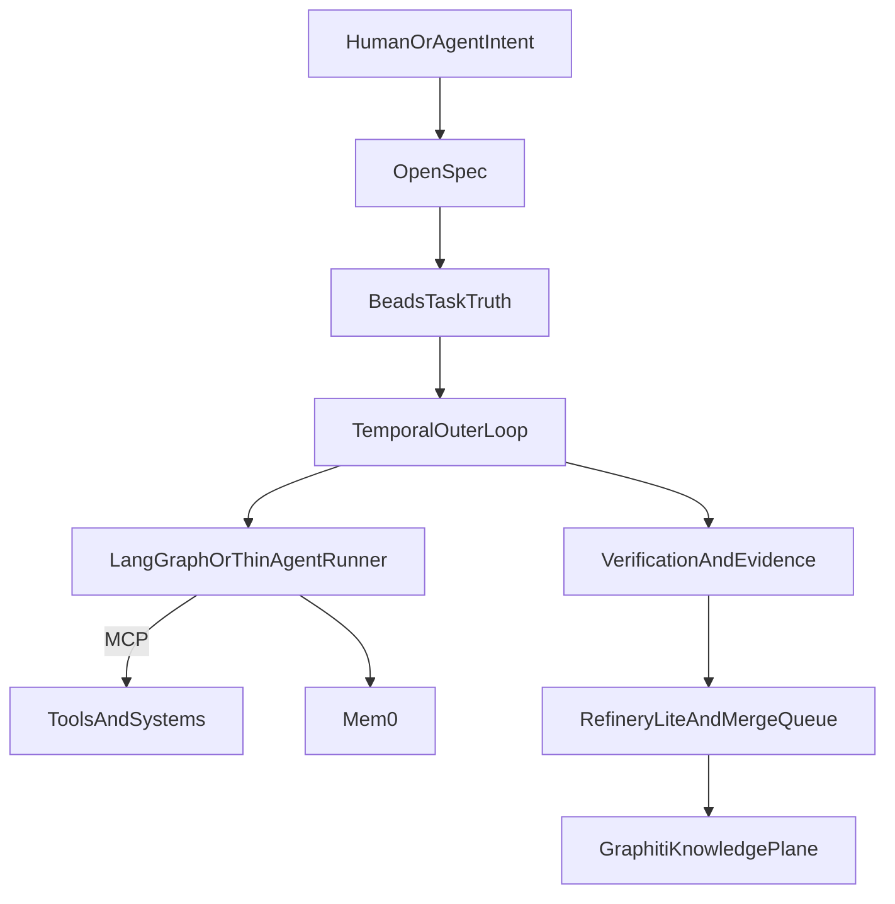

# 🧭📊🏗️ Итоговая comparison matrix и recommended stack 🏗️📊🧭
### Что брать в Autonomous Development Mesh по умолчанию, что брать на frontier, а что не путать с ядром системы

> 📅 Дата: 2026-04-13
> 🔬 Статус: Synthesis note
> 📎 Серия: [11-Memory-Context-Task-Ledgers](./11-memory-context-and-task-ledgers.md) · **[12]**
> 📎 Мосты: [08-Web2-First-MVP](./08-web2-first-mvp-roadmap.md) · [09-Stage9-Sovereign-Dev-Mesh](./09-stage9-sovereign-dev-mesh.md) · [03-GAS-TOWN-ANALYSIS](../03-GAS-TOWN-ANALYSIS.md)

---

## 🎯 Тезис

> Для Autonomous Development Mesh правильная стратегия состоит не в выборе одного “главного AI framework”, а в сборке слоистой системы, где каждый компонент отвечает за свой уровень истины.

Если сказать жёстко:

- `Spec Kit` / `OpenSpec` не заменяют runtime
- `Agent OS` не заменяет spec layer
- `Beads` не заменяет agent memory
- `Mem0` / `Letta` не заменяют task truth
- `Graphiti` / `Zep` не заменяют orchestration

Именно поэтому итог должен быть не “лучший тул”, а **правильная композиция уровней**.

---

## 📐 1 — Основание для сравнения

Сравниваю системы по шести осям:

| Ось | Что означает |
|---|---|
| `frontier strength` | насколько инструмент или подход реально отражает cutting-edge направление |
| `operational maturity` | насколько он пригоден для production или хотя бы устойчивого ежедневного использования |
| `brownfield fit` | насколько хорошо он ложится на существующие кодовые базы |
| `long-horizon durability` | насколько хорошо переживает долгие workflow, handoff и restart |
| `interoperability` | насколько хорошо сочетается с разными агентами, тулзами и протоколами |
| `knowledge-plane fit` | насколько полезен для будущего слоя знаний, traceability и evidence |

Шкала:

- `1` = слабый fit
- `3` = средний fit
- `5` = сильный fit

---

## 📊 2 — Жёсткая comparison matrix

### 2.1 Method and spec layer

| Система / подход | Frontier | Maturity | Brownfield | Long-horizon | Interop | Knowledge-plane | Комментарий |
|---|---:|---:|---:|---:|---:|---:|---|
| `vibe coding` | 2 | 5 | 5 | 1 | 5 | 1 | лучший conversational intake, плохой source of truth |
| `Spec Kit` | 4 | 4 | 3 | 4 | 5 | 4 | сильный общий spec framework, но тяжеловат |
| `OpenSpec` | 4 | 4 | 5 | 4 | 5 | 4 | лучший spec layer для brownfield-heavy работы |
| `Agent OS` | 3 | 4 | 5 | 3 | 4 | 3 | standards/context infrastructure, не runtime |
| `BMAD` | 2 | 3 | 3 | 2 | 3 | 2 | полезен как structured roleplay, но не как core delivery substrate |
| `context engineering` | 5 | 5 | 5 | 5 | 5 | 4 | это уже обязательная инженерная дисциплина, а не экзотика |
| `test-oriented / eval-driven` | 5 | 3 | 4 | 5 | 4 | 5 | сильнейшее frontier-направление, но tooling пока не до конца устоялся |

### 2.2 Runtime, protocol and execution layer

| Система / подход | Frontier | Maturity | Brownfield | Long-horizon | Interop | Knowledge-plane | Комментарий |
|---|---:|---:|---:|---:|---:|---:|---|
| `LangGraph` | 4 | 4 | 4 | 4 | 4 | 4 | сильный graph runtime для controllable workflows |
| `OpenAI Agents SDK` | 4 | 4 | 4 | 3 | 3 | 4 | быстрый путь к practical orchestration, но vendor gravity заметна |
| `Google ADK` | 4 | 3 | 3 | 4 | 4 | 4 | хороший future-facing control plane, но менее нейтрален |
| `CrewAI` | 2 | 3 | 4 | 2 | 3 | 2 | удобен для demos, слаб как durable execution core |
| `AutoGen / AG2` | 3 | 3 | 3 | 2 | 4 | 2 | силён для multi-agent chat patterns, слабее как delivery substrate |
| `Temporal` | 4 | 5 | 5 | 5 | 5 | 4 | лучший durable outer loop для длинных workflows |
| `MCP` | 5 | 5 | 5 | 4 | 5 | 4 | стандартный tool plane, не orchestration runtime |
| `A2A` | 5 | 3 | 4 | 4 | 5 | 4 | сильный future protocol для agent-to-agent coordination |

### 2.3 Memory, task truth and knowledge layer

| Система / подход | Frontier | Maturity | Brownfield | Long-horizon | Interop | Knowledge-plane | Комментарий |
|---|---:|---:|---:|---:|---:|---:|---|
| `AGENTS.md` | 3 | 5 | 5 | 2 | 5 | 2 | полезен только как minimal repo context |
| `Beads` | 5 | 4 | 5 | 5 | 4 | 4 | лучший из просмотренных вариантов именно как task truth substrate |
| `Letta` | 5 | 3 | 3 | 5 | 3 | 3 | memory-first runtime для persistent agents |
| `Mem0` | 4 | 4 | 4 | 4 | 4 | 3 | pragmatic memory layer, хороший как add-on |
| `Graphiti` | 5 | 4 | 4 | 5 | 4 | 5 | сильнейший fit для temporal durable knowledge layer |
| `Zep` | 4 | 4 | 4 | 5 | 4 | 5 | managed infra вокруг temporal context graph |

---

## 🧠 3 — Принудительные выводы

### 3.1 `Spec Kit` или `OpenSpec` для brownfield-heavy работы?

Жёсткий вывод:

> для brownfield-heavy работы сильнее выглядит `OpenSpec`.

Почему:

- он изначально строится как fluid and iterative
- меньше phase rigidity
- лучше терпит реальную жизнь существующих кодовых баз

Но:

- `Spec Kit` остаётся сильнее как общий, более дисциплинирующий meta-framework
- особенно там, где команда хочет больше process rails и ecosystem extensions

Значит:

- `OpenSpec` = default spec layer для living brownfield
- `Spec Kit` = полезный reference model и возможный stricter mode для parts of the system

### 3.2 Чем является `Agent OS` на самом деле?

Жёсткий вывод:

> `Agent OS` лучше всего трактовать как standards/context infrastructure, а не как полный runtime.

Он хорош в:

- извлечении локальных паттернов
- codifying standards
- shaping better specs

Он не решает:

- task execution durability
- stateful orchestration
- evidence-driven promotion

### 3.3 Где место `Beads`?

Жёсткий вывод:

> `Beads` belongs in the stack as task ledger, not as general memory.

То есть он отвечает за:

- task graph
- blocking edges
- ownership
- handoff truth
- progress state

И не отвечает за:

- personal memory
- reasoning history
- architectural knowledge plane

### 3.4 Что брать для памяти: `Graphiti/Zep`, `Letta`, `Mem0` или split architecture?

Жёсткий вывод:

> правильный ответ здесь не “один победитель”, а split architecture by memory type.

Рекомендуемое разведение:

- `AGENTS.md` для minimal repo context
- `Agent OS` для standards memory
- `OpenSpec` для change-specific spec truth
- `Beads` для task truth
- `Mem0` или `Letta` для agent memory
- `Graphiti` / `Zep` для durable temporal knowledge plane

Если forced to choose:

- practical default agent memory = `Mem0`
- frontier-heavy agent memory = `Letta`
- durable knowledge plane = `Graphiti` or `Zep`

### 3.5 Остаётся ли practical default stack Web2-first?

Жёсткий вывод:

> да, practical default stack должен оставаться жёстко Web2-first.

Причина простая:

- frontier указывает на richer agent meshes и protocolized ecosystems
- но реальная delivery value сегодня даётся не децентрализацией как таковой, а убиранием handoff chaos, stage bottlenecks и manual bureaucracy

Значит:

- сначала Web2 NDI
- потом richer A2A mesh
- потом sovereign horizon

---

## 🏗️ 4 — Recommended default stack

Это стек, который лучше всего соответствует `08-Web2-First-MVP`.

### 📦 Слои

| Слой | Recommended default |
|---|---|
| `interaction mode` | `vibe coding` как intake, но не как truth |
| `repo context` | минимальный `AGENTS.md` |
| `standards memory` | `Agent OS`-подобный слой или аналогичный extracted standards catalog |
| `spec layer` | `OpenSpec` |
| `task truth` | `Beads` |
| `tool plane` | `MCP` |
| `runtime / orchestration` | durable outer loop на `Temporal` + pragmatic internal agent runner |
| `agent framework` | `LangGraph` или thin custom orchestrator, если нужен более узкий and explicit flow |
| `agent memory` | `Mem0` |
| `durable knowledge layer` | `Graphiti` |
| `verification truth` | tests + evals + traces + evidence bundles |
| `integration rail` | `merge queue + Refinery-lite + preview env` |

### 🖼️ Картина default stack

### Почему именно так

- `OpenSpec` лучше ложится на brownfield evolution
- `Beads` даёт устойчивый task substrate
- `Temporal` даёт real durability, retries и long-running semantics
- `MCP` закрывает tool plane без vendor lock
- `Mem0` проще внедрить как прикладной memory layer
- `Graphiti` даёт temporal knowledge plane, а не просто vector recall

---

## 🌌 5 — Frontier-heavy alternative stack

Это стек не для MVP, а для агрессивного движения к `Stage 9`.

### 📦 Слои

| Слой | Frontier-heavy alternative |
|---|---|
| `interaction mode` | `vibe + mission compiler + higher autonomy` |
| `repo context` | минимальный `AGENTS.md` + automated context linting |
| `standards memory` | `Agent OS` + dynamic standards indexing |
| `spec layer` | `OpenSpec` plus stricter generated task contracts |
| `task truth` | `Beads` or bead-like ledger with richer event model |
| `tool plane` | `MCP` |
| `coordination plane` | `A2A` |
| `runtime / orchestration` | `Temporal` plus role-split swarm execution |
| `agent memory` | `Letta` |
| `durable knowledge layer` | `Graphiti` or managed `Zep` |
| `control layer` | evaluation-driven orchestration, semantic Refinery, best-of-N candidate selection |

### Где этот стек сильнее

- cross-agent delegation
- persistent agent identity
- deeper long-horizon adaptation
- richer knowledge reuse
- более честный путь к sovereign mesh

### Где он опаснее

- дороже operationally
- сложнее в governance
- выше риск переинженерить систему раньше пользы

---

## ⚠️ 6 — Что не ставить в центр системы

Не стоит делать центральным ядром:

- `CrewAI`
- `AutoGen/AG2`
- `BMAD`
- раздутый `AGENTS.md`
- “один умный агент и много надежды”

Они могут быть полезны:

- как вспомогательные execution styles
- как research sandbox
- как persona wrappers

Но не как основа autonomous delivery mesh.

---

## 🏁 7 — Финальный verdict

Если сжать всё до одной фразы:

> Лучший practical stack сегодня для Autonomous Development Mesh — это `OpenSpec + Beads + MCP + Temporal + Mem0 + Graphiti`, обвязанные verification lattice, evidence bundles, preview env и Refinery-lite.

И ещё жёстче:

> лучший frontier-aligned stack — это тот же костяк, но с `A2A`, `Letta`, semantic Refinery и richer evaluation-driven control поверх.

### Почему это важно

Потому что это впервые даёт внятную развязку между:

- intent
- standards
- task truth
- agent memory
- durable knowledge
- orchestration

А значит, система перестаёт быть “умным CI” и начинает становиться настоящим development mesh.

---

## 🔗 Knowledge Graph Links

- [10-SOTA-Methods-And-Agent-Stacks](./10-sota-methods-and-agent-stacks.md) --enables--> [This Note]
- [11-Memory-Context-And-Task-Ledgers](./11-memory-context-and-task-ledgers.md) --enables--> [This Note]
- [08-Web2-First-MVP](./08-web2-first-mvp-roadmap.md) --constrains--> [Default stack]
- [09-Stage9-Sovereign-Dev-Mesh](./09-stage9-sovereign-dev-mesh.md) --extends--> [Frontier-heavy alternative]
