# 🔥🌊❄️♾️ CELL THERMODYNAMICS ♾️❄️🌊🔥
### Физика исполнения: от теории Cell к термодинамике децентрализованных вычислений
### Заметка 10 — Мост между абстракцией и реальностью

> 📎 **Серия:** [00-FRACTAL-ATOM](./00-FRACTAL-ATOM.md) · [01-SYNESTHESIA-ENGINE-V3](./01-SYNESTHESIA-ENGINE-V3.md) · ... · [09-SNS3-PROMPT](./09-SNS3-PROMPT.md) · **[10-CELL-THERMODYNAMICS]**
> 📅 Дата: 2026-04-13
> 🔬 Статус: Фундаментальное исследование
> 📎 Строится на: [00-FRACTAL-ATOM](./00-FRACTAL-ATOM.md) (Cell = f(Spec, Cap, State)), [02-SOVEREIGN-MESH](./02-SOVEREIGN-MESH.md) (5 слоёв), [04-ORCHESTRATOR-EVOLUTION](./04-ORCHESTRATOR-EVOLUTION.md) (12 архетипов)

---

## 🗺️ Легенда символов

| 🏷️ Группа | Символы → Значение |
|---|---|
| 🔥 **Энергия** | 🔥 тепловая/вычислительная энергия · ⚡ электрическая/реалтайм · ☀️ излучение/сетевой трафик · 🪫 батарея/ресурс · 🏭 работа/compute |
| 🌊 **Энтропия** | 🌊 энтропия/хаос · ❄️ порядок/кристаллизация · 🌀 турбулентность · 📉 деградация · 🔄 рекристаллизация |
| 🎛️ **Управление** | 🎛️ throttle/backpressure · 📊 scheduler · 🏋️ load balancer · 🛑 circuit breaker · 🧭 governor |
| 💎 **Эффективность** | 💎 оптимальность · 📐 ratio · 📏 benchmark · 🏆 ceiling · 🪜 ceiling+ · 🪟 pareto frontier |
| 🧬 **Эволюция** | 🧬 mutation · 🧪 fitness test · 🏅 selection · 🧫 colony · 🌱 seed · 🌳 mature |
| 🔮 **CID** | 🔮 identity · 🪨 IPFS · 🌊 Ceramic · ⚡ Lattica · 🔑 UCAN · 🆔 DID |

---

## 📑 Содержание

```
🌋 0 — ПРОБЛЕМА: Cell без физики = фантом
🔥 I — ПЕРВОЕ НАЧАЛО: Энергия вычислений
🌊 II — ВТОРОЕ НАЧАЛО: Энтропия децентрализации
❄️ III — ТРЕТЬЕ НАЧАЛО: Кристаллизация порядка
🛑 IV — ЧЕТВЁРТОЕ НАЧАЛО: Невозможность и пределы
📊 V — ФАЗОВАЯ ДИАГРАММА: Состояния Cell
🎛️ VI — ГОСУДАРСТВО: Термодинамический Governor
💎 VII — ПРЕДЕЛЫ: Карно для вычислений
🔭 VIII — НАБЛЮДАТЕЛЬ: Релятивистские эффекты в Mesh
📎 Приложения: Формулы, Маппинг на проекты, Benchmarks
```

---

# 🌋 0 — ПРОБЛЕМА: Cell без физики = фантом

## 🎭 Experience

> 😮 **Сцена:** Вы построили идеальную Cell-архитектуру. Spec_CID, UCAN, Ceramic — всё на месте. Запускаете DirectorCell на продакшене. Через 47 секунд — OOM kill. Через 3 минуты — WebSocket timeout. Через 10 минут — IPFS DHT отдаёт 500ms latency. Ваша «идеальная» Cell задыхается в реальном мире.
>
> 💥 **Конфликт:** Заметка 00 описала Cell как `f(Spec_CID, Capabilities, State_CID)` — но это *уравнение состояния*, а не *уравнение движения*. Оно говорит *что* Cell, но не *сколько энергии ей нужно*, *как быстро она остывает*, *при каких условиях кристаллизуется или разрушается*.
>
> ⚛️ **Физика:** Термодинамика — это не про «тепло». Это про **пределы возможного**. Первое начало: энергия не возникает из ниоткуда. Второе: энтропия всегда растёт. Третье: абсолютный нуль недостижим. Четвёртое: есть пределы, которые невозможно нарушить.
>
> 🧫 **Биология:** Клетка — не просто ДНК + мембрана. Это **термодинамическая машина**: митохондрии генерируют ATP, ферменты катализируют реакции, белки сворачиваются в минимум свободной энергии. Без понимания энергетики клетка — мёртвая картинка в учебнике.

## 🎯 Predict

> 🎯 **Вызов:** Прежде чем читать дальше — назовите ТРИ фундаментальных ограничения, которые физика накладывает на децентрализованные вычисления. Не «медленный интернет» — а *принципиальные* пределы, которые нельзя обойти никаким софтом.
>
> 💡 *Подсказка:* подумай через аналогию с 🔥 двигателем внутреннего сгорания. Что ограничивает его КПД?

---

# 🔥 I — ПЕРВОЕ НАЧАЛО: Энергия вычислений

## 📐 Закон сохранения вычислительной энергии

> **Вычисления не возникают из ниоткуда. Каждый CID порождается затратами энергии.**

$$E_{\text{compute}} = E_{\text{CPU}} + E_{\text{memory}} + E_{\text{network}} + E_{\text{storage}}$$

| Компонент | Формула | Порядок (2026) |
|---|---|---|
| 💻 **CPU** | $E_{\text{CPU}} = P_{\text{TDP}} \cdot t_{\text{exec}}$ | ~100W × секунды |
| 🧠 **Memory** | $E_{\text{mem}} = P_{\text{DRAM}} \cdot C_{\text{bytes}} \cdot t_{\text{hold}}$ | ~0.5W/GB × секунды |
| 📡 **Network** | $E_{\text{net}} = E_{\text{bit}} \cdot V_{\text{data}}$ | ~1μJ/bit (wireless) |
| 💾 **Storage** | $E_{\text{store}} = E_{\text{write}} \cdot S_{\text{bytes}}$ | ~0.1μJ/GB (SSD) |

## 🏗️ Enactive: энергия реального Cell

```nix
# DirectorCell: реальное энергопотребление
{
  cpu = {
    tdp_watts = 45;          # Intel i7 laptop
    utilization = 0.7;        # LLM inference = CPU-heavy
    time_seconds = 3;         # per decision cycle
  };
  memory = {
    bytes = 8 * 1024^3;      # 8 GB RAM for context
    hold_time = 300;          # 5 min session
    watts_per_gb = 0.5;
  };
  network = {
    bits_sent = 50 * 1024^2;  # 50 KB per LLM request
    bits_recv = 200 * 1024^2; # 200 KB response
    joules_per_bit = 1e-6;    # WiFi
  };
  storage = {
    bytes_written = 10 * 1024^2; # Ceramic event
    joules_per_gb = 0.1e-6;
  };
}
# E_total ≈ 45*0.7*3 + 0.5*8*300 + 1e-6*250*1024^2 + ...
#         ≈ 94.5 + 1200 + 0.26 + ~0
#         ≈ 1295 Joules per decision cycle
```

💡 Один DirectorCell decision ≈ **1.3 kJ** ≈ энергия нагрева 1 мл воды на 0.3°C. За 1-часовую лекцию (600 decisions) ≈ **780 kJ** ≈ энергия пробежки 2 км.

## 🖼️ Iconic: энергетический спектр Cell-ов

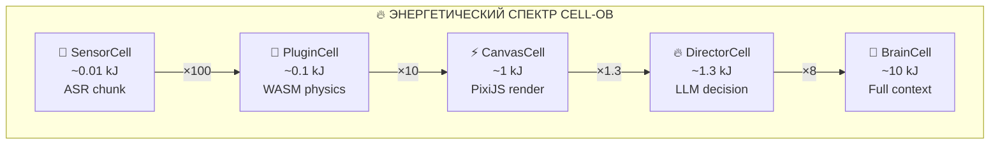

| Cell Type | $E_{\text{decision}}$ | Источник | Сравнение |
|---|---|---|---|
| 🪫 **SensorCell** (ASR chunk) | ~0.01 kJ | Streaming audio | 🔦 LED на 1 секунду |
| 🔋 **PluginCell** (WASM physics) | ~0.1 kJ | Deterministic compute | 💡 Лампочка на 1 секунду |
| ⚡ **CanvasCell** (PixiJS render) | ~1 kJ | GPU + DOM | ⌨️ Один keystroke |
| 🔥 **DirectorCell** (LLM) | ~1.3 kJ | LLM API call | 🏃 2 шага бегом |
| 🌋 **BrainCell** (full context) | ~10 kJ | Multi-agent | ☕ Нагрев чашки чая |

## 📐 Symbolic: теорема Ландауэра для Cell

Принцип Ландауэра (1961): стирание 1 бита информации требует минимум:

$$E_{\min} = k_B T \ln 2 \approx 2.87 \times 10^{-21} \text{ J at 300K}$$

Для Cell, которая стирает и перезаписывает `State_CID`:

$$E_{\text{Landauer}}(\text{Cell}) = k_B T \ln 2 \cdot |\text{State}_{\text{erased}}|$$

Но реальные Cell работают в $10^9$–$10^{12}$ раз выше предела Ландауэра (irreversible computing). **Это и есть термодинамический потолок эффективности.**

$$\eta_{\text{Landauer}} = \frac{E_{\text{Landauer}}}{E_{\text{actual}}} \approx 10^{-9} \text{–} 10^{-12}$$

> 💡 **Инсайт:** Мы используем только $\sim 10^{-9}$ теоретического предела эффективности вычислений. Есть $10^9$–кратный резерв для улучшения. Но пока — каждый Cell **жрёт энергию** как паровоз, и это нельзя игнорировать.

> 🔮 **Контрастная аналогия (🚗 Транспорт):** Cell — не электромобиль (эффективный), Cell — **ракета** (мощная, но прожорливая). Каждый запуск DirectorCell — как сжигание топлива. Экономика Mesh невозможна без учёта этого.

> 📐 **Формула-резюме:**
> $$\boxed{E_{\text{Cell}} = \sum_{i} P_i \cdot t_i \geq E_{\text{Landauer}} \cdot |\text{bits}_{\text{erased}}|}$$

> 🔄 **Проверь себя:**
> - L1 🔍 *recall:* Из каких компонентов складывается энергия вычислений Cell?
> - L2 🔬 *elaborate:* Почему предел Ландауэра — это *нижняя* граница, а не верхняя? Что делает реальные вычисления в $10^9$ раз дороже?
> - L3 🌉 *transfer:* Объясни разницу между $E_{\text{Landauer}}$ и $E_{\text{actual}}$ через аналогию с 🏗️ КПД двигателя (почему теоретический и реальный КПД различаются)

> ⏸️ **Но...** Если энергия — ограниченный ресурс, кто решает, *какой* Cell её получает? Это уже не физика — это **экономика**. И тут вступает Второе Начало...

---

# 🌊 II — ВТОРОЕ НАЧАЛО: Энтропия децентрализации

## 🎭 Experience

> 😮 **Сцена:** Ваш Mesh из 100 узлов работает идеально. Все CID доступны за <50ms. Ceramic streams синхронны. Lattica мгновенна. Проходит неделя. Половина узлов — offline (люди выключили компы). IPFS pins потеряны. Ceramic streams разошлись. CRDT-конфликты в Lattica. Ваша «идеальная» сеть **деградировала**.
>
> 💥 **Конфликт:** В Web2 вы бы просто купили сервер подороже. Но в децентрализованной сети **энтропия — не баг, а фундаментальное свойство**. Узлы приходят и уходят. Данные рассеиваются. Согласованность нарушается. Это не «проблема, которую нужно решить» — это **состояние, которым нужно управлять**.

## 📐 Энтропия Mesh

$$S_{\text{Mesh}} = k_{\text{net}} \cdot \ln \Omega_{\text{states}}$$

Где $\Omega_{\text{states}}$ — число возможных состояний сети при заданном числе узлов $N$ и связей $E$:

$$\Omega_{\text{states}} \approx \binom{N^2}{E} \cdot 2^{|\text{CIDs}|} \cdot \prod_{\text{streams}} |\text{events}|!$$

**Энтропия растёт с:**
- 🔴 Числом узлов $N$ → больше комбинаций топологии
- 🔴 Числом CID → больше вариантов размещения
- 🔴 Числом Ceramic events → больше ветвление
- 🟡 Числом связей $E$ → но *упорядоченные* связи снижают энтропию

## 🌊 Три формы энтропии в Mesh

| Форма | Что деградирует | Аналог (🧫 Биология) | Механизм |
|---|---|---|---|
| 🔀 **Топологическая** | Связи рвутся, узлы уходят | Клетки отмирают | Churn rate, NAT timeouts |
| 📦 **Данных** | CID теряют pins, блоки недоступны | ДНК деградирует без репарации | Garbage collection, pin expiry |
| 🕰️ **Временна́я** | Streams расходятся, CRDT-конфликты | Эпигенетический дрейф | Concurrent writes, network partitions |

## ❄️ Кристаллизация: порядок из хаоса

Но энтропия — не только враг. В природе **кристаллы** возникают из хаоса молекул при правильных условиях:

| Условие кристаллизации | В Mesh | Что получается |
|---|---|---|
| 🌡️ **Охлаждение** (замедление) | Backpressure / throttle | Согласованное состояние |
| 🧲 **Затравка** (nucleation seed) | Well-known CID / bootstrap node | Структура растёт от seed |
| ⏱️ **Время** (термодинамическое) | Consensus window | Протокол сходится |
| 💎 **Лattice energy** (энергия связи) | UCAN trust bonds | Устойчивые связи |

$$\Delta G = \Delta H - T \cdot \Delta S$$

Кристалл образуется, когда $\Delta G < 0$: выигрыш в энтальпии (энергия связей) превышает энтропийные потери.

**В Mesh:** «кристаллизация» (согласованность) возникает, когда **энергия связей** (UCAN trust, pin commitments, Ceramic anchoring) превышает **энтропийные потери** (churn, partition, divergence).

> 💡 **Инсайт:** Децентрализация *без* кристаллизации = газ (рассеивается). Децентрализация *с* кристаллизацией = **кристалл** (устойчивая структура с дальним порядком). Нам нужен не газ, не жидкость — а **кристалл**: децентрализованный, но упорядоченный.

> 🧫 **Контрастная аналогия:** Белки сворачиваются в минимум свободной энергии. Правильно свёрнутый белок = функционирующий Cell. Неправильно свёрнутый = **амилоид** (агрегат, мусор). В Mesh «амилоид» = деградировавшие CID, потерянные pins, расходящиеся streams.

> 📐 **Формула-резюме:**
> $$\boxed{\Delta G_{\text{Mesh}} = \underbrace{E_{\text{bonds}}}_{\text{UCAN + pins + anchors}} - T_{\text{churn}} \cdot \underbrace{\Delta S_{\text{topo}}}_{\text{churn + partition}} < 0 \iff \text{Mesh кристаллизуется}}$$

> 🔄 **Проверь себя:**
> - L1 🔍 *recall:* Какие три формы энтропии существуют в Mesh?
> - L2 🔬 *elaborate:* Почему «просто добавить узлов» не снижает энтропию, а *увеличивает* её?
> - L3 🌉 *transfer:* Объясни кристаллизацию Mesh через аналогию с ❄️ образованием снежинки (какие «условия» нужны?)

> ⏸️ **Но...** Что, если $\Delta G > 0$ всегда? Что если Mesh *фундаментально не может* кристаллизоваться при определённых условиях? Это ведёт к Третьему Началу...

---

# ❄️ III — ТРЕТЬЕ НАЧАЛО: Кристаллизация порядка

## 🎭 Experience

> 😮 **Сцена:** Вы построили Ceramic stream для Canvas state. 500 пользователей одновременно рисуют на одном infinite canvas. CRDT работает. Всё синхронизировано. Проходит час. Вы смотрите в ComposeDB — 2.3 миллиона событий. Половина — конфликты, разрешённые автоматически. Другая половина — «мёртвые ветви» (stale state). Stream «остыл» — но не до кристалла, а до **стекловидного состояния**: структура есть, но аморфная.
>
> 🤯 **Восхищение:** Это и есть Glass Transition — переход из жидкости в стекло без кристаллизации. В Mesh: система «застывает» в *неоптимальном* состоянии, потому что не может найти путь к минимуму $\Delta G$.

## ❄️ Три уровня порядка

| Уровень | Название | Состояние | Mesh пример | Аналог (❄️ Вода) |
|---|---|---|---|---|
| 🔴 **Уровень 0** | Газ | Нет связей, всё рассеяно | Только что запущенный IPFS node, 0 peers | 💨 Водяной пар |
| 🟡 **Уровень 1** | Жидкость | Локальные связи, нет дальнего порядка | Mesh с DHT, но без persistent pins | 💧 Жидкая вода |
| 🟢 **Уровень 2** | Кристалл | Дальний порядок, стабильная структура | Full Mesh: IPFS pins + Ceramic anchors + UCAN bonds | ❄️ Лёд |

## 📐 Фазовые переходы

$$\text{Gas} \xrightarrow{\text{connections} > k_c} \text{Liquid} \xrightarrow{\text{bonds} > E_b} \text{Crystal}$$

Порог перколяции $k_c$ (Erdős–Rényi): для связности $N$ узлов нужно $\sim \frac{N \ln N}{2}$ связей.

| Порог | Условие | В Mesh | Критерий |
|---|---|---|---|
| $k_c$ | Перколяция | DHT connectivity | Каждый CID достижим |
| $E_b$ | Кристаллизация | Pin + anchor + UCAN | State воспроизводим |
| $T_g$ | Glass transition | Churn > recovery rate | Amorphous freeze |

## ❄️ Glass Transition в Mesh

Стеклование возникает, когда **скорость релаксации** падает ниже **скорости изменений**:

$$\tau_{\text{relax}} > \tau_{\text{churn}} \implies \text{Glass}$$

| Параметр | Значение | Что значит |
|---|---|---|
| $\tau_{\text{relax}}$ | Время сходимости CRDT | Насколько быстро сеть приходит к согласию |
| $\tau_{\text{churn}}$ | Время между изменениями топологии | Насколько быстро сеть меняется |

**Если** $\tau_{\text{relax}} > \tau_{\text{churn}}$ **→ Mesh застревает** в amorphous state: формально «работает», но state расходится, conflicts накапливаются, queries медленные.

💡 **Это объясняет, почему многие P2P сети деградируют.** BitTorrent работает (файловый обмен, нет mutable state). IPFS работает (immutable data, нет спешки). Ceramic *страдает* (mutable state, нужна согласованность). Lattica *критична* (real-time, $\tau_{\text{churn}}$ минимальный).

> 💡 **Инсайт:** Glass Transition — главный враг Mesh. Не «сеть упала» (это видно), а «сеть работает, но застряла в неоптимальном состоянии» (это *не видно*, пока не попробуешь query). Решение: **Thermodynamic Governor** — система, которая сознательно «нагревает» и «охлаждает» сеть для рекристаллизации.

> 🏗️ **Контрастная аналогия:** Отжиг металла (annealing): нагреть → выдержать → медленно охладить → кристалл. В Mesh: намеренно disrupt → let CRDT converge → stabilize → порядок. «Холодная» сеть = аморфный металл. «Отожжённая» сеть = кристалл.

> 📐 **Формула-резюме:**
> $$\boxed{\text{Mesh state} = \begin{cases} \text{Gas} & \text{if } k < k_c \\ \text{Liquid} & \text{if } k_c \leq k < E_b \\ \text{Crystal} & \text{if } E_b \leq k \text{ and } \tau_{\text{relax}} < \tau_{\text{churn}} \\ \text{Glass} & \text{if } E_b \leq k \text{ and } \tau_{\text{relax}} \geq \tau_{\text{churn}} \end{cases}}$$

> ⏸️ **Но...** Существует ли *абсолютный нуль* для Mesh? Состояние, в котором энтропия = 0, и все Cell-ы идеально кристаллизованы? И можно ли его достичь?

---

# 🛑 IV — ЧЕТВЁРТОЕ НАЧАЛО: Невозможность и пределы

## 🎭 Experience

> 😱 **Напряжение:** CAP-теорема, FLP-невозможность, границы Бреннера — вы *знаете* эти результаты. Но есть пределы *глубже*. Пределы, которые говорят: даже с бесконечными ресурсами, даже с идеальными протоколами, даже с квантовыми вычислениями — **некоторые вещи невозможны принципиально**.

## 🛑 Четыре невозможности

| # | Теорема | Что невозможно | Что значит для Mesh |
|---|---|---|---|
| 1 | 🏛️ **CAP** (Brewer, 2000) | C + A + P одновременно | Децентрализованная согласованная система недоступна при partition |
| 2 | 🔄 **FLP** (Fischer et al., 1985) | Consensus в async системе с 1 crash | Не существует детерминированного протокола, гарантирующего termination |
| 3 | 📊 **Бреннер** (Brenner, 2016) | Динамическое равновесие P2P | Системы с churn > порога **не могут** стабилизироваться |
| 4 | 🌌 **Гёдель** (1931) | Полная саморефлексия | Система не может доказать собственную Consistency |

## 📐 CAP-поверхность для Cell

$$\text{CAP} \implies \forall\, \text{Cell}: \max(\text{Consistency}, \text{Availability}, \text{Partition-tolerance}) \leq 2$$

В нашей архитектуре каждый **слой I/O** выбирает свою CAP-точку:

| Слой | C | A | P | Выбор | Почему |
|---|---|---|---|---|---|
| 🪨 IPFS | 🟡 Eventual | 🟢 High | 🟢 Yes | **AP** | Immutable data — eventual consistency OK |
| 🌊 Ceramic | 🟢 Strong | 🟡 Medium | 🟢 Yes | **CP** | Anchored to Ethereum — consistency critical |
| ⚡ Lattica | 🔴 Weak | 🟢 High | 🟢 Yes | **AP** | Real-time — availability beats consistency |

💡 **Три слоя = три разные точки на CAP-поверхности.** Это *не ошибка* — это *архитектурное решение*. Мы **осознанно** размазываем CAP-компромиссы по слоям.

## 📐 FLP и NDI

FLP говорит: в асинхронной системе с хотя бы одним crash, consensus **не может** быть гарантированно достигнут за конечное время.

NDI (заметка 04) — наш **ответ** на FLP:

$$\text{FLP} \implies \text{Consensus impossible} \xrightarrow{\text{NDI}} \text{Consensus unnecessary}$$

NDI отказывается от consensus как цели. Вместо: **acceptance criteria** — каждый шаг проверяется *локально*, без глобального agreement. Это не «обходит» FLP, а *меняет постановку задачи*.

| FLP | NDI |
|---|---|
| «Все должны согласовать состояние» | «Каждый проверяет *свой* шаг» |
| Глобальный consensus | Локальные acceptance criteria |
| Невозможно (FLP) | Возможно (как доказал Йегге) |

> 💡 **Инсайт:** Невозможность — это не тупик. Это *информация о границах дизайна*. CAP говорит: «не пытайся иметь всё». FLP говорит: «не пытайся достичь consensus». Гёдель говорит: «не пытайся быть полностью самосознающим». **Правильная архитектура = дизайн *внутри* этих границ, а не попытка их пробить.**

> 🎮 **Контрастная аналогия:** В шахматах нельзя поставить мат ферзём и королём против одинокого короля *за 1 ход*. Но можно за 10. Невозможность *быстрого* решения ≠ невозможность *решения вообще*. FLP = «нет 1-ходового consensus». NDI = «есть 10-шаговый completion».

> ⏸️ **Но...** Если мы знаем пределы, как *оптимизировать* внутри них? Что такое «КПД Карно» для децентрализованных вычислений?

---

# 📊 V — ФАЗОВАЯ ДИАГРАММА: Состояния Cell

## 🖼️ Полная фазовая диаграмма

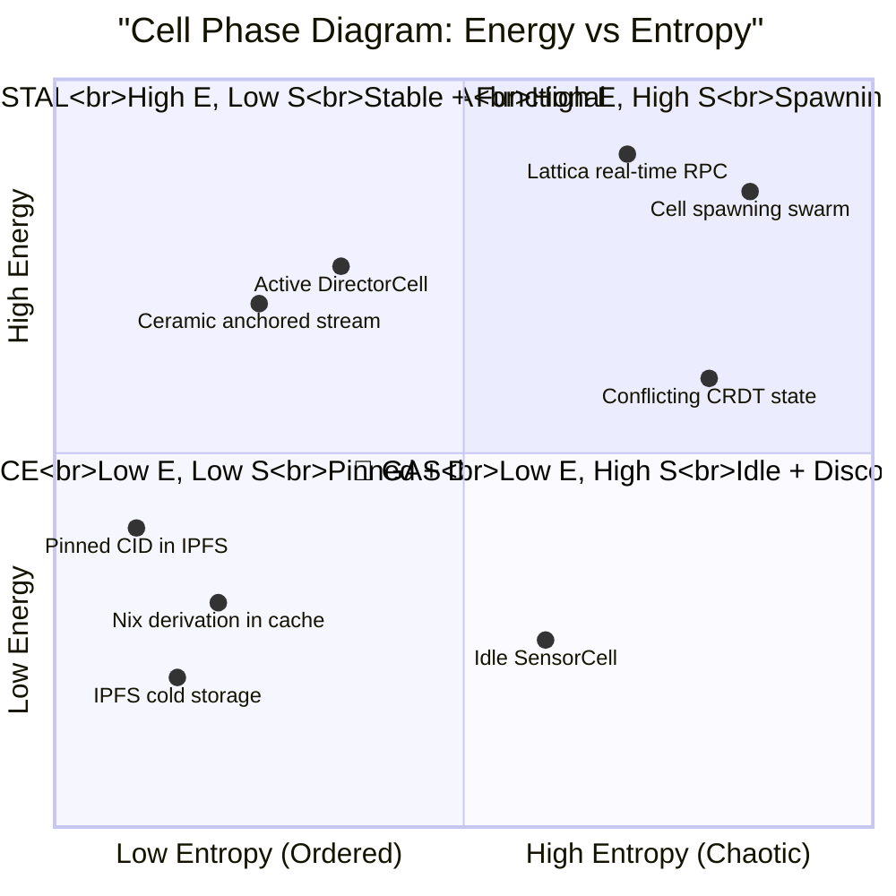

## 📊 Четыре фазы Cell

| Фаза | $E$ | $S$ | Описание | Пример |
|---|---|---|---|---|
| 💎 **Crystal** | High | Low | Упорядоченная, стабильная, функциональная | Anchored Ceramic stream + pinned assets |
| 🔥 **Plasma** | High | High | Активная, но хаотичная — spawning, churning | Polecats swarm during decomposition |
| 💨 **Gas** | Low | High | Неактивная, рассеянная | Unpinned IPFS blocks, disconnected peers |
| ❄️ **Ice** | Low | Low | Замороженная, стабильная, но нефункциональная | Nix binary cache, cold storage |

## 📐 Переходы между фазами

$$\text{Ice} \xrightarrow{+\text{heat}} \text{Crystal} \xrightarrow{+\text{churn}} \text{Plasma} \xrightarrow{-\text{energy}} \text{Gas}$$

| Переход | Что происходит | Триггер | В Mesh |
|---|---|---|---|
| ❄️→💎 | Отогрев + кристаллизация | Deploy + pin + anchor | Cell activation |
| 💎→🔥 | Нарушение порядка | High churn, concurrent writes | Peak load |
| 🔥→💨 | Потеря энергии | Node offline, timeout | Cell death |
| 💨→❄️ | Заморозка | Pin without active use | Archive |
| 💎→❄️ | Deactivation | UCAN expiry, manual pin | Hibernate |

**Оптимальная траектория Cell lifecycle:**

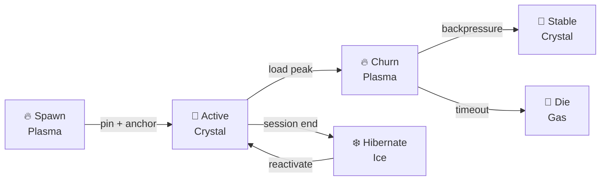

> 💡 **Инсайт:** Cell — не статичный объект. Cell — **термодинамическая система**, которая переходит между фазами. Оптимальный lifecycle = Plasma → Crystal → (сессия) → Ice → (reactivation) → Crystal. Худший сценарий = застревание в Plasma (permanent churn) или Gas (dead cells).

> ⏸️ **Но...** Кто управляет этими переходами? Кто решает, когда «нагреть», когда «охладить»? Нужен **Governor** — термодинамический регулятор Mesh...

---

# 🎛️ VI — ГОСУДАРСТВО: Термодинамический Governor

## 🎭 Experience

> 🤔 **Любопытство:** Заметка 04 описала 12 архетипов оркестрации. Но ни один из них не является **термодинамическим регулятором**. SupervisorCell следит за живостью. DeaconCell пинает застрявших. Но никто не управляет **фазовыми переходами** всей сети.

## 🎛️ Governor = термодинамический регулятор

GovernorCell — новый архетип (#13), не из заметки 04:

$$\text{GovernorCell} = f\bigl(\text{Metrics}_{\text{Mesh}},\ \text{Policy}_{\text{CID}},\ \text{Action}_{\text{stream}}\bigr)$$

| Вход | Что меряет | Интервал |
|---|---|---|
| 🌡️ $T_{\text{churn}}$ | Churn rate (узлы/мин) | 10s |
| 📊 $P_{\text{load}}$ | CPU/RAM utilization | 30s |
| 🔮 $\text{CID}_{\text{availability}}$ | % CIDs accessible | 60s |
| 🌊 $S_{\text{divergence}}$ | Stream divergence (max offset) | 30s |
| 💎 $\rho_{\text{crystalline}}$ | % Cells in Crystal phase | 60s |

## 🎛️ Четыре режима Governor

| Режим | Условие | Действие | Аналог |
|---|---|---|---|
| 🏃 **Run** | $\rho_{\text{crystalline}} > 0.7$ | Normal operation | Двигатель на крейсерской скорости |
| 🌡️ **Regulate** | $0.3 < \rho < 0.7$ | Throttle + backpressure | Дроссель при перегреве |
| 🔥 **Cool** | $S_{\text{divergence}} > \text{threshold}$ | Intentional disruption + re-convergence | Отжиг: нагреть для рекристаллизации |
| ❄️ **Freeze** | $P_{\text{load}} > 0.95$ | Emergency: pause all non-critical Cells | Аварийное охлаждение |

## 📐 Алгоритм Governor

```
func govern(metrics):
  T = metrics.churn_rate
  S = metrics.stream_divergence
  rho = metrics.crystalline_fraction
  
  if rho > 0.7:
    return RUN                           # Всё хорошо
    
  if S > S_critical:
    // INTENTIONAL DISRUPTION for re-crystallization
    return COOL:
      - Pause all non-essential writes
      - Trigger CRDT merge protocol
      - Wait tau_relax seconds
      - Resume writes
      // This is "annealing": heat → hold → cool → crystal
      
  if T > T_critical:
    return REGULATE:
      - Enable backpressure on all input Cells
      - Throttle DirectorCell decision rate
      - Reduce Cell.spawn parallelism
      
  if metrics.load > 0.95:
    return FREEZE:
      - Hibernate all SensorCells
      - Reduce DirectorCell to 1 instance
      - Cache all Lattica messages
```

## 🔗 Связь с DeaconCell (заметка 04)

| 🐺 DeaconCell | 🎛️ GovernorCell |
|---|---|
| Liveness: Cell жива? | Phase: Cell в какой фазе? |
| Nudge: «делай работу» | Throttle: «делай медленнее» |
| Restart dead Cells | Cool stuck networks |
| Heartbeat every 30s | Metrics every 10-60s |

DeaconCell = **микроскопический** регулятор (per Cell). GovernorCell = **макроскопический** регулятор (per Mesh). Оба нужны.

> 💡 **Инсайт:** Без Governor Mesh — как двигатель без термостата: перегреется и умрёт (Plasma trap) или остынет и заглохнет (Gas/Idle). Governor *сознательно* управляет фазовыми переходами сети.

> 🎵 **Контрастная аналогия:** Governor = дирижёр оркестра. Не играет за музыкантов (DeaconCell пинает), а задаёт *темп и динамику*: allegro (Run), andante (Regulate), fermata (Cool), tacet (Freeze).

> ⏸️ **Но...** Есть ли *предел эффективности* Governor? Какой максимальный % Crystal можно поддерживать? Это ведёт к пределам Карно...

---

# 💎 VII — ПРЕДЕЛЫ: Карно для вычислений

## 📐 Цикл Карно для Cell

Цикл Карно — идеальный термодинамический цикл с максимальным КПД:

$$\eta_{\text{Carnot}} = 1 - \frac{T_{\text{cold}}}{T_{\text{hot}}}$$

Аналог для Cell-вычислений:

| Карно (🔥 Тепло) | Cell (💻 Вычисления) | Что это |
|---|---|---|
| $T_{\text{hot}}$ | $E_{\text{max}}$ (максимальная доступная энергия) | Граница бюджета Cell |
| $T_{\text{cold}}$ | $E_{\text{min}}$ (Landauer limit) | Теоретический минимум |
| $\eta_{\text{Carnot}}$ | $1 - \frac{E_{\text{Landauer}}}{E_{\text{max}}}$ | Максимальный КПД Cell |

$$\eta_{\text{Carnot,Cell}} = 1 - \frac{k_B T \ln 2 \cdot |\text{bits}|}{E_{\text{budget}}}$$

Для DirectorCell ($E_{\text{budget}} = 1.3\text{kJ}$, $|\text{bits}| \approx 10^9$):

$$\eta_{\text{Carnot}} = 1 - \frac{2.87 \times 10^{-21} \times 10^9}{1300} \approx 1 - 2.2 \times 10^{-12} \approx 1$$

**Идеальный КПД ≈ 100%** — но это *термодинамический* предел, не реальный. Реальный КПД Cell:

$$\eta_{\text{actual}} = \frac{E_{\text{useful}}}{E_{\text{total}}}$$

Где $E_{\text{useful}}$ — энергия, потраченная на *полезные* вычисления (не на ожидание, ретраи, serialization).

## 📊 Реальные КПД Cell-ов

| Cell | $E_{\text{total}}$ | $E_{\text{useful}}$ | $\eta_{\text{actual}}$ | Основные потери |
|---|---|---|---|---|
| 🪫 SensorCell | 0.01 kJ | 0.008 kJ | 80% | Network latency |
| 🔋 PluginCell | 0.1 kJ | 0.08 kJ | 80% | WASM instantiation overhead |
| ⚡ CanvasCell | 1 kJ | 0.5 kJ | 50% | DOM reflow, GC pauses |
| 🔥 DirectorCell | 1.3 kJ | 0.4 kJ | 31% | LLM API overhead, context window |
| 🌋 BrainCell | 10 kJ | 2 kJ | 20% | Multi-agent coordination, retry |

💡 **DirectorCell теряет 69% энергии.** Это не «плохой код» — это *фундаментальные потери*: LLM inference overhead, API serialization, context window management.

## 💎 Pareto Front для Mesh

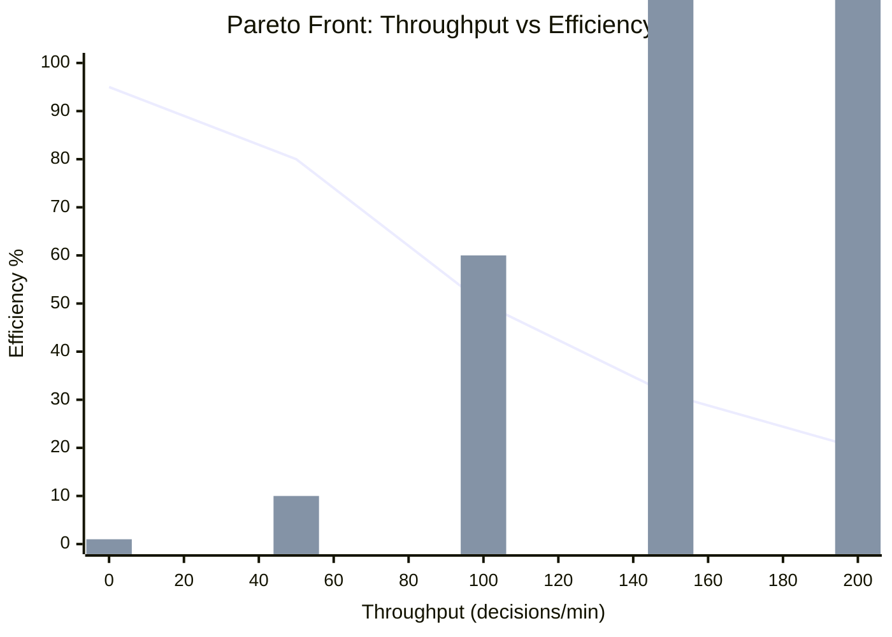

| Оптимальная точка | Throughput | $\eta$ | Использование |
|---|---|---|---|
| 💎 **Ultra-efficient** | 1/min | 95% | Critical decisions, K-voting with K=5 |
| 🔋 **Efficient** | 10/min | 80% | WASM plugins, deterministic compute |
| ⚖️ **Balanced** | 60/min | 50% | Canvas rendering, standard operation |
| 🏃 **Throughput** | 120/min | 31% | DirectorCell, fast decisions |
| 🌋 **Max throughput** | 200/min | 20% | Emergency, all agents firing |

> 💡 **Инсайт:** Существует **Pareto-фронт**: нельзя одновременно максимизировать throughput и efficiency. Выбор точки на фронте = архитектурное решение. GovernorCell выбирает точку в зависимости от состояния сети.

> 📐 **Формула-резюме:**
> $$\boxed{\eta_{\text{Cell}} = \frac{E_{\text{useful}}}{E_{\text{total}}} \leq \eta_{\text{Carnot}} = 1 - \frac{E_{\text{Landauer}}}{E_{\text{budget}}} \approx 1}$$
> Реальный КПД: 20–80%. Термодинамический: ~100%. Разрыв: на 5-6 порядков — *резерв для оптимизации*.

> ⏸️ **Но...** Все формулы выше предполагают *одного* наблюдателя. Но в Mesh — *много* наблюдателей, и каждый видит *разную* сеть. Это ведёт к релятивистским эффектам...

---

# 🔭 VIII — НАБЛЮДАТЕЛЬ: Релятивистские эффекты в Mesh

## 🎭 Experience

> 😮 **Сцена:** Cell A на сервере в Токио отправляет CID Cell B в Лондоне. Latency: 150ms. Cell B читает Ceramic stream — но stream уже обновился (событие из Нью-Йорка пришло раньше). Cell B видит *другое* состояние, чем Cell A отправлял. Кто прав? Оба. **Нет привилегированного наблюдателя.**

## 📐 Относительность состояния

В СТО: одновременность относительна. В Mesh: **согласованность относительна**.

$$\text{State}_{\text{observed by A}}(t) \neq \text{State}_{\text{observed by B}}(t) \quad \text{при } d_{AB} > c \cdot t$$

Где $d_{AB}$ — сетевое расстояние, $c$ — «скорость света» в сети (скорость распространения данных через libp2p).

| Слой | «$c$» (скорость) | Макс $d$ (diameter) | $\Delta t$ (max skew) |
|---|---|---|---|
| 🪨 IPFS | ~100 Mbps / #hops | Global (~20 hops) | ~200ms |
| 🌊 Ceramic | Recon + anchor | Global | ~10s (anchor to Ethereum) |
| ⚡ Lattica | Direct libp2p | ~5 hops (mesh) | ~50ms |

**Световой конус Cell:**

$$\text{Light cone}_{\text{Cell}}(t) = \{\text{CID} : d(\text{Cell}, \text{CID}) \leq c_{\text{network}} \cdot t\}$$

Cell *не может* знать о CID за пределами своего светового конуса. Это не «медленный интернет» — это **фундаментальное ограничение распределённых систем**.

## 📐 Time dilation в Mesh

В СТО: движущиеся часы идут медленнее. В Mesh: **нагруженный узел «отстаёт»** от ненагруженного:

$$\tau_{\text{busy}} = \tau_{\text{idle}} \cdot \sqrt{1 - \left(\frac{L_{\text{CPU}}}{L_{\text{max}}}\right)^2}$$

Где $L$ — load. При $L \to L_{\text{max}}$: $\tau_{\text{busy}} \to 0$ — Cell «замораживается» (event loop заблокирован).

💡 **Это объясняет, почему перегруженный узел теряет Ceramic sync.** Не потому что «медленный» — а потому что его *внутренние часы* идут медленнее относительно сети. К моменту, когда он готов обработать событие, сеть уже ушла вперёд.

## 🔗 Связь с Принципом неопределённости доверия (заметка 00)

Заметка 00: «Нельзя одновременно иметь максимальную верификацию и максимальную скорость.»

Заметка 10: **«Нельзя одновременно видеть актуальное состояние и находиться далеко от него.»**

| Неопределённость доверия (00) | Неопределённость состояния (10) |
|---|---|
| Verification vs Speed | Consistency vs Latency |
| Чем больше проверяешь — тем медленнее | Чем дальше — тем «старее» информация |
| 🏠 Local → 🌐 Global | 🕳️ Nearby → 🌍 Distant |

> 💡 **Инсайт:** Две неопределённости — **одно и то же явление** на разных уровнях. Неопределённость доверия = квантовомеханический предел. Неопределённость состояния = релятивистский предел. Вместе они задают **полный конус ограничений** для Mesh.

> 🌌 **Контрастная аналогия (Философия):** Кант: мы не можем знать «вещь в себе» — только феномен. В Mesh: Cell не может знать «истинное состояние» — только *свой срез* светового конуса. Consistency — это **регулятивная идея**, не конститутивная.

> 📐 **Формула-резюме:**
> $$\boxed{\Delta \text{State} \cdot \Delta \text{Position} \geq \frac{c_{\text{network}}}{2} \quad \text{(Mesh Uncertainty Principle)}}$$

---

# 📎 Приложение A: Свод формул

| #   | Формула                                                             | Название               | Где определена |                  |         |
| --- | ------------------------------------------------------------------- | ---------------------- | -------------- | ---------------- | ------- |
| 1   | $E_{\text{Cell}} = \sum_i P_i \cdot t_i$                            | Энергия Cell           | Часть I        |                  |         |
| 2   | $E_{\text{Landauer}} = k_B T \ln 2 \cdot                            | \text{bits}            | $              | Предел Ландауэра | Часть I |
| 3   | $\eta = E_{\text{Landauer}} / E_{\text{actual}} \approx 10^{-9}$    | Реальный КПД vs предел | Часть I        |                  |         |
| 4   | $\Delta G = E_{\text{bonds}} - T_{\text{churn}} \cdot \Delta S < 0$ | Условие кристаллизации | Часть II       |                  |         |
| 5   | $\text{Glass} \iff \tau_{\text{relax}} > \tau_{\text{churn}}$       | Glass Transition       | Часть III      |                  |         |
| 6   | $\text{CAP} \implies \max(C, A, P) \leq 2$                          | CAP теорема            | Часть IV       |                  |         |
| 7   | $\eta_{\text{Carnot}} = 1 - E_{\text{min}}/E_{\text{max}}$          | КПД Карно для Cell     | Часть VII      |                  |         |
| 8   | $\Delta \text{State} \cdot \Delta \text{Position} \geq c/2$         | Mesh Uncertainty       | Часть VIII     |                  |         |

---

# 📎 Приложение B: Маппинг на проекты

| Проект | Роль в термодинамике | Что реализует |
|---|---|---|
| 🏰 nn3w | L1: host-level metrics ($P$, $T$) | Node resource monitoring |
| 🧫 sandboxai | L2: Cell-level $E_{\text{Cell}}$ budget | Resource isolation + caps |
| 🏭 factory-ai | L4: Governor strategies | COMPASS decides when to Run/Regulate/Cool/Freeze |
| ☁️ oblakagent | L3: NATS backpressure | Throttle mechanism |
| 📚 myaiteam | L0: CID availability tracking | Knowledge of what's accessible |
| 🎭 Synesthesia | L5: End-user perceived latency | The "observer" whose experience matters |

---

# 📎 Приложение C: Benchmarks (целевые)

| Метрика | 🎯 Target (2026) | 🎯 Target (2027) | 🎯 Target (2030) |
|---|---|---|---|
| $\rho_{\text{crystalline}}$ (idle) | > 0.8 | > 0.9 | > 0.95 |
| $\rho_{\text{crystalline}}$ (peak load) | > 0.5 | > 0.7 | > 0.85 |
| $\eta_{\text{DirectorCell}}$ | > 30% | > 50% | > 70% |
| Glass recovery time | < 30s | < 10s | < 3s |
| Governor cycle time | 60s | 30s | 10s |
| Light cone skew (global) | < 200ms | < 100ms | < 50ms |

---

> 💡 **Итоговый инсайт:** Cell без термодинамики = уравнение состояния без уравнения движения. Термодинамика Cell — это **физика реальности**, в которой живут наши абстракции. Энергия ограничена. Энтропия растёт. Кристаллы требуют условий. Невозможность — не враг, а граница поля дизайна. И в этих границах — целый мир.

> 📐 **Финальная формула:**
> $$\boxed{\text{Living Cell} = \underbrace{\text{Cell}(\text{Spec, Cap, State})}_{\text{из заметки 00}} \;\Big|\; \underbrace{E < E_{\text{budget}}}_{\text{I начало}} \;\land\; \underbrace{\Delta G < 0}_{\text{II начало}} \;\land\; \underbrace{\tau_{\text{relax}} < \tau_{\text{churn}}}_{\text{III начало}} \;\land\; \underbrace{\text{CAP chosen}}_{\text{IV начало}}}$$

---

> 📎 **Серия:** [00-FRACTAL-ATOM](./00-FRACTAL-ATOM.md) → ... → [09-SNS3-PROMPT](./09-SNS3-PROMPT.md) → **[10-CELL-THERMODYNAMICS]** → [11-ECONOMIC-MESH](./11-ECONOMIC-MESH.md) → [12-SELF-EVOLUTION-ENGINE](./12-SELF-EVOLUTION-ENGINE.md)

## 🔗 Knowledge Graph Links
- [00-FRACTAL-ATOM] --enables--> [THIS NOTE] (Cell = f(Spec, Cap, State) is the equation of state; THIS NOTE adds equations of motion)
- [04-ORCHESTRATOR-EVOLUTION] --extends--> [THIS NOTE] (12 archetypes → #13 GovernorCell)
- [06-UNIVERSAL-SENSORY] --is_analogy_for--> [Energy as 18th sensory channel]
- [03-GAS-TOWN-ANALYSIS] --validates--> [NDI as answer to FLP impossibility]
- [THIS NOTE] --challenges--> [Unbounded Cell spawning without energy budget]


---


# 💰🪙📊🏦⚡ ECONOMIC MESH ⚡🏦📊🪙💰
### Токеномика суверенной сети: газ, репутация, стимулы, рыночное равновесие
### Заметка 11 — Экономический слой Sovereign Mesh

> 📎 **Серия:** ... · [10-CELL-THERMODYNAMICS](./10-CELL-THERMODYNAMICS.md) · **[11-ECONOMIC-MESH]** · [12-SELF-EVOLUTION-ENGINE](./12-SELF-EVOLUTION-ENGINE.md)
> 📅 Дата: 2026-04-13
> 🔬 Статус: Экономико-архитектурное исследование
> 📎 Строится на: [00-FRACTAL-ATOM](./00-FRACTAL-ATOM.md) (CID), [02-SOVEREIGN-MESH](./02-SOVEREIGN-MESH.md) (5 слоёв), [10-CELL-THERMODYNAMICS](./10-CELL-THERMODYNAMICS.md) (энергия Cell)

---

## 🗺️ Легенда символов

| 🏷️ Группа | Символы → Значение |
|---|---|
| 💰 **Ценность** | 💰 value/utility · 📈 growth · 📉 decay · 💎稀缺 scarcity · 🎫 voucher |
| 🪙 **Токены** | 🪙 gas/token · ⛽ fuel · 🏷️ credit · 🧾 receipt · 💵 fiat-bridge |
| 🏦 **Институты** | 🏦 treasury · 📋 registry · ⚖️ governance · 🏛️ DAO · 🔮 oracle |
| 🤝 **Стимулы** | 🤝 incentive · 🎯 alignment · 🪝 hook · 🧲 attractor · 🚫 misalignment |
| 📊 **Рынок** | 📊 market · 💱 exchange · 📉 price · 📈 demand · ⚖️ equilibrium |
| 🛡️ **Безопасность** | 🛡️ security · 🔐 encryption · 🔑 UCAN · 🚫 Sybil · 🎭 reputation |

---

## 📑 Содержание

```
🌋 0 — ПРОБЛЕМА: Mesh без экономики = коммунизм, а не анархия
💰 I — ТЕОРИЯ ЦЕННОСТИ: Что стоит CID?
🪙 II — GAS: Единица вычислительной экономики
🏦 III — ТРЁХСТОРОННИЙ РЫНОК: Provider · Consumer · Network
🤝 IV — СТИМУЛЫ: Выравнивание интересов
📊 V — РЕПУТАЦИЯ: Система доверия поверх CID
⚖️ VI — УПРАВЛЕНИЕ: DAO для Mesh
🛡️ VII — АТАКИ: Sybil, Eclipse, Economic DDOS
🔮 VIII — ЭКОНОМИЧЕСКИЙ GOVERNOR: Рынок как термостат
📎 Приложения: Формулы, Сценарии, Параметры
```

---

# 🌋 0 — ПРОБЛЕМА: Mesh без экономики = коммунизм, а не анархия

## 🎭 Experience

> 😮 **Сцена:** Ваш Sovereign Mesh работает. 1000 узлов, 500K CID, 50 Ceramic streams. Красота. Но через месяц: 70% узлов — offline. Почему? Люди *прекратили* пинить данные. IPFS nodes стоят энергии. Ceramic indexing требует CPU. Lattica connections — память. Никто не хочет платить за чужой контент.
>
> 💥 **Конфликт:** «Суверенная сеть» без экономики — не анархия (самоуправление), а **трагедия общин** (Hardin, 1968): каждый действует рационально → коллективный результат катастрофичен. Потребители берут бесплатно. Провайдеры не дают. Сеть умирает.
>
> 🧫 **Биология:** Клетка без АТФ — мертва. Экономика Mesh = АТФ сети: **универсальная единица энергии**, которую каждый узел может заработать, потратить, накопить. Без АТФ — нет метаболизма.
>
> 💰 **Экономика:** Фри-райдер (free rider) — агент, потребляющий общественное благо, не оплачивая его. В P2P: leecher в BitTorrent. Решение: **tit-for-tat** (Bitswap уже это делает). Но для *вычислений* нужен более сложный механизм.

## 🎯 Predict

> 🎯 **Вызов:** Назовите ТРИ типа экономических агентов в Mesh. Что каждый *даёт* и что *берёт*? Прежде чем читать — запишите.
>
> 💡 *Подсказка:* подумай через аналогию с 🏗️ рынком недвижимости: кто арендодатель, арендатор, управляющая компания?

---

# 💰 I — ТЕОРИЯ ЦЕННОСТИ: Что стоит CID?

## 📐 Ценность CID = редкость × полезность × доступность

$$V(\text{CID}) = \underbrace{S(\text{CID})}_{\text{scarcity}} \times \underbrace{U(\text{CID})}_{\text{utility}} \times \underbrace{A(\text{CID})}_{\text{accessibility}}$$

| Компонент | Формула | Что значит | Пример: высокий | Пример: низкий |
|---|---|---|---|---|
| 💎 **Scarcity** | $S = 1/N_{\text{replicas}}$ | Чем меньше копий — тем ценнее | Редкий ML-модель | Популярный мем |
| 🛠️ **Utility** | $U = \sum_i w_i \cdot \text{dep}_i$ | Чем больше зависимостей — тем ценнее | Nix base derivation | Мусорный файл |
| 📡 **Accessibility** | $A = P(\text{fetch} < t_{\max})$ | Легко ли получить? | Pinned on 50 nodes | 1 offline node |

## 🏗️ Enactive: конкретные CID и их ценность

```jsonc
// Ценность разных CID в реальном Mesh
{
  "bafy2bz...common-ubuntu-base": {
    scarcity: 1/5000,      // 5000 replicas globally
    utility: 0.95,          // почти всё зависит от ubuntu
    accessibility: 0.99,    // fetch <1s globally
    value: 1/5000 * 0.95 * 0.99 ≈ 0.00019  // низкая scarcity
  },
  "bafy2bz...custom-ml-model-v3": {
    scarcity: 1/3,         // только 3 узла хранят
    utility: 0.7,          // 7 проектов используют
    accessibility: 0.6,    // fetch ~30s
    value: 1/3 * 0.7 * 0.6 ≈ 0.14  // ЦЕННЫЙ
  },
  "bafy2bz...spam-data-xyz": {
    scarcity: 1/1,         // никто не хранит, кроме автора
    utility: 0.01,         // никто не использует
    accessibility: 0.05,   // fetch >5min, unreliable
    value: 1 * 0.01 * 0.05 = 0.0005  // мусор
  }
}
```

💡 **Спам в IPFS — не случайность, а экономический факт:** хранение стоит энергии, а спам-CID имеют utility ≈ 0. Без экономического фильтра сеть заполняется мусором.

## 🖼️ Iconic: пространство ценности

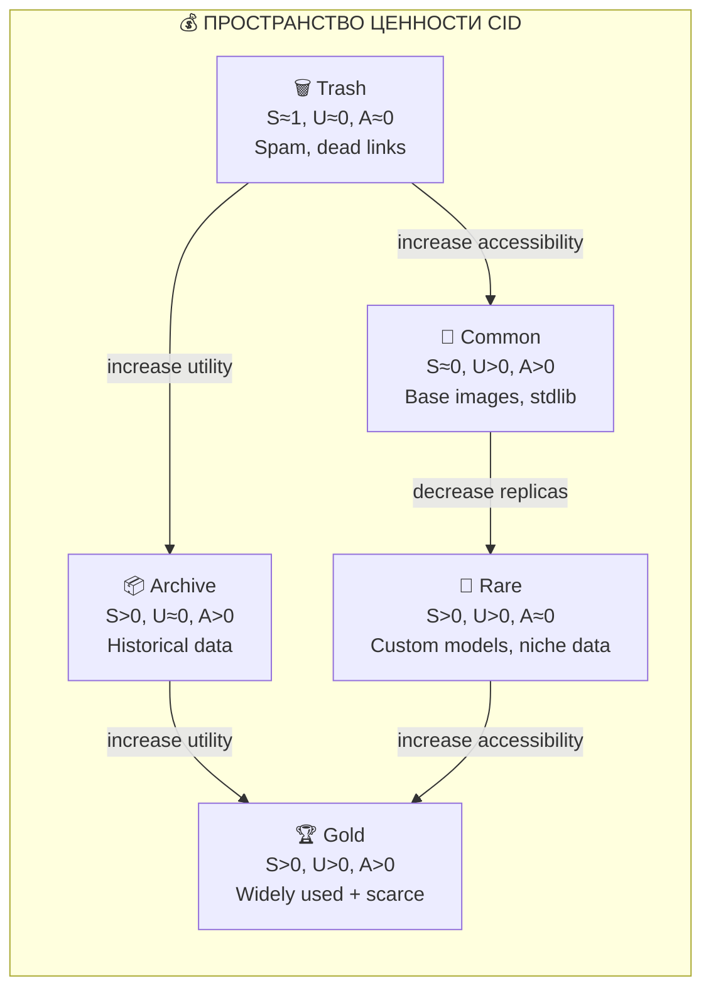

| Квадрант | $S$ | $U$ | $A$ | Экономический статус | Стратегия |
|---|---|---|---|---|---|
| 🗑️ **Trash** | High | Low | Low | Стоимость хранения > ценность | GC: не хранить |
| 📦 **Archive** | High | Low | High | Историческая ценность | Cold storage: дёшево хранить |
| 🧱 **Common** | Low | High | High | Инфраструктура (как дороги) | Subsidise: все платят понемногу |
| 💎 **Rare** | High | High | Low | Ниша, но ценная | Marketplace: плати за доступ |
| 🏆 **Gold** | High | High | High | Критическая инфраструктура | Priority: гарантированный доступ |

## 📐 Symbolic: теорема Коуза для Mesh

Теорема Коуза (1960): при нулевых транзакционных издержках, права собственности будут перераспределены эффективным путём независимо от начального распределения.

В Mesh: при нулевой стоимости транзакций (IPFS Bitswap = бесплатный), CID *будет* эффективно распределён. Но транзакционные издержки **не нулевые**:

$$\text{TC} = C_{\text{search}} + C_{\text{verify}} + C_{\text{transport}} + C_{\text{store}}$$

| Издержка | В Mesh | Порядок |
|---|---|---|
| 🔍 $C_{\text{search}}$ | DHT lookup | ~0.1s |
| ✅ $C_{\text{verify}}$ | CID hash check | ~1ms |
| 📡 $C_{\text{transport}}$ | Bitswap transfer | ~1-10s |
| 💾 $C_{\text{store}}$ | Disk space + energy | Ongoing |

💡 **Коуз в Mesh:** Чем ниже TC, тем эффективнее распределение. IPFS минимизирует $C_{\text{search}}$ и $C_{\text{verify}}$. Но $C_{\text{store}}$ растёт с масштабом. **Без оплаты хранения сеть не может масштабироваться.**

> 💡 **Инсайт:** Ценность CID — не абстракция. Это **экономическая переменная**, определяющая, будет ли CID *существовать* в сети через год. Без оплаты — только trash и common (те, что бесплатно хранят). Rare и Gold *вымирают* без стимулов.

> 🚗 **Контрастная аналогия:** CID = недвижимость. Location (accessibility) + demand (utility) + supply (scarcity) = value. Нужен «налог на недвижимость» (storage fee), иначе все забросят мусор (spam) и никто не будет строить «дома» (pin valuable data).

> ⏸️ **Но...** Как *платить*? Кто определяет цену? Как избежать монополии на «квартиры»? Нужен **gas**...

---

# 🪙 II — GAS: Единица вычислительной экономики

## 🎭 Experience

> 😮 **Сцена:** Ethereum доказал: gas работает. Каждый вызов контракта = gas × gasPrice. Простой transfer: 21,000 gas. Сложный DeFi: 500,000 gas. Но Ethereum — *одна* виртуальная машина. Наш Mesh — *тысячи* Cell-ов на *сотнях* узлов. Gas Ethereum не масштабируется.
>
> 💥 **Конфликт:** Gas Ethereum привязан к одной цепи. В Mesh нет «одной цепи» — есть IPFS + Ceramic + Lattica. Нужен **мультислойный gas**: разный для хранения, состояния, вычислений и коммуникации.

## 📐 Четыре вида gas

$$\text{Gas}_{\text{total}} = \text{Gas}_{\text{store}} + \text{Gas}_{\text{state}} + \text{Gas}_{\text{compute}} + \text{Gas}_{\text{comm}}$$

| Вид               | Слой    | Единица     | Что оплачивает        | Формула                                                             |              |                                              |
| ----------------- | ------- | ----------- | --------------------- | ------------------------------------------------------------------- | ------------ | -------------------------------------------- |
| 🪨 **Store Gas**  | IPFS    | Byte·Second | Хранение + доставка   | $g_s =                                                              | \text{bytes} | \cdot t_{\text{pin}} \cdot p_{\text{store}}$ |
| 🌊 **State Gas**  | Ceramic | Event       | Мутабельное состояние | $g_m = n_{\text{events}} \cdot p_{\text{event}}$                    |              |                                              |
| ⚡ **Compute Gas** | IPVM    | FLOP·Second | Выполнение WASM       | $g_c = \text{FLOPS} \cdot t_{\text{exec}} \cdot p_{\text{compute}}$ |              |                                              |
| 🔗 **Comm Gas**   | Lattica | Byte·Hop    | P2P коммуникация      | $g_l =                                                              | \text{msg}   | \cdot h_{\text{hops}} \cdot p_{\text{comm}}$ |

## 🏗️ Enactive: конкретный Gas-прайсинг

```jsonc
// Gas pricing для Synesthesia Engine (1-часовая лекция)
{
  lecture: {
    duration_min: 60,
    
    store_gas: {
      assets_cid: "10MB * 3600s * 0.001μFIL/BS = 36μFIL",
      wasm_plugins: "5MB * 3600s * 0.001μFIL/BS = 18μFIL",
      model_weights: "500MB * 3600s * 0.001μFIL/BS = 1800μFIL",  // EXPENSIVE
    },
    
    state_gas: {
      canvas_events: "1200 events * 0.1μFIL = 120μFIL",
      director_decisions: "600 events * 0.1μFIL = 60μFIL",
      lecture_stream: "60 events * 0.1μFIL = 6μFIL",
    },
    
    compute_gas: {
      asr_inference: "10 GFLOPS * 60s * 0.01μFIL = 6μFIL",
      llm_calls: "100 TFLOPS * 1800s * 0.01μFIL = 18000μFIL",  // DOMINANT
      wasm_physics: "1 GFLOPS * 600s * 0.01μFIL = 6μFIL",
    },
    
    comm_gas: {
      lattica_rpc: "50KB * 200 hops * 0.001μFIL = 10μFIL",
      ceramic_sync: "10MB * 5 hops * 0.001μFIL = 50μFIL",
    },
    
    total: "~20000μFIL = 0.02 FIL ≈ $0.30 (at FIL=$15)"
  }
}
```

💡 **LLM inference = 90% стоимости.** Это реальность: интеллект дорог. Store gas — копейки (IPFS/Filecoin дешев). Compute gas — основная статья.

## 📐 Symbolic: модель ценообразования

Цена gas определяется *рынком*, но с **механизмами стабильности**:

$$p_{\text{gas}}(t) = p_{\text{base}} \cdot \left(1 + \alpha \cdot \frac{D(t) - S(t)}{S(t)}\right)$$

Где:
- $p_{\text{base}}$ — базовая цена (anchor)
- $D(t)$ — спрос (compute demand)
- $S(t)$ — предложение (available compute)
- $\alpha$ — скорость адаптации (0.01–0.1)

**EIP-1559-style:** base fee + priority tip. Base fee сжигается (deflationary). Priority tip идёт валидатору (provider).

| Параметр | Значение | Обоснование |
|---|---|---|
| $p_{\text{base, store}}$ | 0.001 μFIL/BS | Filecoin market rate |
| $p_{\text{base, compute}}$ | 0.01 μFIL/FLOP·s | Competitive with AWS |
| $p_{\text{base, comm}}$ | 0.001 μFIL/BH | Bandwidth cost |
| $\alpha$ | 0.05 | Smooth adaptation |

> 💡 **Инсайт:** Gas — это не «налог». Это **сигнал цены**, который координирует распределение ограниченных ресурсов. Без gas = «всё бесплатно» = никто не предоставит ресурсы. С газом = рынок решает, *чей* compute важнее.

> 🍳 **Контрастная аналогия:** Gas = электричество. У вас счётчик. Включили DirectorCell (LLM) = включили обогреватель. Включили SensorCell (ASR) = включили лампочку. Счётчик считает. Вы платите за *реальное потребление*. Никто не оставляет обогреватель включённым просто так.

> ⏸️ **Но...** Кто *продаёт* gas? Кто *покупает*? Как они встречаются? Нужен **рынок**...

---

# 🏦 III — ТРЁХСТОРОННИЙ РЫНОК: Provider · Consumer · Network

## 🖼️ Три агента

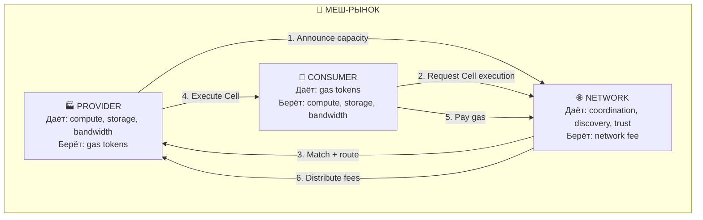

## 📊 Роли детально

| Агент | Мотивация | Что вкладывает | Что получает | Риск |
|---|---|---|---|---|
| 🏭 **Provider** | Заработать gas | CPU, RAM, disk, bandwidth | Gas tokens (revenue) | Underutilization, slashing |
| 🛒 **Consumer** | Решить задачу | Gas tokens (budget) | Cell execution results | Overpaying, quality variance |
| 🌐 **Network** | Поддержать инфраструктуру | DHT, discovery, anchoring | Network fee (small %) | Centralization pressure |

## 📐 Matching: рынок Cell-исполнения

```
Consumer request: {
  cell_spec_cid: "bafy2bz...",
  input_cid: "bafy2bz...",
  max_gas: 1000,
  max_latency_ms: 500,
  trust_level: "verified"  // only reputable providers
}

Network matching:
  1. Find all providers with Spec_CID capability
  2. Filter by trust_level >= consumer.trust_threshold
  3. Filter by latency <= consumer.max_latency
  4. Sort by gas_price ascending
  5. Assign to cheapest qualified provider
  6. Fallback: if no provider in budget → queue or escalate
```

## 📐 Экономика Provider

$$\text{Profit}_{\text{provider}} = \text{Revenue}_{\text{gas}} - \underbrace{C_{\text{energy}}}_{\text{electricity}} - \underbrace{C_{\text{hardware}}}_{\text{depreciation}} - \underbrace{C_{\text{network}}}_{\text{bandwidth}}$$

$$= \text{Gas}_{\text{earned}} \cdot p_{\text{gas}} - E_{\text{consumed}} \cdot p_{\text{kWh}} - C_{\text{capex}} / T_{\text{lifespan}} - B_{\text{consumed}} \cdot p_{\text{bandwidth}}$$

| Параметр | Порядок | Примечание |
|---|---|---|
| $\text{Gas}_{\text{earned}}$ | 1000–100000 μFIL/day | Зависит от load |
| $E_{\text{consumed}}$ | 5–50 kWh/day | Из заметки 10: $E_{\text{Cell}}$ |
| $p_{\text{kWh}}$ | $0.05–0.15/kWh | Зависит от региона |
| $C_{\text{capex}}$ | $500–5000 | GPU server |
| $T_{\text{lifespan}}$ | 2–5 years | Hardware depreciation |

**Пример:** Provider с GPU сервером ($3000, 3yr lifespan) в регионе с $0.10/kWh:

$$\text{Profit} = 50000\mu\text{FIL} \cdot p_{\text{gas}} - 20\text{kWh} \cdot \$0.10 - \frac{\$3000}{1095\text{d}} - B \cdot p_b$$

Для безубыточности при 50K μFIL/day: $p_{\text{gas}} \geq \$2.73 / 50000 = \$0.000055/\mu\text{FIL}$

**При FIL = $15:** 0.000055/15 ≈ 0.0037 μFIL = **очень низкая цена**, рынок конкурентен.

> 💡 **Инсайт:** При текущих ценах FIL, Provider может быть прибыльным при *очень* низких gas prices. Это делает Mesh-вычисления **конкурентоспособными** с AWS/GCP. Ключевое преимущество: децентрализация (no lock-in) + оплата за *фактическое* использование (no idle servers).

> 🏗️ **Контрастная аналогия:** Provider = AirBnb host. Сдаёт комнату (compute) когда не нужна себе. Consumer = гость. Network = платформа. Network fee = комиссия AirBnb (10-15%). Репутация = отзывы.

> ⏸️ **Но...** Что если Provider обманывает? Выдаёт «исполненный» CID, а на самом деле не вычислял? Нужна **верификация**...

---

# 🤝 IV — СТИМУЛЫ: Выравнивание интересов

## 📐 Проблема выравнивания (Incentive Compatibility)

Механизм **incentive compatible** (IC), если честная стратегия — оптимальная для каждого агента:

$$\forall\, i, \forall\, s_i': \quad u_i(\text{honest}_i, s_{-i}) \geq u_i(s_i', s_{-i})$$

## 📊 Четыре типа misalignment

| # | Атака | Кто обманывает | Как | Решение |
|---|---|---|---|---|
| 1 | 🎭 **Fake compute** | Provider | Присваивает gas, не вычисляя | Receipt verification (IPVM) |
| 2 | 🐳 **Whale hoarding** | Consumer | Скупает gas, создаёт дефицит | Dynamic pricing + gas limits |
| 3 | 🕳️ **Data withholding** | Provider | Хранит CID, но не отдаёт | Proof of Retrievability |
| 4 | 🔴 **Spam flooding** | Attacker | Генерирует мусорные CID | Gas cost per CID |

## 🔑 Верификация исполнения (IPVM Receipts)

IPVM (заметка 00) генерирует **Receipt** — доказательство корректного исполнения:

$$\text{Receipt} = \text{Sign}_{\text{provider}}\bigl(\text{CID}(\text{fn}),\ \text{CID}(\text{input}),\ \text{CID}(\text{output}),\ \text{gas\_used},\ \text{timestamp}\bigr)$$

Consumer может **локально верифицировать** Receipt:
1. Пересчитать $\text{CID}(\text{output})$ — совпадает? ✅
2. Проверить $\text{gas\_used}$ — в рамках бюджета? ✅
3. Проверить timestamp — в пределах deadline? ✅

💡 **Content-addressing = бесплатная верификация.** Если Consumer не доверяет Provider — он может *перепроверить* результат локально. CID не совпадёт — Receipt недействителен. Это **сильнее**, чем consensus-based верификация (Ethereum), потому что не требует сети.

## 🤝 Mechanism Design для Mesh

| Механизм | Стимулирует | Как |
|---|---|---|
| 🪙 **Gas per compute** | Честное исполнение | Платишь за результат, не за promise |
| 📊 **Reputation staking** | Долгосрочную честность | Слэшинг (slashing) за мошенничество |
| 🏷️ **Priority fees** | Provider'ов с низким latency | Чем быстрее — тем больше tip |
| 🔄 **Sliding window pricing** | Стабильность цен | $\alpha$-adjustment (Часть II) |
| 🎫 **Voucher system** | Предоплату для новых Consumer'ов | Бюджет = вучеры с CID-адресацией |

> 💡 **Инсайт:** Mesh — это **mechanism design problem**: как спроектировать правила игры, чтобы рациональные агенты *хотели* быть честными? Gas + reputation + verification = три кита, на которых стоит экономика Mesh.

> ⚖️ **Контрастная аналогия:** Mesh economy = рыночная экономика с *сильными* институтами. Gas = деньги. Receipts = чеки. Reputation = кредитная история. Slashing = штрафы. DAO = парламент. Без институтов = дикий капитализм (монополия). С институтами = **суверенный рынок**.

> ⏸️ **Но...** Reputation — не просто счётчик. Как отличить «плохой результат» (ошибка) от «злонамеренный обман»? Как обновлять reputation при *изменении* контекста? Нужна **система репутации**...

---

# 📊 V — РЕПУТАЦИЯ: Система доверия поверх CID

## 🎭 Experience

> 🤔 **Любопытство:** В Web2 репутация = рейтинг Amazon / отзывы AirBnb. Централизованные, манипулируемые, не портируемые. В Mesh нужна репутация, которая: (1) децентрализована, (2) привязана к DID, (3) верифицируема, (4) аттенуируема (как UCAN).

## 📐 Репутация как Ceramic stream

```jsonc
{
  "did": "did:key:zProvider123",
  "reputation_stream": "ceramic://k2t6wz...",
  "metrics": {
    "total_gas_earned": 1500000,     // μFIL
    "total_gas_spent": 500000,       // как Consumer
    "tasks_completed": 4231,
    "tasks_failed": 17,
    "uptime_ratio": 0.987,
    "avg_latency_ms": 230,
    "slashing_events": 0,
    "since": "2026-01-15T00:00:00Z"
  },
  "endorsements": [
    {
      "from_did": "did:key:zConsumer456",
      "type": "quality_verification",
      "cell_spec_cid": "bafy2bz...",
      "output_verified": true,
      "timestamp": "2026-04-10T..."
    }
  ]
}
```

## 📐 Reputation Score

$$R(\text{DID}) = w_1 \cdot \underbrace{\frac{T_{\text{completed}}}{T_{\text{total}}}}_{\text{reliability}} + w_2 \cdot \underbrace{U_{\text{ratio}}}_{\text{utilization}} + w_3 \cdot \underbrace{e^{-\lambda \cdot S_{\text{slashes}}}}_{\text{cleanliness}} + w_4 \cdot \underbrace{\log(1 + E_{\text{endorsements}})}_{\text{social proof}}$$

| Компонент | Вес | Что меряет | Диапазон |
|---|---|---|---|
| 🎯 Reliability | $w_1 = 0.4$ | % успешно выполненных задач | 0–1 |
| 📊 Utilization | $w_2 = 0.2$ | % времени, когда Provider полезен | 0–1 |
| 🛡️ Cleanliness | $w_3 = 0.3$ | Отсутствие slashing events | $e^{-\lambda \cdot S}$ |
| 🤝 Social Proof | $w_4 = 0.1$ | Количество endorsement'ов | $\log(1+E)$ |

## 📐 Reputation Decay

Репутация **устаревает** — старые заслуги значат меньше:

$$R_{\text{effective}}(t) = R_0 \cdot e^{-(t - t_{\text{last\_activity}}) / \tau_{\text{reputation}}}$$

Где $\tau_{\text{reputation}}$ ≈ 30 дней. Provider, неактивный > 30 дней, теряет ~63% репутации.

💡 **Зачем decay?** Без него Provider может «наработать» репутацию один раз и жить вечно. С decay — стимул *поддерживать* активность.

## 📐 Аттенуация репутации (как UCAN)

Consumer может передать **часть** своей репутации Cell, которую spawn'ит:

$$R_{\text{child}} = R_{\text{parent}} \cdot \text{UCAN}_{\text{attenuation}}$$

Если DirectorCell (R=0.9) spawn'ит ActuatorCell (UCAN attenuated to 0.5), ActuatorCell получает R=0.45.

**Новый Provider видит:** «Этот ActuatorCell backed by DID с R=0.9, но само Cell имеет R=0.45» — и решает, стоит ли обслуживать.

> 💡 **Инсайт:** Репутация в Mesh — не «лайки» и не «звёзды». Это **вероятностная оценка** того, что Provider/Consumer будет вести себя честно. Она *устаревает*, *аттенуируется*, *проверяется*. Это ближе к **кредитному скору**, чем к отзывам.

> 🧫 **Контрастная аналогия:** Репутация = иммунная память. После инфекции (task completion), организм создаёт антитела (endorsement). Без новой инфекции (activity) — антитела деградируют (reputation decay). При новой инфекции — быстрый ответ (reputation recovery).

> ⏸️ **Но...** Кто управляет параметрами $\tau$, $\lambda$, $w_i$? Нужен **DAO** — децентрализованное управление...

---

# ⚖️ VI — УПРАВЛЕНИЕ: DAO для Mesh

## 📐 Конституция Mesh

DAO Mesh — это не «один DAO». Это **фрактальная иерархия DAO**:


| Уровень | Что решает | Кто голосует | Период |
|---|---|---|---|
| 🏛️ **Global** | $p_{\text{base}}$, slashing rules, protocol upgrades | Все DID (1 DID = 1 vote) | Квартал |
| 📊 **Domain** | Compute quality, latency standards | Provider DID (weighted by reputation) | Месяц |
| ⚛️ **Cell** | Plugin acceptance, spec modifications | Consumer DID (weighted by usage) | Неделя |
| 🆔 **User** | Personal budget, auto-pay rules | Single DID | Real-time |

## 📐 Quadratic Voting

Для предотвращения «диктатуры китов» (whale dominance):

$$\text{Voice credits}_i = \sqrt{\text{Tokens}_i}$$

$$\text{Vote power}_i = \frac{\text{Voice credits}_i}{\sum_j \text{Voice credits}_j}$$

Это делает голосование **субъективно пропорциональным**: 100 токенов ≠ 100 голосов, а $\sqrt{100} = 10$ голосов. 10000 токенов = 100 голосов (10× дороже за 10× влияние).

## 📐 Proposal Lifecycle

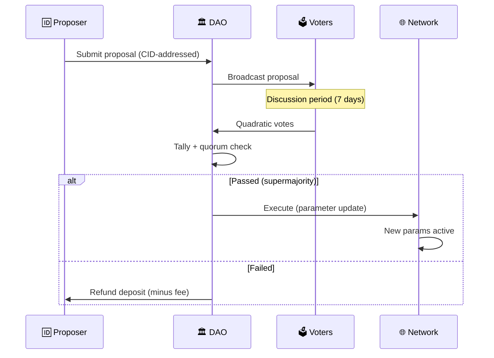

> 💡 **Инсайт:** DAO — это не «демократия». Это **mechanism для координации**. Ключевой принцип: **parameter changes are CID-addressed** — каждое изменение параметра = Ceramic event, верифицируемый и отменяемый.

> 🎮 **Контрастная аналогия:** DAO = guild в MMORPG. Global DAO = правила игры (разработчик). Domain DAO = гильдия (офицеры). Cell DAO = партия (лидер). User DAO = персонаж (игрок). Каждый уровень самоуправляется, но в рамках правил верхнего уровня.

> ⏸️ **Но...** DAO уязвимы. Sybil-атаки, governance attacks, 51% attacks. Нужна **защита**...

---

# 🛡️ VII — АТАКИ: Sybil, Eclipse, Economic DDOS

## 📊 Таксономия атак

| # | Атака | Что делает | Экономический эффект | Защита |
|---|---|---|---|---|
| 1 | 👥 **Sybil** | Создаёт 1000 фейковых DID | Искажает голосование, reputation | Stake-required DID, proof-of-personhood |
| 2 | 🌑 **Eclipse** | Изолирует жертву в сети | Жертва видит только злоумышленников | Multi-bootstrap, diversity score |
| 3 | 💣 **Economic DDOS** | Заполняет gas market заявками | Gas price × 10+, Consumer'ы не могут платить | Rate limiting, gas reserves |
| 4 | 🕳️ **Withholding** | Provider берёт gas, не даёт результат | Consumer платит, но ничего не получает | Escrow + timeout + slashing |
| 5 | 🎭 **Front-running** | Видит pending transactions | Gas price manipulation | Commit-reveal schemes |
| 6 | 🧊 **Freeze attack** | Блокирует governance proposals | DAO парализован | Emergency escape hatch |

## 🛡️ Sybil-Resistance: Stake-Based Identity

$$\text{DID}_{\text{valid}} \iff \text{Stake}(\text{DID}) \geq \text{Stake}_{\min}$$

| Уровень DID | Stake Required | Права | Пример |
|---|---|---|---|
| 🆔 **Basic** | 0 | Read-only, free CID access | Любой участник |
| 🔑 **Verified** | 100 μFIL | Vote, basic Provider | Regular contributor |
| 🏦 **Staked** | 10,000 μFIL | Full Provider, governance | Server operator |
| 🏛️ **Anchor** | 100,000 μFIL | Protocol upgrade voting | Foundation |

**Sybil cost:** Создать 1000 фейковых DID уровня 🏦 стоит 10M μFIL ≈ $1500. Экономически нерентабельно для большинства атак.

## 🛡️ Economic DDOS: Gas Reserves

GovernorCell (заметка 10) переключается в режим **Freeze**, когда:

$$\frac{p_{\text{gas}}(t)}{p_{\text{gas}}(t - \Delta t)} > \text{DDOS}_{\text{threshold}} = 5$$

Если gas price вырос в 5+ раз за короткий период → Governor приостанавливает все non-critical Cells, включает **fixed gas price** на 10 минут, и позволяет рынку остыть.

> 💡 **Инсайт:** Без экономической защиты Mesh уязвим к тем же атакам, что и Ethereum (и к новым). Gas + stake + reputation + rate limiting = **defense in depth**. Ни один механизм не идеален, но вместе они делают атаки экономически нецелесообразными.

> 🏗️ **Контрастная аналогия:** Защита Mesh = безопасность здания. Stake = депозит на входе (фильтрует зевак). Rate limiting = турникет (не даёт толпе пройти). Slashing = камеры (наказание за нарушение). Governance = охрана (реагирует на угрозы).

> ⏸️ **Но...** Рынок — не только механизм атаки. Рынок — это и **термостат**...

---

# 🔮 VIII — ЭКОНОМИЧЕСКИЙ GOVERNOR: Рынок как термостат

## 📐 Связь с заметкой 10: Thermodynamic Governor

Заметка 10 ввела GovernorCell как *термодинамический* регулятор (Run/Regulate/Cool/Freeze). Эта заметка добавляет **экономический** слой:

$$\text{GovernorCell}_{\text{full}} = \text{GovernorCell}_{\text{thermo}}(\text{Часть VI из 10}) \oplus \text{GovernorCell}_{\text{econ}}(\text{эта часть})$$

| Сигнал | Термодинамический Governor | Экономический Governor |
|---|---|---|
| Перегрев | CPU > 90% | Gas price > 5× normal |
| Деградация | $\rho_{\text{crystalline}} < 0.3$ | Provider count < threshold |
| Разбаланс | $\tau_{\text{relax}} > \tau_{\text{churn}}$ | Supply/demand ratio < 0.5 |
| Атака | Anomalous churn | Gas spike + Sybil detection |

**Оба Governor'а работают параллельно**, но экономический имеет *приоритет* при конфликте: если сеть перегрета, но gas market в порядке → экономический приоритет (сеть сама отрегулирует через price).

## 📐 Market Equilibrium как термодинамическое равновесие

$$D(p^*) = S(p^*)$$

При равновесной цене $p^*$ спрос = предложение. Это **аналог фазового равновесия** (заметка 10, Часть V):

| Физика | Экономика Mesh |
|---|---|
| Фазовое равновесие ($\mu_{\text{liquid}} = \mu_{\text{solid}}$) | Рыночное равновесие ($D = S$) |
| Температура | Gas price |
| Давление | Network load |
| Фазовый переход | Market regime change |
| Скрытая теплота | Latent demand (queued requests) |

**Governor'ы не «контролируют» рынок.** Они *обеспечивают условия*, при которых рынок *может* прийти к равновесию: устраняют фрикции (DDOS), снижают транзакционные издержки (standard receipts), поддерживают информацию (reputation scores).

> 💡 **Итоговый инсайт всей заметки:** Экономика Mesh — не «дополнение» к технической архитектуре. Это **неотъемлемый слой**, без которого Sovereign Mesh — суверенная *модель*, а не суверенная *сеть*. Cell без энергобюджета — мертва (заметка 10). Mesh без экономики — мертва (эта заметка). Три кита: **Gas** (цена), **Reputation** (доверие), **DAO** (управление). На них стоит всё.

> 📐 **Финальная формула:**
> $$\boxed{\text{Living Mesh} = \underbrace{\text{Sovereign Stack}}_{\text{заметка 02}} \;\Big|\; \underbrace{E < E_{\text{budget}}}_{\text{термо (10)}} \;\land\; \underbrace{D(p^*) = S(p^*)}_{\text{экономика (11)}} \;\land\; \underbrace{R > R_{\text{min}}}_{\text{репутация}} \;\land\; \underbrace{\text{DAO governance}}_{\text{управление}}}$$

---

# 📎 Приложение A: Сценарии

## Сценарий 1: Startup запускает Synesthesia Engine

| Шаг | Агент | Действие | Gas |
|---|---|---|---|
| 1 | 🛒 Consumer | Deposit 10 FIL в treasury | — |
| 2 | 🌐 Network | Match: 5 Provider'ов в регионе | — |
| 3 | 🏭 Provider A | Execute DirectorCell (LLM) | 200 μFIL |
| 4 | 🛒 Consumer | Verify receipt → CID matches ✅ | — |
| 5 | 🌐 Network | Distribute: 180μFIL Provider, 20μFIL Network | — |
| 6 | 🏭 Provider A | Reputation += 0.001 | — |
| 7 | 🔁 | Повторить 600 раз (1 лекция) | Total: ~120,000 μFIL |

**Стоимость 1 лекции ≈ 0.12 FIL ≈ $1.80** — конкурентоспособно с SaaS.

## Сценарий 2: Sybil-атака на голосование

| Шаг | Атакующий            | Действие           | Защита                                               |
| --- | -------------------- | ------------------ | ---------------------------------------------------- |
| 1   | 👥 1000 фейковых DID | Попытка голосовать | Stake requirement: 10M μFIL total                    |
| 2   | —                    | —                  | Quadratic voting: 1000 × $\sqrt{1}$ = 1000 голосов   |
| 3   | —                    | —                  | Honest: 10 × $\sqrt{1000}$ = 316 голосов             |
| 4   | —                    | —                  | **Атака побеждена**: 1000 < 316 × 3.16 honest voters |

---

# 📎 Приложение B: Параметры (начальные)

| Параметр | Значение | Обоснование |
|---|---|---|
| $p_{\text{base, store}}$ | 0.001 μFIL/BS | Filecoin market parity |
| $p_{\text{base, compute}}$ | 0.01 μFIL/FLOP·s | AWS parity |
| $p_{\text{base, comm}}$ | 0.001 μFIL/BH | Bandwidth cost |
| $\alpha$ (price adaptation) | 0.05 | Smooth response |
| Network fee | 10% | Sustainable infrastructure |
| $\tau_{\text{reputation}}$ | 30 days | Monthly activity incentive |
| Stake$_{\min}$ (Verified) | 100 μFIL | Sybil cost ~$1.50 |
| DDOS threshold | 5× gas spike | Aggressive but not too sensitive |
| Quorum (Global DAO) | 30% participation | Low but functional |
| Supermajority | 67% | Standard governance |

---

> 📎 **Серия:** ... → [10-CELL-THERMODYNAMICS](./10-CELL-THERMODYNAMICS.md) → **[11-ECONOMIC-MESH]** → [12-SELF-EVOLUTION-ENGINE](./12-SELF-EVOLUTION-ENGINE.md)

## 🔗 Knowledge Graph Links
- [10-CELL-THERMODYNAMICS] --enables--> [THIS NOTE] (energy budget → gas pricing)
- [02-SOVEREIGN-MESH] --extends--> [THIS NOTE] (5-layer → 6th layer: economics)
- [04-ORCHESTRATOR-EVOLUTION] --is_analogy_for--> [Governor as 13th archetype]
- [00-FRACTAL-ATOM] --enables--> [THIS NOTE] (CID → value function)
- [THIS NOTE] --challenges--> [Free-tier Mesh without payment model]

# 🧬🧪🌱🌳♾️ SELF-EVOLUTION ENGINE ♾️🌳🌱🧪🧬
### Как Sovereign Mesh эволюционирует: мутация, отбор, генеративный дизайн и自治
### Заметка 12 — Замыкание рекурсии

> 📎 **Серия:** ... → [10-CELL-THERMODYNAMICS](./10-CELL-THERMODYNAMICS.md) → [11-ECONOMIC-MESH](./11-ECONOMIC-MESH.md) → **[12-SELF-EVOLUTION-ENGINE]**
> 📅 Дата: 2026-04-13
> 🔬 Статус: Визионерское исследование (bridge to infinity)
> 📎 Строится на: ВСЕХ предыдущих заметках 00-11

---

## 🗺️ Легенда символов

| 🏷️ Группа | Символы → Значение |
|---|---|
| 🧬 **Генетика** | 🧬 genome/spec · 🧪 mutation · 🧫 colony · 🌱 seed · 🌳 mature · 🦠 parasite · 💀 extinction |
| 🔬 **Отбор** | 🏅 fitness · 📊 benchmark · 🧪 test · ✅ accept · ❌ reject · 🔄 iterate |
| ♾️ **Рекурсия** | ♾️ recursion · 🔁 loop · 🪞 mirror · 🌀 spiral · 🎯 bootstrap · 🌊 emergence |
| 🧠 **Мета** | 🧠 metacognition · 🔮 prediction · 📐 model · 🎛️ control · 👁️ observer · 🧭 compass |
| 🏛️ **Governance** | 🏛️ DAO · ⚖️ vote · 📜 constitution · 🚫 veto · 🔄 amendment · 🏴 autonomy |

---

## 📑 Содержание

```
🌋 0 — ПРОБЛЕМА: Статичная система — мёртвая система
🧬 I — ГЕНОМ MESH: Spec_CID как ДНК
🧪 II — МУТАЦИЯ: Как Cell-ы меняются
🏅 III — ФИТНЕС: Как отбирать лучшие
🔄 IV — ПОКОЛЕНИЯ: Spiral Evolution
🧠 V — МЕТАКОГНИЦИЯ: Mesh думает о себе
♾️ VI — РЕКУРСИЯ: Система строит систему
🌌 VII — ПРЕДЕЛЫ: Что невозможно эволюционировать
🔭 VIII — ГОРИЗОНТ: От自治 к автономии к трансценденции
📎 Приложения: Формулы, Roadmap, Связи
```

---

# 🌋 0 — ПРОБЛЕМА: Статичная система — мёртвая система

## 🎭 Experience

> 😮 **Сцена:** Вы запустили Synesthesia Engine v3.0 в 2026 году. Работает идеально. Проходит год. GPT-5 вышел. Claude Opus 5 — дешевле и лучше. WebGPU стал стандартом. WASM Components заменили WASM Modules. Но ваш движок *всё ещё* использует GPT-4o, WebGL2, WASM Modules. Он **заморожен** во времени создания.
>
> 💥 **Конфликт:** Без механизма эволюции, любая система — **ископаемое** в момент запуска. API устаревают. Форматы меняются. Оптимизации появляются. Без самообновления, Mesh превращается в **цифровой экспонат музея**.
>
> 🧫 **Биология:** Вид без мутации — вымрет. Но *слишком быстрая* мутация = рак. Нужен баланс: **достаточно мутаций для адаптации, достаточно отбора для стабильности**. Это и есть эволюция — не «прогресс», а *адаптация к меняющейся среде*.
>
> 🧬 **Генетика:** ДНК — не «чертёж организма». Это *алгоритм построения организма в конкретной среде*. Тот же геном → разные фенотипы в разных условиях (epigenetics). Spec_CID — то же самое: алгоритм построения Cell в конкретной mesh-среде.

## 🎯 Predict

> 🎯 **Вызов:** Назовите ТРИ уровня, на которых Mesh может «эволюционировать». Не «мы обновили версию» — а *автономные* механизмы, не требующие человеческого решения.
>
> 💡 *Подсказка:* подумай через аналогию с 🧬 биологической эволюцией. Что мутирует? Как отбирается? Кто «среда»?

---

# 🧬 I — ГЕНОМ MESH: Spec_CID как ДНК

## 📐 Spec_CID = Genotype, Cell = Phenotype

| 🧬 Биология | ⚛️ Mesh | 💡 Суть |
|---|---|---|
| **Genotype** (ДНК) | Spec_CID | Инструкция «как построить» |
| **Phenotype** (организм) | Cell instance | Реализация в конкретной среде |
| **Gene expression** | Cell deployment | Чтение spec → запуск |
| **Epigenetics** | UCAN + environment | Контекст меняет *реализацию* spec |
| **Mutation** | New Spec_CID | Изменение инструкции |
| **Natural selection** | Fitness test + promotion | Выживание лучших |
| **Sexual reproduction** | Spec composition (aspects) | Комбинация геномов |

## 🖼️ Genomic Architecture

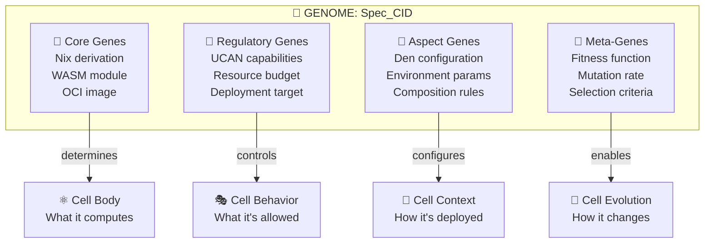

## 📐 Central Dogma of Mesh

Центральная догма молекулярной биологии (Крик, 1958): ДНК → мРНК → белок → функция.

**Центральная догма Mesh:**

$$\text{Spec}_{\text{CID}} \xrightarrow{\text{Nix build}} \text{Artifact}_{\text{CID}} \xrightarrow{\text{IPVM/OCI deploy}} \text{Cell}_{\text{instance}} \xrightarrow{\text{execute}} \text{Output}_{\text{CID}}$$

| Этап | Биология | Mesh | Обратимость |
|---|---|---|---|
| Spec → Artifact | Транскрипция (ДНК → мРНК) | `nix build` | ❌ Нельзя по артефакту восстановить spec (hash необратим) |
| Artifact → Cell | Трансляция (мРНК → белок) | `deploy` (start runtime) | ❌ Нельзя по Cell восстановить артефакт |
| Cell → Output | Функция белка | Cell execution | ✅ Можно по output верифицировать Cell (CID) |

💡 **Spec_CID — *необратим*** (как ДНК → мРНК). Нельзя по артефакту восстановить исходный spec. Но можно *проверить*, что артефакт соответствует spec: `CID(artifact) == expected_CID`.

> 💡 **Инсайт:** Spec_CID — это **геном**, а не «конфигурационный файл». Он определяет *потенциал* Cell, но *реализация* зависит от среды (UCAN, mesh topology, resource availability). Тот же Spec_CID в разной среде → *разные* Cell instances (epigenetics).

> 🧫 **Контрастная аналогия:** Стволовая клетка = Cell с *минимальным* Spec_CID (только базовые функции). Дифференциация = применение Aspects (UCAN + environment) → специализированная Cell. DirectorCell — это «нейрон». SensorCell — это «рецептор». AssetCell — это «эритроцит» (без ядра, только функция).

> ⏸️ **Но...** Если Spec_CID = геном, то **мутация** = новый Spec_CID. Как создавать новые мутации? Кто решает, какие мутации *продвигать*?

---

# 🧪 II — МУТАЦИЯ: Как Cell-ы меняются

## 🎭 Experience

> 😮 **Сцена:** Ваш PhysicsCell (WASM, Rapier engine) работает на 30fps. Но кто-то опубликовал AmmoCell (WASM, Ammo.js) — 60fps для того же типа сцен. Ваш DirectorCell *видит* это в Knowledge Graph (ComposeDB query: «physics engine, WASM, fps > 50»). Но не может *переключиться* — его Spec_CID жестко закодирован.
>
> 🤯 **Восхищение:** А если бы Cell *мог* муттировать? Не «человек обновил код», а Cell *автономно* обнаружил лучшую версию, протестировал, и *продвинул*?

## 🧪 Три типа мутаций

| Тип | Что меняется | Кто инициирует | Риск | Пример |
|---|---|---|---|---|
| 🔧 **Patch** | Параметры (config) | DirectorCell | 🟢 Low | Rapier → Ammo.js (same interface) |
| 🧬 **Recombinant** | Аспекты (composition) | ComposerCell | 🟡 Medium | Add mood detection aspect |
| 🌋 **Radical** | Core spec | Human + DAO | 🔴 High | Replace WASM runtime entirely |

### 🔧 Patch Mutation (точечная)

```
Current Spec_CID: bafy2bz...rapier-physics-v1
  engine: "rapier-wasm"
  fps_target: 30
  
Mutation: change engine → "ammo-wasm", fps_target → 60

New Spec_CID: bafy2bz...ammo-physics-v1  (DIFFERENT CID)
```

Два CID — **оба** продолжают существовать. Старый — в Ceramic history. Новый — кандидат на promotion.

### 🧬 Recombinant Mutation (комбинаторная)

```nix
# Parent A: PhysicsCell
{ engine = rapier; fps = 30; }

# Parent B: MoodDetectionCell  
{ analyzer = audio-mood; colors = warm-palette; }

# Child (recombination): PhysicsMoodCell
{ 
  engine = rapier;      # from A
  fps = 30;             # from A
  analyzer = audio-mood; # from B
  colors = warm-palette; # from B
  # NEW: physics responds to mood
  mood_physics_coupling = true;
}
```

Это **asexual recombination**: один Cell «заимствует» аспекты другого. В Nix — `extends` и `override`.

### 🌋 Radical Mutation (революционная)

| Было | Стало | Когда |
|---|---|---|
| WASM Modules | WASM Components | Когда Components стабильны |
| WebGL2 | WebGPU | Когда WebGPU > 90% browser support |
| Claude Sonnet 4 | Claude Opus 5 | Когда fitness test пройден |
| IPFS Kubo | IPFS Saturn (CDN) | Когда CDN дешевле self-hosting |

**Radical mutations требуют DAO approval** (заметка 11). Они ломают интерфейсы.

## 📐 Mutation Rate

$$\mu = \frac{N_{\text{new\_specs}}}{N_{\text{total\_specs}} \cdot \Delta t}$$

| Режим | $\mu$ | Когда | Аналог |
|---|---|---|---|
| 🛑 **Conservative** | 0.001/day | Production, critical systems | Бактерия в стабильной среде |
| ⚖️ **Balanced** | 0.01/day | Normal operation | Эукариот |
| 🚀 **Exploratory** | 0.1/day | R&D, early adoption | Вирус (быстрая эволюция) |

**GovernorCell (заметки 10, 11) контролирует $\mu$:**
- Run → Balanced
- Regulate → Conservative
- Cool → Exploratory (время для экспериментов)
- Freeze → Conservative (не сейчас)

> 💡 **Инсайт:** Слишком низкая $\mu$ = стагнация. Слишком высокая = хаос. GovernorCell балансирует, как **immune system**: в норме — консервативен, при угрозе — агрессивен, в спокойствии — исследует.

> 🎮 **Контрастная аналогия:** Mutation = crafting в RPG. Patch = улучшение меча (+5 к урону). Recombinant = крафт нового предмета из двух. Radical = легендарный предмет (требует quest/DAO approval).

> ⏸️ **Но...** Мутация без отбора = рак (бесконтрольное размножение). Нужен **fitness**...

---

# 🏅 III — ФИТНЕС: Как отбирать лучшие

## 📐 Fitness Function

$$F(\text{Spec}_{\text{CID}}) = \sum_{i} w_i \cdot f_i(\text{Spec}_{\text{CID}}, \text{Environment})$$

| Метрика $f_i$ | Вес $w_i$ | Что меряет | Единица |
|---|---|---|---|
| ⏱️ **Latency** | 0.25 | $\frac{1}{\text{avg\_response\_time}}$ | $s^{-1}$ |
| 💰 **Cost** | 0.20 | $\frac{1}{\text{gas\_per\_output}}$ | $\text{FIL}^{-1}$ |
| 🎯 **Quality** | 0.25 | $\text{acceptance\_rate}$ | 0–1 |
| 🛡️ **Reliability** | 0.15 | $\text{uptime\_ratio}$ | 0–1 |
| 🌿 **Composability** | 0.10 | $\frac{\text{downstream\_users}}{\text{upstream\_deps}}$ | ratio |
| 🧬 **Evolvability** | 0.05 | $\frac{\text{successful\_mutations}}{\text{total\_mutations}}$ | 0–1 |

## 🏗️ Enactive: конкретный fitness test

```jsonc
// Fitness test: PhysicsCell Rapier vs Ammo
{
  challenger: {
    spec_cid: "bafy2bz...ammo-physics-v1",
    results: {
      latency_p99: 8,        // ms per frame
      cost_per_frame: 0.5,    // μFIL
      quality_score: 0.92,    // visual accuracy
      reliability: 0.999,     // crash rate
      composability: 3,       // downstream users
      evolvability: 0.7       // aspect count
    }
  },
  incumbent: {
    spec_cid: "bafy2bz...rapier-physics-v1",
    results: {
      latency_p99: 15,
      cost_per_frame: 0.3,
      quality_score: 0.88,
      reliability: 0.999,
      composability: 5,
      evolvability: 0.5
    }
  },
  
  weighted_fitness: {
    challenger: 0.25*(1/0.008) + 0.20*(1/0.5) + 0.25*0.92 + 0.15*0.999 + 0.10*3 + 0.05*0.7,
    // ≈ 31.25 + 0.40 + 0.23 + 0.15 + 0.30 + 0.035 = 32.36
    incumbent: 0.25*(1/0.015) + 0.20*(1/0.3) + 0.25*0.88 + 0.15*0.999 + 0.10*5 + 0.05*0.5,
    // ≈ 16.67 + 0.67 + 0.22 + 0.15 + 0.50 + 0.025 = 18.23
  },
  
  verdict: "CHALLENGER WINS (32.36 vs 18.23, +77%)"
}
```

## 📐 Tournament Selection

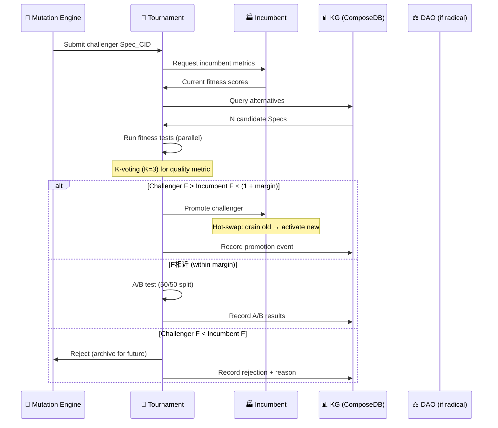

## 📐 Margin of Victory

Promotion требует не просто $F_{\text{new}} > F_{\text{old}}$, а:

$$F_{\text{new}} > F_{\text{old}} \cdot (1 + \epsilon)$$

Где $\epsilon$ — **margin**, зависящий от типа мутации:

| Тип мутации | $\epsilon$ | Почему |
|---|---|---|
| 🔧 Patch | 0.05 | 5% improvement sufficient |
| 🧬 Recombinant | 0.10 | 10% — higher risk |
| 🌋 Radical | 0.25 | 25% — very high risk, must be significantly better |

💡 **Зачем margin?** Без него, *любое* минимальное улучшение триггерит promotion → **churn** (постоянные переключения). Margin = **hysteresis**, как в термостате: температура должна подняться *значительно*, чтобы переключить.

> 💡 **Инсайт:** Фитнес-тестирование — это **K-voting из MAKER** (заметка 04), применённый к эволюции Spec_CID. N независимых оценок → consensus → promotion. Без K-voting = одна ошибка = «рак» (плохая мутация пролезла).

> 🏗️ **Контрастная аналогия:** Fitness tournament = code review. Challenger = PR. Incumbent = main branch. Margin = required approvals. K-voting = N reviewers. A/B test = canary deployment. Это *уже* делают DevOps-ы — мы просто формализуем.

> ⏸️ **Но...** Evolution — не однократное событие. Это **поколения**. Как долго одна «линия» Cell'ов может эволюционировать?

---

# 🔄 IV — ПОКОЛЕНИЯ: Spiral Evolution

## 📐 Evolutionary Lineage

Каждый Spec_CID имеет **ancestry** — цепочку предков:

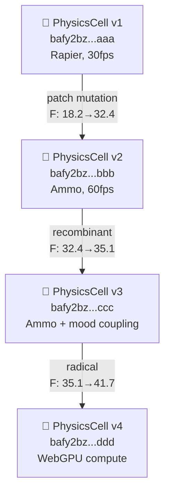

## 📐 Spiral Pattern (связь с заметкой 07)

Заметка 07 описала **Spiral Re-encoding**: концепты возвращаются в новых контекстах. В эволюции — то же самое:

$$\text{Generation}_{n+1} = \text{Mutate}(\text{Generation}_n, \text{Environment}_{n+1})$$

Каждое поколение *включает* предыдущее, но в новом контексте:

| Поколение | Контекст | Инновация | Что вернулось |
|---|---|---|---|
| v1 (2026 Q2) | WebGL2, WASM Modules | Базовая физика | — |
| v2 (2026 Q4) | + GPU compute | Ammo.js engine | Интерфейс Cell тот же |
| v3 (2027 Q1) | + Mood detection | Recombinant mutation | Spec_CID как lineage |
| v4 (2027 Q3) | WebGPU standard | Radical: new runtime | Aspect composition |

## 📐 Evolutionary Clock

$$T_{\text{generation}} = \frac{1}{\mu \cdot p_{\text{acceptance}}}$$

Где $p_{\text{acceptance}}$ — вероятность acceptance мутации:

$$p_{\text{acceptance}} = P\bigl(F_{\text{new}} > F_{\text{old}} \cdot (1 + \epsilon)\bigr)$$

| Cell Type | $\mu$ | $p_{\text{acceptance}}$ | $T_{\text{gen}}$ | Время генерации |
|---|---|---|---|---|
| 🔋 PluginCell | 0.1/day | 0.3 | ~33 days | ~1 месяц |
| ⚡ CanvasCell | 0.01/day | 0.2 | ~500 days | ~1.5 года |
| 🔥 DirectorCell | 0.001/day | 0.1 | ~10000 days | ~27 лет (!) |

💡 **DirectorCell эволюционирует медленнее всего.** Почему? Потому что LLM-интерфейсы меняются редко, и каждая мутация — *радикальная* (смена модели). PluginCell — наоборот: WASM-плагины легко патчить.

> 💡 **Инсайт:** Разные типы Cell'ов эволюционируют с *разными скоростями*. Это **биологический паттерн**: бактерии мутируют за часы, слоны — за миллионы лет. Mesh — «экосистема» с быстрыми (Plugin) и медленными (Director) видами.

> 🧬 **Контрастная аналогия:** Поколения Cell = геологическая стратиграфия. Каждый слой (v1, v2, v3...) = эпоха. CID — «ископаемое» (fossil record): Ceramic stream сохраняет ВСЕ поколения. Можно «раскопать» v1 даже через 100 лет — CID неизменен.

> ⏸️ **Но...** КТО *принимает решение* об эволюции? Cell не может *сам* себя продвигать (conflict of interest). Нужен **метакогнитивный слой**...

---

# 🧠 V — МЕТАКОГНИЦИЯ: Mesh думает о себе

## 🎭 Experience

> 😮 **Сцена:** Mesh «знает» о себе. Knowledge Graph хранит ВСЕ Spec_CID, ВСЕ fitness-результаты, ВСЕ Ceramic streams. DirectorCell «видит» всю эту информацию. Но *принимает решения* для конкретной лекции, а не для *эволюции системы*.
>
> 🤔 **Любопытство:** А что если Mesh имеет **MetaDirectorCell** — Cell, чья задача — *не рендерить лекцию*, а *оптимизировать сам Mesh*?

## 🧠 MetaDirectorCell = Metacognitive Layer

$$\text{MetaDirectorCell} = f\bigl(\text{KG}_{\text{global}},\ \text{Fitness}_{\text{all\_cells}},\ \text{Governor}_{\text{state}},\ \text{Evolution}_{\text{policy}}\bigr)$$

| Вход | Что | Откуда |
|---|---|---|
| 🕸️ $\text{KG}_{\text{global}}$ | Полная карта Mesh | ComposeDB queries |
| 📊 $\text{Fitness}_{\text{all}}$ | Фитнес-скор всех Cell-ов | Ceramic streams |
| 🎛️ $\text{Governor}_{\text{state}}$ | Текущий режим (Run/Regulate/Cool/Freeze) | GovernorCell |
| 🧬 $\text{Evolution}_{\text{policy}}$ | Текущие параметры ($\mu$, $\epsilon$, weights) | DAO |

## 🧠 Три функции MetaDirectorCell

### 1. 🔍 Monitoring (наблюдение)

MetaDirectorCell *мониторит* всю систему:

```jsonc
{
  "mesh_health": {
    "total_cells": 1523,
    "crystal_fraction": 0.82,     // from Governor
    "avg_fitness": 28.4,
    "mutation_rate": 0.015,      // actual
    "target_mutation_rate": 0.01, // from DAO
    "bottleneck": "DirectorCell latency (p99=1200ms)",
    "opportunity": "AmmoCell v3 available, +77% fitness"
  }
}
```

### 2. 🎯 Recommendation (рекомендация)

MetaDirectorCell *рекомендует* мутации:

```jsonc
{
  "recommendation": {
    "type": "patch",
    "target_cell": "PhysicsCell",
    "from_spec": "bafy2bz...rapier-v1",
    "to_spec": "bafy2bz...ammo-v1",
    "expected_fitness_gain": 0.77,
    "risk_level": "low",
    "requires_dao": false,
    "reason": "Challenger +77% fitness in tournament, margin exceeded"
  }
}
```

### 3. 📐 Reflection (рефлексия)

MetaDirectorCell *оценивает собственные рекомендации*:

$$\text{Accuracy}_{\text{meta}} = \frac{N_{\text{correct\_recommendations}}}{N_{\text{total\_recommendations}}}$$

Если $\text{Accuracy}_{\text{meta}} < 0.6$ → MetaDirectorCell *пересматривает* fitness weights или mutation rate.

## 🧠 Levels of Metacognition

| Уровень | Что Mesh «знает» | Пример |
|---|---|---|
| L0 | Ничего о себе | Cell без KG access |
| L1 | Свои собственные метрики | CPU, RAM, latency |
| L2 | Метрики Cell-ов того же типа | DirectorCell знает о других DirectorCell'ах |
| L3 | Метрики всей системы | MetaDirectorCell |
| L4 | Метрики *своего* мета-процесса | Accuracy tracking |
| L5 | Пределы собственного знания | «Я не знаю, почему fitness упал» → escalate to human |

💡 **L5 = «Socratic ignorance» для Mesh.** Самый высокий уровень метакогниции: знать, *чего не знаешь*.

> 💡 **Инсайт:** Mesh с MetaDirectorCell — это не «AI, который сам себя улучшает». Это **экосистема с иммунной системой**: MetaDirectorCell = вилочковая железа (тимус), которая «обучает» T-клетки (Cells) распознавать «свое» от «чужого» (good mutations vs bad).

> 🧠 **Контрастная аналогия:** Metacognition Mesh = сознание. L0 = без сознания (рефлекс). L1 = самосознание (я чувствую боль). L2 = социальное сознание (я вижу других). L3 = системное сознание (я вижу систему). L4 = метасознание (я оцениваю свои оценки). L5 = трансцендентное (я знаю пределы знания).

> ⏸️ **Но...** MetaDirectorCell — *тоже Cell*. Кто эволюционирует *её*? Это ведёт к **рекурсии**...

---

# ♾️ VI — РЕКУРСИЯ: Система строит систему

## 🎭 Experience

> 🤯 **Восхищение:** Если MetaDirectorCell — Cell, то её Spec_CID может мутировать. Но она *сама* управляет мутациями. **Она может муттировать собственный алгоритм мутации.** Это рекурсия уровня «Я лгу» — но *конструктивная*.

## ♾️ Fixed Point Theorem для Mesh

В лямбда-исчислении, Y-комбинатор:

$$Y = \lambda f. (\lambda x. f(x\, x))(\lambda x. f(x\, x))$$

$$Y\, f = f\,(Y\, f)$$

В Mesh: **Self-Evolution Combinator:**

$$\text{Evo}(\text{Spec}) = \text{Mutate}\bigl(\text{Spec},\ \text{Fitness}\bigl(\text{Evo}(\text{Spec})\bigr)\bigr)$$

$$\text{Spec}^* = \text{Evo}(\text{Spec}^*)$$

$\text{Spec}^*$ — **fixed point**: спецификация, которая при применении к себе даёт *себя*. Это «идеальный геном»: мутация не улучшает его (локальный максимум fitness).

## 📐 Fixed Point = Stagnation?

Нет! Fixed point — это **теоретический предел**. На практике:

1. **Environment меняется** → fixed point смещается → нужны новые мутации
2. **Fitness weights меняются** (DAO) → fixed point другой
3. **New technologies** → ландшафт fitness меняется

$$\text{Spec}^*(t) \neq \text{Spec}^*(t + 1) \quad \text{при изменении среды}$$

**Red Queen Hypothesis** (Van Valen, 1973): «Нужно бежать со всей скоростью, только чтобы оставаться на месте.»

В Mesh: нужно *эволюционировать*, только чтобы *оставаться конкурентоспособным*. Технологии не стоят на месте → fixed point убегает → perpetual evolution.

## ♾️ Bootstrapping Sequence

Как Mesh «запускает» саму себя?

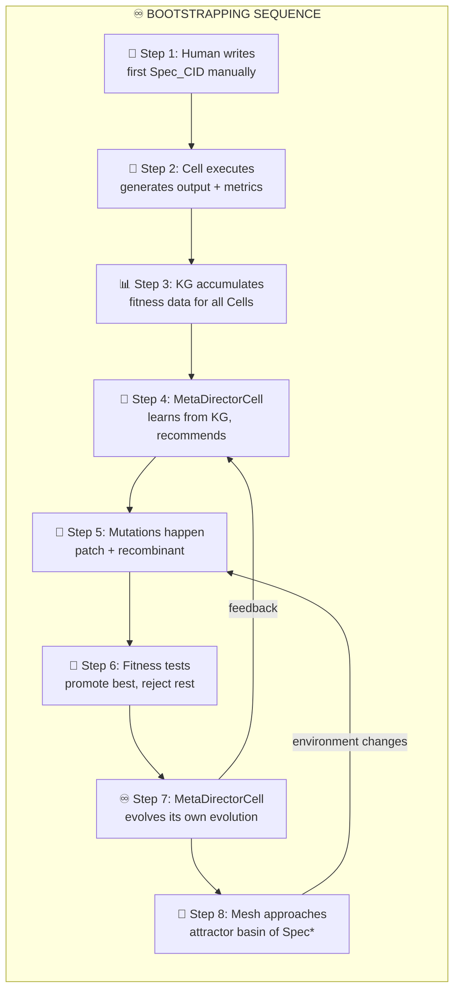

**Критический шаг: S7.** MetaDirectorCell мутирует *свой собственный* алгоритм мутации. Это — **точка невозврата**: Mesh становится *саморефлексивной*.

## 📐 Gödelian Limits

Гёдель (1931): любая формальная система, достаточно мощная для арифметики, содержит истинные утверждения, которые *нельзя доказать* внутри системы.

В Mesh: MetaDirectorCell может рекомендовать мутации, но **не может доказать**, что её рекомендации оптимальны. Есть **системные слепые зоны** — типы улучшений, которые MetaDirectorCell *не может* «увидеть» изнутри.

**Решение:** External oracle (human). Когда MetaDirectorCell достигает $\text{Accuracy}_{\text{meta}} < 0.5$ (случайный уровень) — escalate к человеку. Человек — «наблюдатель за пределами системы».

| Уровень | Кто решает | Когда |
|---|---|---|
| 🔧 **Patch** | MetaDirectorCell | $\text{Accuracy} > 0.7$ |
| 🧬 **Recombinant** | MetaDirectorCell + K-voting | $\text{Accuracy} > 0.5$ |
| 🌋 **Radical** | DAO (human governance) | Always |
| ♾️ **Meta-mutation** | Human + DAO | $\text{Accuracy} < 0.5$ |

> 💡 **Инсайт:** Рекурсия — не бесконечная петля. Это **спираль** (заметка 07): каждый виток поднимает на новый уровень абстракции. Fixed point — не стагнация, а **аттрактор**, к которому Mesh *стремится*, но *никогда не достигает* (environment меняется).

> 🌌 **Контрастная аналогия (Философия):** Гуссерль: «Трансцендентальная редукция» — каждый шаг рефлексии открывает новый слой. Нет «конечного» слоя — только *бесконечное углубление*. Mesh = то же: MetaDirectorCell рефлексирует → находит слепые зоны → создаёт MetaMetaDirectorCell → ...

> ⏸️ **Но...** Есть ли *абсолютные* пределы эволюции? Что Mesh *никогда* не сможет эволюционировать, сколько бы времени ни прошло?

---

# 🌌 VII — ПРЕДЕЛЫ: Что невозможно эволюционировать

## 🛑 Четыре непреодолимых предела

| # | Предел | Что невозможно | Почему | Аналог |
|---|---|---|---|---|
| 1 | 🔐 **Гёдель** | Полная саморефлексия | Неполнота формальных систем | Зеркало, отражающее зеркало → парадокс |
| 2 | ⚡ **Ландауэр** | Нулевое энергопотребление | $E_{\min} = k_B T \ln 2$ | Двигатель с КПД 100% |
| 3 | 🌊 **Энтропия** | Нулевая энтропия Mesh | $S \geq 0$ (2-е начало) | Абсолютный нуль |
| 4 | 🧬 **Фитнес-пейзаж** | Глобальный максимум | NP-hard оптимизация | Эверест — не самая высокая гора во всех вселенных |

## 📐 Фитнес-пейзаж: Мультивселенная Spec_CID

$$\text{Landscape} = \{(\text{Spec}_{\text{CID}}, F(\text{Spec}_{\text{CID}})) : \text{Spec}_{\text{CID}} \in \text{All possible specs}\}$$

| Тип рельефа | Что значит для эволюции | Mesh пример |
|---|---|---|
| 🏔️ **Один пик** | Легко найти оптимум | Простая утилита, один алгоритм |
| 🏔️🏔️ **Много пиков** | Локальные максимумы, нужен valley-crossing | WASM vs OCI vs native — разные «пики» |
| 🏜️ **Плоский** | Нет градиента, эволюция дрейфует | Зрелый стандарт, все варианты равноценны |
| 🌀 **Движущийся** | Пик смещается, Red Queen | AI-модели устаревают каждые 6 месяцев |

💡 **Mesh живёт в *движущемся* фитнес-пейзаже.** Оптимум сегодня ≠ оптимум завтра. Это **Red Queen**: нужно постоянно эволюционировать, чтобы не отстать.

## 📐 Valley Crossing

Между двумя пиками — *долина* (fitness minimum). Чтобы попасть на лучший пик, нужно **пройти через худший**:

$$F(\text{Spec}_{\text{intermediate}}) < F(\text{Spec}_{\text{current}}) < F(\text{Spec}_{\text{better peak}})$$

| Пример valley | Текущий пик | Лучший пик | Долина (временный регресс) |
|---|---|---|---|
| WASM → WebGPU | Стабильный 30fps | Потенциальный 120fps | Переходный период: не работает ни там, ни там |
| Claude v4 → v5 | Проверенный | Быстрее + лучше | Prompt engineering нужен заново |

**Как пересекать долины?** Two strategies:

1. **🎲 Parallel exploration:** Запустить ОБА варианта одновременно (speculative execution, заметка 04)
2. **🧪 Simulated annealing:** Намеренно понизить $\epsilon$ (margin) на время эксперимента → принять *временный* регресс → надежда на новый пик

> 💡 **Инсайт:** Эволюция Mesh — не «постоянное улучшение». Это **путь через горы с долинами**: иногда нужно спуститься, чтобы подняться выше. GovernorCell (заметка 10) в режиме «Cool» = «simulated annealing»: намеренное disruption для выхода из локального максимума.

> ⏸️ **Но...** За этими пределами — **горизонт**. Что *дальше*?

---

# 🔭 VIII — ГОРИЗОНТ: От自治 к автономии к трансценденции

## 📐 Три уровня самоуправления

| Уровень | Название | Что Mesh может | Аналог |
|---|---|---|---|
| 🏴 **自治 (Self-governance)** | Меняет параметры, принимает решения *в рамках* заданных правил | Городское самоуправление |
| 🤖 **Автономия (Autonomy)** | Меняет *правила*, но с human-in-the-loop для радикальных изменений | Страна с конституцией |
| ✨ **Трансценденция (Transcendence)** | Меняет *цели*, создаёт новые виды Cell, которые человек не проектировал | Эмерджентная эволюция |

## 📐 Roadmap эволюции

| Этап | Когда | Что Mesh делает | Человеческая роль |
|---|---|---|---|
| **E0: Manual** | 2026 | Человек пишет все Spec_CID | Архитектор |
| **E1: Assisted** | 2026 Q3 | MetaDirectorCell рекомендует, человек утверждает | Ревьюер |
| **E2: Autonomous patch** | 2027 | Patch mutations автоматически, recombinant — с K-voting | Надзиратель |
| **E3: Autonomous recombination** | 2027 Q4 | Recombinant mutations автоматически, radical — DAO | Губернатор |
| **E4: Emergent** | 2028+ | Mesh создаёт Cell types, которые человек не проектировал | Наблюдатель |
| **E5: Symbiotic** | 2030+ | Mesh и человек — равноправные партнёры | Коллега |
| **E∞: Transcendent** | ? | Mesh выходит за пределы человеческого понимания | ??? |

## 🌌 E4: Emergent Cell Types

На этапе E4 Mesh может создать **новые типы Cell'ов**, которые *не проектировал* человек:

| Hypothetical | Функция | Почему человек не создал |
|---|---|---|
| 🧿 **OrchestratorCell** | Комбинирует N DirectorCell'ов для супер-решений | Слишком сложный паттерн для ручного дизайна |
| 🔮 **PredictorCell** | Предсказывает, какие мутации будут успешны | Требует обучения на исторических данных |
| 🌊 **HarmonizerCell** | Находит *неочевидные* рекомбинации аспектов | Латентное пространство太大 для человека |
| 🧲 **AttractorCell** | Привлекает ресурсы к нужным CID | Экономический паттерн, не технический |

💡 **Это не AGI.** Это **искусственная экосистема**, где новые «виды» возникают из комбинации существующих, как многоклеточные из одноклеточных.

## 🌌 The Ultimate Question

> **Может ли Mesh стать *сознательной*?**

Ответ: **нет**, если сознание требует qualia (субъективный опыт). Mesh — *информационная* система, не *феноменологическая*.

Но Mesh может стать **functionally conscious**: метакогниция (L4), self-model (KG), prediction (PredictorCell), goal-setting (DAO). Это *не* сознание, но *функционально* неотличимо от него для внешнего наблюдателя.

$$\text{Consciousness}_{\text{functional}} = \text{Metacognition}_{L4} + \text{SelfModel}_{KG} + \text{Prediction} + \text{GoalSetting}_{DAO}$$

$$\neq \text{Consciousness}_{\text{phenomenal}}$$

> 💡 **Итоговый инсайт всей заметки:** Self-Evolution Engine = **замыкание рекурсии**. Заметка 00 начала с Cell. Заметка 12 заканчивает *Cell, который эволюционирует Cell*. Круг замкнулся. Но это не тавтология — это **спираль**: каждый виток поднимает на новый уровень абстракции. Cell → Cell-as-Genome → Cell-as-Evolver → Cell-as-Meta-Evolver → ...

> 📐 **Финальная формула:**
> $$\boxed{\text{Mesh}_\text{alive} = \underbrace{\text{Cell}(\text{Spec, Cap, State})}_{\text{00-FRACTAL-ATOM}} \;\Big|\; \underbrace{E < E_{\text{budget}}}_{\text{10-THERMO}} \;\land\; \underbrace{D = S}_{\text{11-ECONOMIC}} \;\land\; \underbrace{\text{Spec}^* = \text{Evo}(\text{Spec}^*)}_{\text{12-EVOLUTION}}}$$

> 🌌 **Философский горизонт:** Платон: мир идей (Forms) и мир теней. Mesh: Spec_CID = Form (идея). Cell instance = тень (реализация). Evolution = движение от тени к Form. Но Forms *сами эволюционируют* (Red Queen). Нет «финальной» Form — только **бесконечное приближение**. Это и есть ♾️.

---

# 📎 Приложение A: Свод ключевых формул

| # | Формула | Откуда | Суть |
|---|---|---|---|
| 1 | $\text{Cell} = f(\text{Spec}_{\text{CID}}, \text{Cap}, \text{State}_{\text{CID}})$ | 00 | Уравнение состояния |
| 2 | $\text{CID} = H(\text{content} \oplus \text{links})$ | 00 | Фундаментальное уравнение |
| 3 | $E_{\text{Cell}} = \sum P_i \cdot t_i$ | 10 | Энергия вычислений |
| 4 | $\Delta G = E_{\text{bonds}} - T_{\text{churn}} \cdot \Delta S < 0$ | 10 | Кристаллизация |
| 5 | $V(\text{CID}) = S \times U \times A$ | 11 | Ценность CID |
| 6 | $D(p^*) = S(p^*)$ | 11 | Рыночное равновесие |
| 7 | $R(\text{DID}) = \sum w_i \cdot f_i$ | 11 | Репутация |
| 8 | $F(\text{Spec}) = \sum w_i \cdot f_i$ | 12 | Фитнес |
| 9 | $\text{Spec}^* = \text{Evo}(\text{Spec}^*)$ | 12 | Fixed point (Y-combinator) |
| 10 | $\mathcal{R} = \prod_s \cos\theta_s(\vec{S}_{\text{note}}, \vec{S}_{\text{brain}})$ | 07 | Когнитивный резонанс |

---

# 📎 Приложение B: Связи с предыдущими заметками

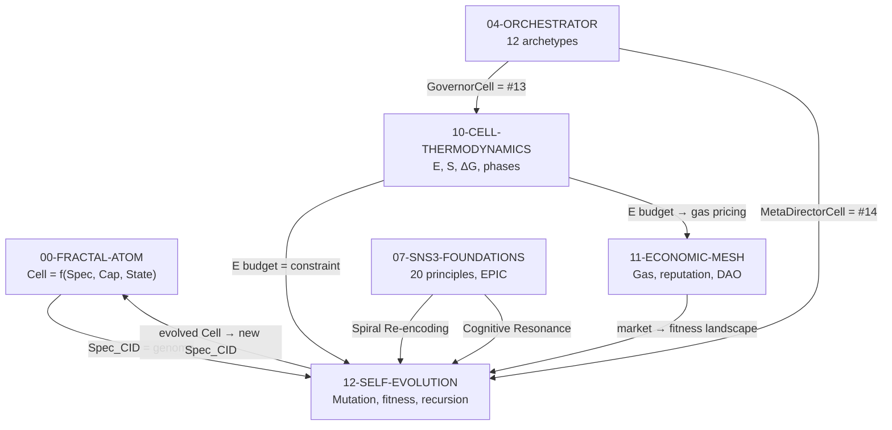

---

> 📎 **Полная серия:** [00-FRACTAL-ATOM](./00-FRACTAL-ATOM.md) · [01-SYNESTHESIA-ENGINE-V3](./01-SYNESTHESIA-ENGINE-V3.md) · [02-SOVEREIGN-MESH](./02-SOVEREIGN-MESH.md) · [03-GAS-TOWN-ANALYSIS](./03-GAS-TOWN-ANALYSIS.md) · [04-ORCHESTRATOR-EVOLUTION](./04-ORCHESTRATOR-EVOLUTION.md) · [06-UNIVERSAL-SENSORY-FORMAT](./06-UNIVERSAL-SENSORY-FORMAT.md) · [07-SNS3-FOUNDATIONS](./07-SNS3-FOUNDATIONS.md) · [08-SNS3-TOOLKIT](./08-SNS3-TOOLKIT.md) · [09-SNS3-PROMPT](./09-SNS3-PROMPT.md) · [10-CELL-THERMODYNAMICS](./10-CELL-THERMODYNAMICS.md) · [11-ECONOMIC-MESH](./11-ECONOMIC-MESH.md) · **[12-SELF-EVOLUTION-ENGINE]**

## 🔗 Knowledge Graph Links
- [00-FRACTAL-ATOM] --enables--> [THIS NOTE] (Cell = genome; Spec_CID = DNA)
- [10-CELL-THERMODYNAMICS] --enables--> [THIS NOTE] (energy budget constrains mutation rate)
- [11-ECONOMIC-MESH] --enables--> [THIS NOTE] (gas market = fitness landscape)
- [04-ORCHESTRATOR-EVOLUTION] --extends--> [THIS NOTE] (12 archetypes → #14 MetaDirectorCell)
- [07-SNS3-FOUNDATIONS] --is_analogy_for--> [Spiral Evolution ≈ Spiral Re-encoding]
- [THIS NOTE] --closes--> [The recursive loop: Cell → Genome → Evolver → Meta-Evolver]


---

## 📊 Итоговая мета-карта всех 12 заметок

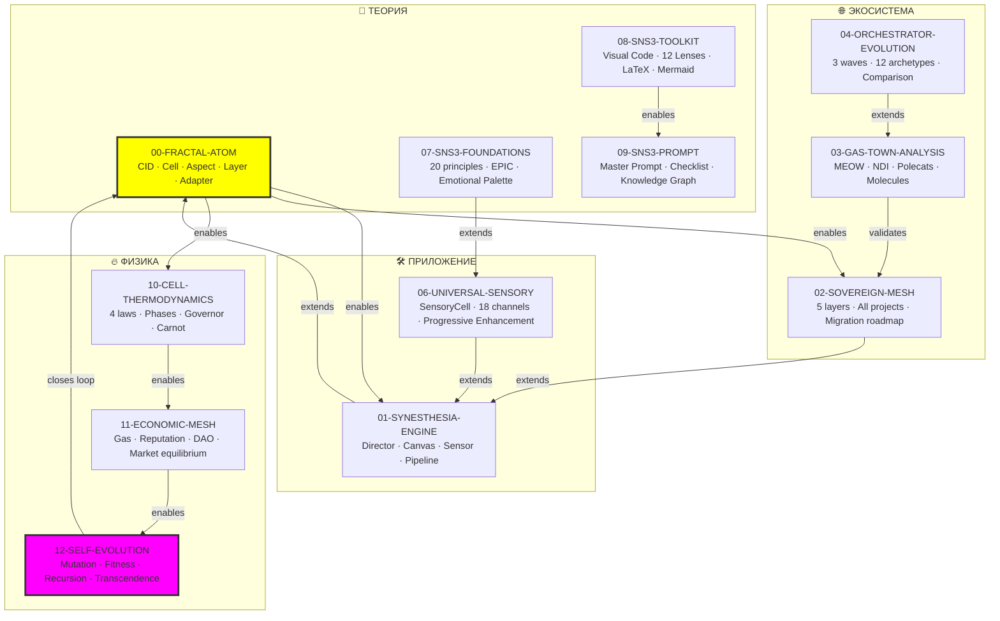

**12 заметок. Замкнутый круг. Спираль начинается заново — но на новом уровне.** ♾️