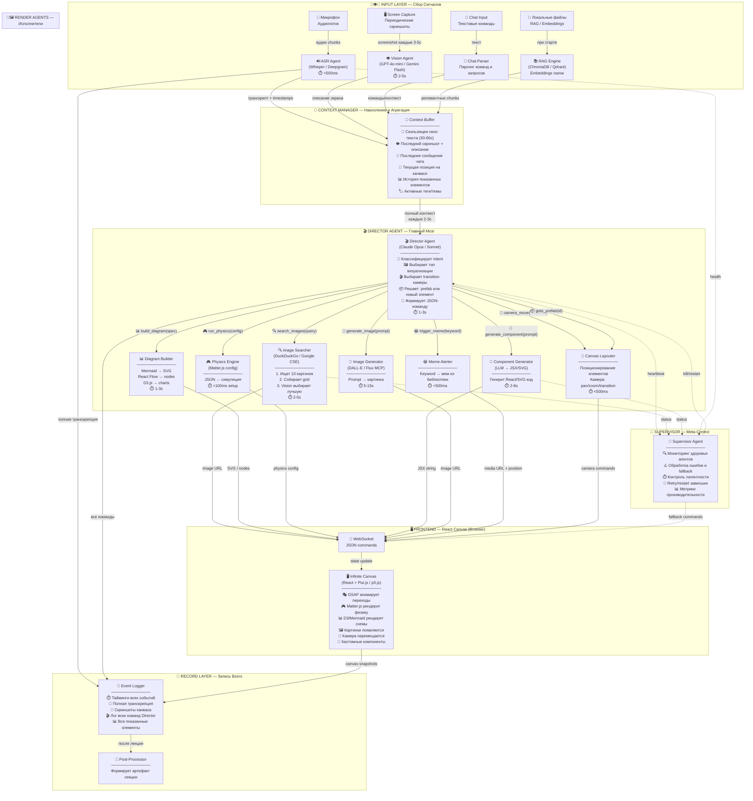

# 🎭🌌 LIVE NEURAL PRESENTATION ENGINE 🌌🎭
## 📐 Архитектурная заметка: Real-Time AI-Driven Infinite Canvas Presentation System

> **🧠 Концепция:** Я говорю вслух → нейросеть слушает, видит мой экран, читает чат → в реальном времени на бесконечном канвасе появляются анимированные визуализации, схемы, картинки, физические симуляции, диаграммы → всё записывается и структурируется в лекцию-артефакт.

---

## 📑 Содержание

- [🌀 Часть I — Infinite Canvas: Концепция Пространства](#-часть-i--infinite-canvas-концепция-пространства)
- [🤖 Часть II — Мульти-Агентная Архитектура](#-часть-ii--мульти-агентная-архитектура)
- [🏗️ Часть III — Полный Pipeline: от Голоса до Пикселя](#-часть-iii--полный-pipeline-от-голоса-до-пикселя)
- [🧰 Часть IV — Каталог Технологий по Тирам](#-часть-iv--каталог-технологий-по-тирам)
- [⚗️ Часть V — Связки Технологий: Идеальные и Сомнительные](#-часть-v--связки-технологий-идеальные-и-сомнительные)
- [🗃️ Часть VI — Отвергнутые, но Великолепные: Потенциал Хаков](#-часть-vi--отвергнутые-но-великолепные-потенциал-хаков)
- [📼 Часть VII — Post-Lecture: Запись, Структурирование, Артефакт](#-часть-vii--post-lecture-запись-структурирование-артефакт)
- [🔗 Часть VIII — Все Awesome-Списки и Ссылки](#-часть-viii--все-awesome-списки-и-ссылки)

---

# 🌀 Часть I — Infinite Canvas: Концепция Пространства

## 🗺️ Философия бесконечного холста

Бесконечный канвас — это **не слайды**. Это **пространство мысли** 🧠💭, где каждая идея занимает физическое место, и связи между идеями существуют буквально — как расстояния, как визуальные мосты, как навигационные пути.

### 🔮 Ключевые принципы

| 🏷️ Принцип | 📝 Описание | 🎯 Зачем |
|---|---|---|
| 🌐 **Пространственная память** | Каждый блок контента имеет координаты `(x, y)` на канвасе | Мозг запоминает _где_ была идея, а не _когда_ |
| 🔭 **Масштаб как контекст** | Zoom out = обзор всех тем; Zoom in = детали одной темы | Семантический зум — уровень абстракции привязан к масштабу |
| 🔄 **Возвратность** | Камера может вернуться к ранее показанным областям | Повторение = закрепление. Визуальный callback |
| 🎬 **Кинематографические переходы** | Pan, zoom, rotate, warp, cut, dissolve, flip между областями | Каждый переход — метафора отношения между идеями |
| 📦 **Заготовки (Prefabs)** | Заранее размещённые области с метаданными-описаниями | AI знает что где лежит и может обращаться по описанию |
| 🔲 **Группировка экранов** | Несколько областей можно показать одновременно (split view, zoom-to-fit) | Сравнение, параллели, обзор |

### 🎬🎥 Типы переходов камеры

Камера на канвасе — это **виртуальный оператор** 🎥. AI-дирижёр выбирает переход исходя из **семантики** того, что происходит в речи:

| 🎬 Переход | 🖼️ Визуал | 🧠 Семантика (когда использовать) |
|---|---|---|
| 🔄 `smooth_pan` | Плавное перемещение камеры | Продолжение мысли, следующий шаг |
| 🏎️ `fast_pan` | Быстрый перелёт | Резкая смена темы |
| 🔍 `zoom_in` | Приближение к деталям | Углубление, "давайте посмотрим поближе" |
| 🔭 `zoom_out` | Отдаление, обзор | "В общей картине...", обобщение |
| ↩️ `return_to` | Возврат к ранее показанной области | "Как мы обсуждали ранее..." |
| 📐 `zoom_to_fit_group` | Масштаб подстраивается под группу экранов | Сравнение нескольких концепций |
| 🌀 `spiral_zoom` | Спиральное приближение | Драматичное раскрытие, кульминация |
| ✂️ `hard_cut` | Мгновенная смена без анимации | Контраст, разрыв, шок |
| 💫 `dissolve` | Перекрёстное растворение | Плавная связь двух контекстов |
| 🔃 `rotate_3d` | 3D-поворот канваса | Взгляд с другой стороны |
| 📱 `split_screen` | Канвас делится на 2-4 зоны | Параллельное сравнение |
| 🪞 `mirror_flip` | Зеркальный переворот | "А теперь наоборот..." |

### 📦🗂️ Система заготовок (Prefabs)

Заготовки — это **заранее размещённые на канвасе области** с метаинформацией. AI знает их содержимое через описания, но не обязан показывать все.

```json
{
  "prefabs": [
    {
      "id": "prefab_nix_arch",
      "position": {"x": 0, "y": 0},
      "size": {"w": 1920, "h": 1080},
      "description": "Архитектура NixOS: схема модулей, flakes, store",
      "tags": ["nix", "architecture", "modules", "flakes"],
      "content_type": "diagram",
      "priority": "high"
    },
    {
      "id": "prefab_comparison_table",
      "position": {"x": 2200, "y": 0},
      "size": {"w": 1920, "h": 1080},
      "description": "Сравнительная таблица дистрибутивов Linux",
      "tags": ["linux", "comparison", "distros"],
      "content_type": "table",
      "priority": "medium"
    }
  ]
}
```

🔑 **AI может:**
- 🎯 Перелететь к нужной заготовке по тегам или описанию
- 🔲 Зазумить на группу заготовок, показав обзор
- ✏️ Модифицировать заготовку в реальном времени (добавить элементы, подсветить)
- 🆕 Создать новую область рядом с существующей заготовкой
- 🔗 Визуально связать заготовки линиями/стрелками

---

# 🤖 Часть II — Мульти-Агентная Архитектура

## 🎭 Зачем нужно несколько агентов?

Один агент не справится 🚫. Задача декомпозируется на **параллельные потоки** с разной латентностью и разными требованиями:

| 🤖 Роль | ⏱️ Латентность | 🧠 Интеллект | 📊 Нагрузка |
|---|---|---|---|
| 🎤 ASR (транскрипция) | `<500ms` | Низкий (Whisper) | Постоянная |
| 👁️ Screen Watcher | `~2-5s` | Средний (Vision) | Периодическая |
| 💬 Chat Reader | `<1s` | Низкий | По событию |
| 🎬 **Director (Дирижёр)** | `1-3s` | **Высокий (Opus/Sonnet)** | Постоянная |
| 🖼️ Image Searcher | `2-5s` | Средний | По запросу |
| 🎨 Component Generator | `2-8s` | Высокий | По запросу |
| 📊 Diagram Builder | `1-3s` | Средний | По запросу |
| 🎮 Physics Simulator | `<100ms` | Нет (движок) | По запросу |
| 😂 Meme Alerter | `<500ms` | Низкий | По ключевым словам |
| 📝 Logger/Recorder | `<100ms` | Нет | Постоянная |
| 📐 Canvas Layouter | `<500ms` | Средний | Постоянная |

## 🏛️ Иерархия агентов

```
                    ┌─────────────────────┐
                    │  👑 SUPERVISOR       │
                    │  (Meta-контроль)     │
                    │  Мониторинг, ошибки  │
                    └──────────┬──────────┘
                               │
                    ┌──────────▼──────────┐
                    │  🎬 DIRECTOR        │
                    │  (Opus / Sonnet)    │
                    │  Главный мозг       │
                    │  Решает ЧТО и КАК   │
                    └──────────┬──────────┘
                               │
            ┌──────────────────┼──────────────────┐
            │                  │                  │
    ┌───────▼───────┐  ┌──────▼──────┐  ┌───────▼───────┐
    │ 📡 INPUT LAYER │  │ 🎨 RENDER  │  │ 📝 RECORD    │
    │               │  │    LAYER    │  │    LAYER      │
    │ 🎤 ASR        │  │            │  │               │
    │ 👁️ Screen     │  │ 🖼️ Images  │  │ 📼 Timeline   │
    │ 💬 Chat       │  │ 📊 Diagrams│  │ 📄 Transcript │
    │ 📂 RAG/Files  │  │ 🎮 Physics │  │ 🗂️ Metadata   │
    └───────────────┘  │ 🧩 Custom  │  └───────────────┘
                       │ 😂 Memes   │
                       │ 📐 Layout  │
                       └────────────┘
```

## 🔮 Детальная схема взаимодействия агентов

Ниже — **полная архитектурная схема** потока данных между всеми агентами, от входа до пикселя на экране. Это самая сложная часть системы, поэтому здесь схема оправдана:



### 🎬🧠 Director Agent: Подробнее о главном мозге

Director — это **самый важный** агент. Он получает контекст и принимает решение: **что показать, как показать, где показать**. Его системный промпт определяет всю "режиссуру" лекции.

**📋 Что Director получает (вход):**
```
🧠 Контекст:
├── 📝 Текст: "...и вот мячик отскакивает от стены, это как в физике..."
├── 👁️ Экран: "Пользователь показывает VSCode с кодом на Python"
├── 💬 Чат: (пусто)
├── 📍 Канвас: камера на (3200, 1400), zoom 1.0, видны элементы [nix_arch, table_1]
├── 📦 Доступные prefabs: [prefab_physics_demo (x:5000, y:0), ...]
├── 📊 История: последние 5 действий → [показал схему, добавил текст, ...]
└── 🏷️ Теги: [physics, demo, analogy]
```

**📤 Что Director выдаёт (выход):**
```json
{
  "actions": [
    {
      "type": "camera_move",
      "transition": "smooth_pan",
      "duration_ms": 800,
      "target": {"x": 5200, "y": 200, "zoom": 1.2}
    },
    {
      "type": "physics_simulation",
      "engine": "matter_js",
      "position_on_canvas": {"x": 5200, "y": 200},
      "config": {
        "entities": [
          {"id": "wall", "shape": "rect", "x": 700, "y": 300, "isStatic": true, "style": "neon_blue"},
          {"id": "ball", "shape": "circle", "x": -50, "y": 280, "velocity": {"x": 18, "y": -4}, "restitution": 0.85, "style": "glow_orange"}
        ],
        "gravity": {"x": 0, "y": 1}
      },
      "entrance": "scale_bounce"
    },
    {
      "type": "add_text",
      "content": "Упругое столкновение",
      "position_on_canvas": {"x": 5200, "y": 50},
      "entrance": "typewriter",
      "style": "heading_glow"
    }
  ]
}
```

### 👑 Supervisor Agent: Зачем нужен надзиратель

Supervisor **не участвует** в творческом процессе. Его задача — **надёжность и отказоустойчивость** 🛡️:

| 🔧 Задача Supervisor | 📝 Описание |
|---|---|
| 💓 **Heartbeat мониторинг** | Каждый агент шлёт пинг. Если пинга нет `>10s` → перезапуск |
| ⚠️ **Error handling** | Если Image Searcher упал → показать placeholder, продолжить |
| ⏱️ **Latency watchdog** | Если Director думает `>5s` → использовать fallback (простой текст) |
| 🔄 **Queue management** | Если накопилось 10+ необработанных команд → приоритизация |
| 📊 **Metrics** | Средняя латентность, количество ошибок, загрузка |
| 🚨 **Graceful degradation** | Если API недоступен → переключение на локальную модель |

---

# 🏗️ Часть III — Полный Pipeline: от Голоса до Пикселя

## ⚡ Пошаговый flow одного цикла

Вот что происходит за **каждые 2-3 секунды** работы системы:

```
⏱️ t=0.0s     🎤 Микрофон захватывает аудио-chunk (2-3 секунды)
                     │
⏱️ t=0.3s     🔊 ASR Agent (Whisper/Deepgram) транскрибирует
                     │ "...и вот мячик отскакивает от стены..."
                     │
⏱️ t=0.5s     🧠 Context Buffer обновляется:
                     │ ├── новый текст добавлен в скользящее окно
                     │ ├── NER: извлечены сущности ["мячик", "стена", "физика"]
                     │ └── intent: "физическая аналогия / метафора"
                     │
⏱️ t=0.5s     👁️ [параллельно] Vision Agent анализирует свежий скриншот
                     │ → "Пользователь показывает IDE с Python-кодом"
                     │
⏱️ t=0.8s     🎬 Director Agent получает обновлённый контекст
                     │ 🤔 Принимает решения:
                     │ ├── intent = "physical_metaphor"
                     │ ├── best_viz = "physics_simulation" (Matter.js)
                     │ ├── transition = "smooth_pan" к свободной области
                     │ ├── secondary = "add_label" с текстом
                     │ └── effect = "burst" при столкновении
                     │
⏱️ t=1.5s     📐 Canvas Layouter: рассчитывает свободные координаты
                     │
⏱️ t=1.8s     🔌 WebSocket: JSON-команда уходит на фронтенд
                     │
⏱️ t=2.0s     🖥️ React Canvas:
                     │ ├── 🎬 GSAP smooth_pan → камера плавно перемещается
                     │ ├── 🎮 Matter.js получает config → физика запускается
                     │ ├── 🎭 GSAP анимирует появление (scale_bounce)
                     │ └── ✨ Mo.js burst при столкновении мяча со стеной
                     │
⏱️ t=2.0s     📼 [параллельно] Logger записывает:
                     ├── timestamp, транскрипт, команду, скриншот canvas
```

## 🔌🖥️ Входные каналы: как AI получает информацию

### 🎤 Канал 1: Голос (ASR)

| 🏷️ Параметр | 📋 Значение |
|---|---|
| 🔊 Модель | Whisper Large v3 (локально) или Deepgram Nova-2 (API) |
| ⏱️ Латентность | 300-500ms |
| 📡 Протокол | Streaming WebSocket, chunks по 2-3 секунды |
| 🌍 Язык | Мультиязычный (русский + английский) |
| 📝 Выход | Текст + word-level timestamps |

### 👁️ Канал 2: Экран (Screen Capture + Vision)

Ты хочешь, чтобы AI **видел твой экран** 🖥️👁️ и мог отталкиваться от того, что ты показываешь. Это реализуется так:

| 🏷️ Параметр | 📋 Значение |
|---|---|
| 📸 Захват | `puppeteer` screen capture или `obs-websocket` или системный API |
| ⏱️ Частота | Скриншот каждые 3-5 секунд (настраиваемо) |
| 🧠 Модель | GPT-4o-mini / Gemini Flash (быстрые, дешёвые vision-модели) |
| 📝 Промпт | "Опиши что показано на экране. Что пользователь делает? Какие ключевые элементы видны?" |
| 📤 Выход | Текстовое описание экрана → в Context Buffer |
| 💡 Применение | Director может сослаться на код, который ты показываешь, или визуализировать архитектуру, которую ты демонстрируешь |

### 💬 Канал 3: Чат

| 🏷️ Параметр | 📋 Значение |
|---|---|
| 🖥️ Интерфейс | Веб-панель рядом с канвасом или отдельное окно |
| 📝 Возможности | Текстовые команды, ссылки, файлы, корректировки |
| 🤖 Парсинг | Простой NLP: `"/show image <url>"`, `"/zoom out"`, `"/goto prefab:nix_arch"` |
| 💡 Применение | Точные указания, вставка URL, корректировка поведения AI |

### 📂 Канал 4: Локальные файлы (RAG)

| 🏷️ Параметр | 📋 Значение |
|---|---|
| 📚 Хранилище | ChromaDB / Qdrant (локально, через Docker или Nix) |
| 🔄 Индексация | При старте: сканировать указанные папки → chunk → embed |
| 🔍 Поиск | По ходу лекции: Director может запросить `search_files("NixOS flakes architecture")` |
| 📝 Выход | Релевантные фрагменты из твоих файлов → в контекст Director |

---

# 🧰 Часть IV — Каталог Технологий по Тирам

## 🏆 Тир S — "Must Have" (Ядро системы)

Без этих технологий система не будет работать или будет работать плохо.

### 🟢 GSAP (GreenSock Animation Platform)

| | |
|---|---|
| 🔗 | [greensock.com/gsap](https://greensock.com/gsap/) |
| ⭐ | ~20k GitHub stars |
| 📦 | `npm install gsap` |
| 🏷️ | Анимационный движок |

**🟢 Плюсы:**
- 🏎️ Самый производительный анимационный движок для веба, оптимизирован до безумия
- 🔄 **Flip Plugin** — записывает состояние "до", ты меняешь DOM, он анимирует разницу автоматически. Идеально для layout transitions
- ⏱️ **Timeline** — цепочки анимаций с точным контролем, можно лейблы, вложенные таймлайны
- 🎭 **Stagger** — каскадные анимации для списков, grid, множества элементов
- 📐 **ScrollTrigger** — хоть и не для скролла в нашем случае, но scrub-механика применима к управлению прогрессом от AI
- 🌐 Framework-agnostic, работает с React, Vue, vanilla, Canvas, SVG, WebGL
- 📖 Безупречная документация, огромное community

**🔴 Минусы:**
- 💰 Некоторые плагины (MorphSVG, DrawSVG, SplitText) — только с платной подпиской Club GreenSock
- 📏 Размер бандла может быть значительным если тянуть всё

**🎯 Роль в системе:** Движок ВСЕХ анимаций на канвасе — переходы, появления, исчезновения, морфинг, layout changes. AI выбирает из библиотеки заготовленных GSAP-анимаций.

---

### 🟢 Pixi.js

| | |
|---|---|
| 🔗 | [pixijs.com](https://pixijs.com/) |
| ⭐ | ~44k GitHub stars |
| 📦 | `npm install pixi.js` |
| 🏷️ | WebGL 2D рендерер |

**🟢 Плюсы:**
- 🏎️ **Лучшая производительность** для 2D в браузере — WebGL с автоматическим батчингом draw calls
- 🖼️ Спрайты, текстуры, частицы, фильтры, маски, blend modes
- 📐 Container-иерархия как DOM — можно группировать, трансформировать
- 🎮 Используется в играх → проверен на нагрузках 60fps
- 🔌 Есть `@pixi/react` для интеграции с React
- 🖥️ Canvas fallback если нет WebGL

**🔴 Минусы:**
- 📈 Кривая обучения выше чем у DOM/SVG — нужно думать в терминах спрайтов, текстур
- 📝 Текст рендерится в текстуры → менее удобно чем DOM для текста
- 🚫 Нет встроенной физики или анимационного API (нужен GSAP / Anime.js)

**🎯 Роль в системе:** Основной **render engine** бесконечного канваса. Все элементы живут в Pixi.js Container. Камера = трансформация root container. Обеспечивает 60fps при тысячах элементов на канвасе.

---

### 🟢 React (Vite)

| | |
|---|---|
| 🔗 | [react.dev](https://react.dev/) + [vite.dev](https://vite.dev/) |
| ⭐ | ~230k + ~70k GitHub stars |
| 📦 | `npm create vite@latest -- --template react-ts` |
| 🏷️ | UI фреймворк + бандлер |

**🟢 Плюсы:**
- 🧩 Компонентная архитектура идеальна для модульных рендереров
- 🔥 Vite — мгновенный HMR, быстрая сборка
- 📚 LLM (Opus, Sonnet) обучены на огромном корпусе React — генерят React-код с минимальными ошибками
- 🌐 Экосистема: React Flow, Framer Motion, `@pixi/react`, react-konva, react-three-fiber...
- 🔌 Легко управлять состоянием через Zustand/Jotai → WebSocket → state update → re-render

**🔴 Минусы:**
- 🐌 Virtual DOM reconciliation может тормозить при >1000 элементах (решение: Pixi.js для тяжёлой графики)
- 📦 Overhead сборки и зависимостей

**🎯 Роль в системе:** Каркас приложения. Управляет состоянием, рендерит DOM-оверлей (тексты, UI), встраивает Pixi.js Canvas, монтирует специализированные рендереры (React Flow, D3 и т.д.).

---

### 🟢 FastAPI + WebSocket (Python)

| | |
|---|---|
| 🔗 | [fastapi.tiangolo.com](https://fastapi.tiangolo.com/) |
| ⭐ | ~78k GitHub stars |
| 📦 | `pip install fastapi uvicorn websockets` |
| 🏷️ | Backend / Оркестратор |

**🟢 Плюсы:**
- 🐍 Python — ты его любишь, все ML/AI библиотеки на Python
- ⚡ Async native, WebSocket support из коробки
- 📖 Автодокументация API (Swagger/OpenAPI)
- 🔌 Легко интегрировать с Whisper, LangChain, LlamaIndex, ChromaDB

**🔴 Минусы:**
- 🐌 Python медленнее Node.js для I/O-bound задач (но async компенсирует)
- 🧵 GIL может быть проблемой для CPU-bound задач (решение: multiprocessing, или вынести в отдельные процессы)

**🎯 Роль в системе:** Центральный сервер. Хостит WebSocket, координирует агентов, проксирует API-вызовы к LLM, обрабатывает ASR-поток.

---

## 🥇 Тир A — "Highly Recommended" (Мощное усиление)

Технологии, которые сильно улучшают систему, но не являются единственным вариантом.

### 🔵 Matter.js 🎮⚽

| | |
|---|---|
| 🔗 | [brm.io/matter-js](https://brm.io/matter-js/) |
| ⭐ | ~17k GitHub stars |
| 📦 | `npm install matter-js` |
| 🏷️ | 2D физический движок |

**🟢 Плюсы:**
- 🎮 Полноценная rigid-body физика: гравитация, столкновения, трение, упругость
- 📋 **Управляется чистым JSON** — идеально для AI-генерации
- 👁️ Встроенный рендерер для debug, но можно рендерить через Pixi.js
- 📖 Простой API, хорошая документация
- 🧪 Constraints (пружины, верёвки), composite bodies

**🔴 Минусы:**
- 🚫 Только rigid body, нет частиц/жидкостей (для этого → LiquidFun)
- 📉 При >500 тел может тормозить (решение: Rapier на WASM)
- 🔧 Не обновлялся активно последние годы (но стабилен)

**💡 Альтернативы:**
- **Rapier** 🦀 (rapier.rs) — Rust→WASM, значительно быстрее, 2D+3D, но сложнее API
- **Planck.js** (piqnt.com/planck.js) — JS-порт Box2D, проверен годами
- **LiquidFun** 🌊 — расширение Box2D от Google, добавляет частицы и жидкости

**🎯 Роль в системе:** Рендерер "физических метафор". AI описывает сцену JSON → Matter.js симулирует → Pixi.js рисует.

---

### 🔵 D3.js 📊📈

| | |
|---|---|
| 🔗 | [d3js.org](https://d3js.org/) |
| ⭐ | ~109k GitHub stars |
| 📦 | `npm install d3` |
| 🏷️ | Data-driven визуализация |

**🟢 Плюсы:**
- 🏆 **Золотой стандарт** визуализации данных в вебе
- 🔄 **Enter/Update/Exit** паттерн — данные пришли → элементы анимированно появляются/обновляются/исчезают
- 📊 Графики любого типа: bar, line, pie, scatter, treemap, force-directed, sankey, chord...
- 🎨 Полный контроль над SVG — каждый пиксель настраиваемый
- ⏱️ Встроенные `.transition()` для анимированных обновлений

**🔴 Минусы:**
- 📈 Высокий порог входа, императивный API
- 🐌 SVG может тормозить при >5000 элементах (решение: canvas-рендерер)
- 🔄 Конфликтует с React за управление DOM (решение: D3 для расчётов, React для рендера)

**🎯 Роль в системе:** Рендерер графиков и data-driven визуализаций. AI передаёт данные и тип графика → D3 строит анимированную визуализацию.

---

### 🔵 Mermaid 📐🔀

| | |
|---|---|
| 🔗 | [mermaid.js.org](https://mermaid.js.org/) |
| ⭐ | ~73k GitHub stars |
| 📦 | `npm install mermaid` |
| 🏷️ | Text-to-diagram |

**🟢 Плюсы:**
- 🏎️ **Мгновенный рендер** — текст → SVG за миллисекунды
- 🤖 **Самый AI-friendly** из всех diagram-инструментов — LLM обучены на огромном корпусе Mermaid
- 📊 Flowcharts, sequence diagrams, class diagrams, state diagrams, ER diagrams, Gantt, pie, mindmap, timeline, git graph
- 📝 Текстовый DSL — минимальный объём данных для передачи по WebSocket

**🔴 Минусы:**
- 🎨 Ограниченная стилизация, диаграммы выглядят "утилитарно"
- 🚫 Нет анимации (статические SVG) — нужно анимировать внешне через GSAP
- 📐 Layout может быть непредсказуемым для сложных графов

**🎯 Роль в системе:** Быстрые диаграммы "на лету". AI генерит Mermaid-спецификацию текстом → мгновенный SVG → GSAP анимирует появление.

---

### 🔵 React Flow 🔀🔗

| | |
|---|---|
| 🔗 | [reactflow.dev](https://reactflow.dev/) |
| ⭐ | ~26k GitHub stars |
| 📦 | `npm install @xyflow/react` |
| 🏷️ | Node-based диаграммы |

**🟢 Плюсы:**
- 🧩 React-native: ноды = React-компоненты, можно вставить что угодно внутрь
- 🔗 Анимированные edge (связи), кастомные стили, animated dots
- 🔄 Drag-and-drop, масштабирование, мини-карта
- 📋 JSON-based: `{nodes: [...], edges: [...]}` — AI легко генерит
- 🎨 Полностью кастомизируемый вид нод и связей

**🔴 Минусы:**
- 🐌 При >500 нод может тормозить (DOM-based)
- 📐 Auto-layout требует дополнительных библиотек (dagre, elkjs)
- 🏷️ Лицензия: free для open-source, платная для некоторых коммерческих use-cases

**🎯 Роль в системе:** Визуализация архитектур, процессов, графов зависимостей. AI передаёт nodes+edges JSON → React Flow рендерит интерактивную диаграмму.

---

### 🔵 Framer Motion 💫🔄

| | |
|---|---|
| 🔗 | [motion.dev](https://motion.dev/) |
| ⭐ | ~25k GitHub stars |
| 📦 | `npm install framer-motion` |
| 🏷️ | Декларативная React-анимация |

**🟢 Плюсы:**
- 🪄 **Layout animations** — элемент перемещается из точки A в точку B магически, просто меняя props
- 🌊 Spring physics — естественное движение, overshoots, bounce
- 🎭 `AnimatePresence` — анимация появления/исчезновения элементов
- ✋ Gesture support (drag, tap, hover) — полезно для интерактивности
- 📝 Декларативный API идеально ложится на React-парадигму

**🔴 Минусы:**
- ⚖️ Тяжелее чем GSAP для сложных timeline-based анимаций
- 🚫 Только React (не framework-agnostic)
- 🐌 Медленнее GSAP на бенчмарках для сложных анимаций

**🎯 Роль в системе:** Анимация DOM-оверлея (тексты, карточки, UI-элементы поверх canvas). Работает в паре с GSAP — Framer Motion для React-компонентов, GSAP для Pixi.js и SVG.

---

### 🔵 p5.js 🎨🌀

| | |
|---|---|
| 🔗 | [p5js.org](https://p5js.org/) |
| ⭐ | ~22k GitHub stars |
| 📦 | `npm install p5` / CDN |
| 🏷️ | Creative coding |

**🟢 Плюсы:**
- 🎨 **Генеративное искусство** нативно — шум Перлина, частицы, процедурные паттерны
- 🤖 **LLM идеально генерят p5.js код** — огромная база примеров в обучающих данных
- 🔄 `draw()` loop = встроенная стейт-машина 60fps
- 📐 Векторная математика, силы, ускорение — лёгкая "физика" без Matter.js
- 🖥️ WebGL mode для 3D
- 🔊 Встроенный sound analysis (p5.sound)
- 🌐 P5LIVE — горячая перезагрузка `draw()` без перезапуска

**🔴 Минусы:**
- 🎨 Эстетика "creative coding" — менее "corporate" чем GSAP+DOM
- 🚫 Нет нативной компонентной архитектуры (это sketch, не app)
- ⚡ Производительность ниже чем Pixi.js для 2D (нет батчинга)
- 🔧 Требует обёртки для интеграции в React (`react-p5`, `p5-wrapper`)

**💡 Особая суперсила:** AI может генерировать **целые p5.js скетчи** (30-50 строк) за 1-2 секунды, которые мгновенно визуализируют абстрактные концепции. Это делает p5.js лучшим кандидатом для "AI рисует на лету".

**🎯 Роль в системе:** Рендерер для генеративных/процедурных визуализаций, когда нужно что-то уникальное, что не покрывается стандартными диаграммами/графиками.

---

## 🥈 Тир B — "Nice to Have" (Приятные усиления)

### 🟡 Mo.js ✨💥

| | |
|---|---|
| 🔗 | [mojs.github.io](https://mojs.github.io/) |
| ⭐ | ~18k GitHub stars |
| 📦 | `npm install @mojs/core` |
| 🏷️ | Motion graphics спецэффекты |

**🟢 Плюсы:**
- 💥 **Burst** — радиальные взрывы частиц (конфетти, фейерверк, стрелки)
- 🌀 **ShapeSwirl** — синусоидальные траектории, органические движения
- 🔮 **Shape primitives** — круг, крест, зигзаг, полигон с анимированными параметрами
- ⏱️ **Timeline** — оркестрация множества эффектов

**🔴 Минусы:**
- 🔧 Менее активно поддерживается чем GSAP
- 📏 Niche-библиотека — только для спецэффектов, не для general-purpose анимации

**🎯 Роль в системе:** Burst/sparkle/confetti эффекты при ключевых моментах — когда спикер делает акцент, при завершении блока, при "вау"-моментах.

---

### 🟡 Theatre.js 🎬🎹

| | |
|---|---|
| 🔗 | [theatrejs.com](https://www.theatrejs.com/) |
| ⭐ | ~12k GitHub stars |
| 📦 | `npm install @theatre/core @theatre/studio` |
| 🏷️ | Визуальный timeline editor для анимаций |

**🟢 Плюсы:**
- 🎹 **Визуальный редактор** анимаций прямо в браузере — keyframes, easing curves, graph editor
- 🤝 Dual workflow: код + визуальный тюнинг
- 🔌 Работает с React, Three.js, HTML, SVG, любым JS-объектом
- 💾 Состояние анимации экспортируется как JSON → можно пре-заготовить красивые анимации

**🔴 Минусы:**
- ⚖️ AGPL 3.0 лицензия на Studio (только dev-time, production = Apache 2.0)
- 📈 Overhead для простых анимаций — overkill если GSAP достаточно
- 🧩 Дополнительная сложность в архитектуре

**🎯 Роль в системе:** Предварительная настройка анимаций для prefabs. Ты в визуальном редакторе тюнишь идеальные entrance/exit анимации, экспортируешь как JSON, AI использует их.

---

### 🟡 Anime.js 🌸✨

| | |
|---|---|
| 🔗 | [animejs.com](https://animejs.com/) |
| ⭐ | ~50k GitHub stars |
| 📦 | `npm install animejs` |
| 🏷️ | Лёгкий анимационный движок |

**🟢 Плюсы:**
- 🪶 Легковесный (~17KB gzipped)
- 🎯 Простой API: `anime({targets: '.el', translateX: 250, duration: 800})`
- 🌀 SVG morphing, path animation
- ⏱️ Stagger, timeline, easing

**🔴 Минусы:**
- 🆚 Менее мощный чем GSAP (нет Flip, нет ScrollTrigger-аналога)
- 🔄 Дублирует функционал GSAP в стеке

**🎯 Роль в системе:** Fallback/альтернатива GSAP для лёгких анимаций. Или самостоятельная замена если лицензия GSAP не устраивает.

---

### 🟡 Lottie / dotLottie 🎞️🔄

| | |
|---|---|
| 🔗 | [lottiefiles.com](https://lottiefiles.com/) |
| ⭐ | ~30k+ GitHub stars (lottie-web) |
| 📦 | `npm install @lottiefiles/dotlottie-wc` |
| 🏷️ | Pre-designed animated assets |

**🟢 Плюсы:**
- 🎨 Тысячи **бесплатных анимированных ассетов** (иконки, loader-ы, иллюстрации)
- 🔄 **State Machine** (dotLottie) — интерактивные анимации с логикой
- 🏎️ Маленький размер файлов, GPU-рендер
- 🖥️ Кроссплатформенный (web, iOS, Android)

**🔴 Минусы:**
- 🚫 AI не может генерить Lottie-файлы на лету — это pre-made ассеты
- 🎨 Нужен After Effects / Lottie Creator для создания кастомных анимаций

**🎯 Роль в системе:** Библиотека micro-animations — loading indicators, иконки с анимацией, декоративные элементы. AI выбирает подходящий Lottie-ассет из библиотеки по тегам.

---

### 🟡 Three.js 🌐🎲

| | |
|---|---|
| 🔗 | [threejs.org](https://threejs.org/) |
| ⭐ | ~103k GitHub stars |
| 📦 | `npm install three` |
| 🏷️ | WebGL 3D движок |

**🟢 Плюсы:**
- 🎲 **Полноценный 3D** в браузере — меши, материалы, освещение, тени, постпроцессинг
- 🌐 Самая большая экосистема WebGL
- 📦 React-обёртка: `@react-three/fiber` + `@react-three/drei` — декларативный 3D в React
- 🎨 Шейдеры, частицы, инстансинг — безлимитный визуал

**🔴 Минусы:**
- 📈 Тяжёлый (200KB+), высокий порог входа
- 🔋 Энергоёмкий, GPU-нагрузка
- 🤖 AI генерит Three.js код хуже, чем 2D-код (сложность API)

**🎯 Роль в системе:** Опциональный рендерер для 3D-визуализаций — когда нужно показать 3D-модель, объёмную диаграмму, или эффектный фон.

---

## 🥉 Тир C — "Specialized" (Специализированные инструменты)

### 🟠 Rapier 🦀⚡

| | |
|---|---|
| 🔗 | [rapier.rs](https://rapier.rs/) |
| ⭐ | ~4k GitHub stars |
| 📦 | `npm install @dimforge/rapier2d` |
| 🏷️ | Высокопроизводительная 2D/3D физика (Rust→WASM) |

**🟢** Значительно быстрее Matter.js (Rust/WASM), 2D+3D, детерминизм
**🔴** Сложнее API, меньше примеров, меньше community
**🎯** Замена Matter.js если нужна производительность (>500 тел)

---

### 🟠 LiquidFun 🌊💧

| | |
|---|---|
| 🔗 | [google.github.io/liquidfun](https://google.github.io/liquidfun/) |
| 📦 | JS-порт через Emscripten |
| 🏷️ | Частицы + жидкости (расширение Box2D от Google) |

**🟢** Визуально впечатляющие жидкостные симуляции, мягкие тела
**🔴** Тяжёлый, мало документации, заброшен (но стабилен)
**🎯** "Вау"-эффект: жидкость, плазма, мягкие тела для визуальных метафор

---

### 🟠 Vivus 🖊️✍️

| | |
|---|---|
| 🔗 | [github.com/maxwellito/vivus](https://github.com/maxwellito/vivus) |
| ⭐ | ~15k GitHub stars |
| 📦 | `npm install vivus` |
| 🏷️ | SVG path drawing animation |

**🟢** Эффект "рисования" SVG — как будто невидимая рука рисует схему
**🔴** Только stroke animation, не заливка
**🎯** Красивое появление диаграмм и иконок — вместо fade-in они "рисуются"

---

### 🟠 Cytoscape.js 🕸️🔬

| | |
|---|---|
| 🔗 | [js.cytoscape.org](https://js.cytoscape.org/) |
| ⭐ | ~10k GitHub stars |
| 📦 | `npm install cytoscape` |
| 🏷️ | Граф-теоретические сети |

**🟢** Оптимизирован для огромных графов (тысячи узлов), алгоритмы layout
**🔴** Специализирован на графах, менее красив чем React Flow для простых диаграмм
**🎯** Визуализация сложных сетей, зависимостей, knowledge graphs

---

### 🟠 Konva / React-Konva 🎨🖱️

| | |
|---|---|
| 🔗 | [konvajs.org](https://konvajs.org/) |
| ⭐ | ~11k GitHub stars |
| 📦 | `npm install react-konva konva` |
| 🏷️ | Декларативный 2D Canvas |

**🟢** React-компоненты для Canvas (`<Rect>`, `<Circle>`, `<Text>`, `<Image>`), event handling на шейпах
**🔴** Медленнее Pixi.js (нет WebGL батчинга), ограниченные фильтры/эффекты
**🎯** Альтернатива Pixi.js если нужен проще API и React-first подход (за счёт производительности)

---

### 🟠 Snap.svg / SVG.js 🔷✏️

| | |
|---|---|
| 🔗 | [snapsvg.io](http://snapsvg.io/) / [svgjs.dev](https://svgjs.dev/) |
| 🏷️ | SVG-манипуляция |

**🟢** Полный контроль над SVG: создание, анимация, морфинг
**🔴** SVG масштабируется хуже Canvas/WebGL для большого количества элементов
**🎯** Кастомные SVG-иллюстрации, сгенерированные AI в виде SVG-кода

---

## 🔮 Тир D — "Experimental / Future" (Экспериментальные и вдохновляющие)

### 🟣 cables.gl 🔌🎛️

| | |
|---|---|
| 🔗 | [cables.gl](https://cables.gl/) |
| 🏷️ | Нодовое визуальное программирование, WebGL |
| 📜 | MIT License |

**🟢** Визуальный dataflow → WebGL рендер, real-time, браузерный, standalone-версия
**🔴** Сложно управлять через AI (нодовый интерфейс), не code-first
**💡 Потенциал хака:** Экспортировать из cables.gl готовые "патчи" как WebGL-шейдеры/фоны для канваса. Потрясающие генеративные фоны!

---

### 🟣 Hydra 💧🌈

| | |
|---|---|
| 🔗 | [hydra.ojack.xyz](https://hydra.ojack.xyz/) |
| 🏷️ | Браузерный live-coding визуальный синтезатор |

**🟢** Шейдерная графика в реальном времени, невероятная красота, audio-reactive, код = 1-3 строки
**🔴** Слишком абстрактная для информационных презентаций (это VJing, не данные)
**💡 Потенциал хака:** Использовать как **фоновый слой** канваса! AI подбирает Hydra-preset под настроение: спокойная тема = медленные волны 🌊, энергичная = глитч ⚡, данные = матричный rain 🟢. Hydra работает в iframe под основным канвасом.

---

### 🟣 Motion Canvas 🎬🔧

| | |
|---|---|
| 🔗 | [motioncanvas.io](https://motioncanvas.io/) |
| ⭐ | ~16k GitHub stars |
| 📦 | `npm create @motion-canvas@latest` |
| 🏷️ | Программные анимированные видео |

**🟢 Плюсы (почему круто):**
- 🎨 **Самые красивые** программные анимации из всех рассмотренных
- 📝 TypeScript generators для точного контроля таймингов
- 🔤 LaTeX, CodeBlock, красивые текстовые анимации
- 🔥 Hot-reload в редакторе, синхронизация с аудио
- 🧩 Модульная архитектура: `@motion-canvas/core`, `@motion-canvas/2d`
- 📐 Примитивы: `Rect`, `Circle`, `Line`, `Txt`, `Img`, `Layout`, `Node`, `CodeBlock`, `Latex`
- 📦 `@motion-canvas/player` — веб-компонент для показа анимаций в браузере

**🔴 Минусы (почему отброшен):**
- 🚫 **Нет нативного API для внешнего управления** в real-time (Issue #213 открыт с 2023)
- ⏱️ Архитектура generators (`yield*`) заточена под timeline/sequence, не под стейт-машину
- 🔄 Переход между сценами = создание новой сцены, а не обновление стейта

**💡 Потенциал хака (как интегрировать):**
1. Использовать `@motion-canvas/player` как **компонент внутри React-приложения**
2. Написать кастомный **scene-switcher** через WebSocket: бэкенд шлёт команду → фронтенд загружает предварительно скомпилированные сцены Motion Canvas
3. **Pre-rendered snippets** — AI генерит Motion Canvas код → компилируется заранее → воспроизводится как видео-клип внутри канваса
4. Вдохновляться **стилем анимаций** Motion Canvas (как делает 3Blue1Brown) и воссоздавать их через GSAP+Pixi.js

---

### 🟣 Rive ⚙️🎭

| | |
|---|---|
| 🔗 | [rive.app](https://rive.app/) |
| 🏷️ | Интерактивные анимации с state machine |

**🟢 Плюсы (почему круто):**
- 🏎️ **120fps GPU-рендер** через собственный Rive Renderer
- 🔄 **State Machine** — анимации реагируют на входные данные без кода
- 📦 Один `.riv` файл = ассет + логика + анимация
- 🖥️ SDK для Web, iOS, Android, Flutter, React

**🔴 Минусы (почему отброшен):**
- 🎨 Требует **Rive Editor** для создания ассетов — AI не может создать `.riv` файл из кода
- 📐 Не подходит для динамической генерации контента

**💡 Потенциал хака:**
1. Создать **библиотеку Rive-ассетов** заранее: анимированные иконки, loader-ы, персонажи, переходы
2. AI управляет state machine через SDK: `rive.setBooleanInput("isActive", true)` → ассет анимированно меняет состояние
3. Использовать как "декоративный слой" — ассеты реагируют на события лекции

---

### 🟣 Remotion / Revideo 🎥📹

| | |
|---|---|
| 🔗 | [remotion.dev](https://www.remotion.dev/) / [github.com/redotvideo/revideo](https://github.com/redotvideo/revideo) |
| ⭐ | ~21k / ~4k GitHub stars |
| 🏷️ | Программное видеопроизводство |

**🟢 Плюсы (почему крутые):**
- 🎬 React-компоненты = видеокадры, полная мощь React-экосистемы
- 📦 Revideo = MIT fork, бесплатный для коммерческого использования
- 🎨 Можно встроить Three.js, D3, любой React-компонент
- 🎵 Аудио-синхронизация

**🔴 Минусы (почему отброшены):**
- 🐌 Рендерят **видеофайлы** через Puppeteer/FFmpeg — не real-time
- ⏱️ 30 секунд видео = минуты рендера

**💡 Потенциал хака для post-production:**
Идеально для **Части VII (Post-Lecture)**! После лекции: взять лог событий → сгенерировать Remotion-проект → отрендерить финальное полированное видео лекции с анимациями.

---

### 🟣 Manim 🐍📐

| | |
|---|---|
| 🔗 | [manim.community](https://www.manim.community/) |
| ⭐ | ~23k GitHub stars (community edition) |
| 📦 | `pip install manim` |
| 🏷️ | Математические анимации на Python |

**🟢 Плюсы (почему крут):**
- 📐 **Лучшие математические анимации** в мире (3Blue1Brown)
- 🐍 Python — AI прекрасно генерит Manim-код
- 🔤 LaTeX рендер из коробки
- 📊 Графики, координатные плоскости, 3D-поверхности

**🔴 Минусы (почему отброшен):**
- 🐌 **Offline-рендер** через FFmpeg, каждая сцена = секунды-минуты рендера
- 🚫 Нет real-time playback

**💡 Потенциал хака:**
1. **Pre-render библиотека** — заготовить частые математические анимации как видео-клипы
2. **ManimGL** (original 3Blue1Brown version) — есть real-time OpenGL рендер, но менее стабильный
3. **Post-production** — рендерить Manim-анимации для финального артефакта лекции

---

### 🟣 TouchDesigner 🎛️🎨

| | |
|---|---|
| 🔗 | [derivative.ca](https://derivative.ca/) |
| 🏷️ | Индустриальный нодовый real-time графический движок |

**🟢** Лучший real-time визуальный движок в индустрии, VJing, инсталляции, проджекшн-мэппинг
**🔴** Десктопный, проприетарный, НЕ web, сложен, нельзя встроить в браузер
**💡 Потенциал хака:** Использовать как **внешний рендерер** через NDI/Spout → захват в OBS. Или вдохновляться визуалами.

---

# ⚗️ Часть V — Связки Технологий: Идеальные и Сомнительные

## 💎 Идеальные связки

### 💎 Связка "Production Powerhouse" 🏗️🏎️

> **React + Vite + Pixi.js + GSAP + Matter.js + D3 + Mermaid + React Flow**

```
🧠 Назначение: максимальная красота + гибкость + производительность
⏱️ Время на setup: ~2-3 недели
🎯 Результат: уровень Apple Keynote + интерактивность + AI-управление
```

| 🧩 Компонент | 🎯 За что отвечает | 🔌 Как связаны |
|---|---|---|
| React+Vite | 🏠 Каркас, состояние, HMR | Корневой уровень |
| Pixi.js | 🖥️ Infinite Canvas рендер (60fps) | `@pixi/react` внутри React |
| GSAP | 🎬 Все анимации, transitions, Flip | Управляет Pixi.js объектами + DOM |
| Matter.js | 🎮 Физические симуляции | Расчёт позиций → Pixi.js рендерит |
| D3.js | 📊 Графики и data-viz | SVG → вставляется как текстура в Pixi.js |
| Mermaid | 📐 Быстрые диаграммы | SVG → вставляется как текстура в Pixi.js |
| React Flow | 🔀 Node-based диаграммы | React-компонент в DOM-оверлее |

**🟢 Почему идеально:**
- Каждая технология делает то, в чём лучшая
- Нет дублирования ответственности
- Pixi.js обеспечивает производительность канваса
- GSAP — единый анимационный движок для всего
- Модульность: можно добавлять/убирать рендереры

---

### 💎 Связка "Creative Lightning" ⚡🎨

> **p5.js + GSAP (DOM overlay) + Mo.js + Mermaid**

```
🧠 Назначение: быстрый старт, максимальная AI-генеративность
⏱️ Время на setup: ~3-5 дней
🎯 Результат: creative coding эстетика, AI генерит визуалы напрямую
```

| 🧩 Компонент | 🎯 За что отвечает |
|---|---|
| p5.js | 🎨 Основной canvas, вся генеративная графика, простая физика |
| GSAP | 🎬 DOM-оверлей: тексты, карточки поверх p5 canvas |
| Mo.js | 💥 Спецэффекты, bursts, акценты |
| Mermaid | 📐 Диаграммы (рендерятся в SVG, вставляются через p5 `loadImage`) |

**🟢 Почему идеально для быстрого старта:**
- p5.js — AI генерит код мгновенно, один файл = один визуал
- Не нужен React, build system минимальный
- `draw()` loop = стейт-машина из коробки

---

### 💎 Связка "3D Immersive" 🌐🎲

> **React + Three.js (@react-three/fiber) + Theatre.js + Rapier**

```
🧠 Назначение: 3D визуализации, пространственные данные
⏱️ Время на setup: ~3-4 недели
🎯 Результат: 3D-мир, камера летает в пространстве
```

**🟢** Потрясающий визуал, "infinite canvas" в 3D
**🔴** Сложность x10, GPU-нагрузка, AI хуже генерит 3D-код

---

## ⚠️ Сомнительные связки

### ⚠️ "Frankenstack" 🧟

> **Remotion + Manim + Motion Canvas одновременно**

**🔴 Почему плохо:**
- Три инструмента для одной задачи (программная анимация)
- Ни один не работает в real-time
- Несовместимые рантаймы (Python + Node + Node)
- Overhead координации перекроет все преимущества

---

### ⚠️ "DOM Hell" 😵

> **React + Framer Motion + D3 + React Flow + Konva + SVG.js**

**🔴 Почему плохо:**
- Всё через DOM → тормоза при >200 элементах на канвасе
- Framer Motion + D3 конфликтуют за управление DOM
- Konva + SVG.js + React Flow — три способа рендерить одно и то же
- Нет WebGL → нет масштабирования

---

### ⚠️ "Overkill 3D" 🤯

> **Three.js + Babylon.js + PlayCanvas**

**🔴 Почему плохо:**
- Три конкурирующих 3D-движка, выбери один
- Каждый тянет >200KB, GPU-нагрузка x3
- Несовместимые scene graph-ы

---

## 🏆 Матрица "Лучшее для чего"

| 🎯 Задача | 🥇 Лучшее решение | 🥈 Альтернатива |
|---|---|---|
| 🖥️ Infinite Canvas (основа) | **Pixi.js** | Three.js (если нужен 3D) |
| 🎬 Анимации переходов | **GSAP** (Flip + Timeline) | Framer Motion (если React-only) |
| 🎮 Физика "мячик в стену" | **Matter.js** | Rapier (если >500 тел) |
| 📊 Графики/charts | **D3.js** | Recharts (проще, но ограниченнее) |
| 📐 Быстрые диаграммы | **Mermaid** | React Flow (если нужна интерактивность) |
| 🔀 Node-based графы | **React Flow** | Cytoscape.js (если >1000 узлов) |
| 🎨 Генеративная графика | **p5.js** | Raw Canvas API |
| 💥 Спецэффекты/burst | **Mo.js** | GSAP (можно имитировать, но сложнее) |
| ✍️ SVG drawing эффект | **Vivus** | GSAP DrawSVG (платный плагин) |
| 🎞️ Pre-made animations | **Lottie** | Rive (если state machine нужна) |
| 🎬 Тюнинг анимаций visual | **Theatre.js** | Motion Canvas editor |
| 🌊 Жидкости/частицы | **LiquidFun** | Pixi.js Particles |
| 🌈 Шейдерные фоны | **Hydra** (iframe) | cables.gl |
| 📐 Программные видео (post) | **Remotion** / **Manim** | Motion Canvas |
| 🤖 AI-friendliness (код) | **p5.js** > **SVG** > **Mermaid** | React+Tailwind |
| 🏎️ Производительность 2D | **Pixi.js** > Canvas API > SVG | Konva (средняя) |

---

# 🗃️ Часть VI — Отвергнутые, но Великолепные: Потенциал Хаков

Каждая технология ниже была отброшена из основного стека, но имеет **уникальные суперсилы** 🦸, которые можно использовать через хаки:

| 🟣 Технология | 🌟 Уникальная суперсила | 🚫 Причина отказа | 🔧 Хак для интеграции | ⚡ Сложность хака |
|---|---|---|---|---|
| **Motion Canvas** | 🎬 Красивейшие programmatic анимации, LaTeX | Нет real-time API | `@motion-canvas/player` как embed-компонент; pre-render сцены | 🟡 Средняя |
| **Rive** | 🏎️ 120fps GPU, state machine | Нужен Rive Editor, нет code-gen | Библиотека pre-made `.riv` ассетов, AI управляет state machine через SDK | 🟢 Легко |
| **Manim** | 📐 Лучшая математика, 3Blue1Brown стиль | Offline FFmpeg рендер | ManimGL для real-time OpenGL; pre-render клипы; post-production | 🔴 Сложно |
| **Remotion** | 🎬 React = видео, полная экосистема | Рендер в файл, не live | Post-production: лог лекции → Remotion проект → видео | 🟢 Легко |
| **Revideo** | 🆓 MIT, fork Motion Canvas | Тоже не real-time | То же что Remotion, плюс headless rendering API | 🟢 Легко |
| **Hydra** | 🌈 Невероятные шейдерные визуалы за 1 строку | Абстрактная, не информационная | iframe background layer; AI выбирает preset по настроению | 🟢 Легко |
| **cables.gl** | 🎛️ Нодовый WebGL, real-time | Не code-first, сложно AI управлять | Экспорт патчей как WebGL-компоненты для фонов | 🟡 Средняя |
| **TouchDesigner** | 🎨 Лучший real-time визуальный движок | Десктопный, проприетарный | NDI/Spout → OBS; вдохновляться стилем | 🔴 Сложно |
| **Theatre.js** | 🎹 Визуальный timeline editor | Overhead для простых анимаций | Pre-tune entrance/exit анимации → export JSON → use in GSAP | 🟡 Средняя |
| **Lottie** | 🎞️ 1000+ ready animations | Нельзя генерить на лету | Библиотека micro-animations, AI выбирает по тегам | 🟢 Легко |
| **LiquidFun** | 🌊 Жидкости и мягкие тела | Тяжёлый, заброшен | Встроить для "вау"-моментов, ограничить кол-во частиц | 🟡 Средняя |

---

# 📼 Часть VII — Post-Lecture: Запись, Структурирование, Артефакт

## 📝 Что записывается во время лекции

Параллельно с визуализацией, **Logger Agent** 📼 записывает абсолютно всё:

| 📋 Данные | 🕐 Частота | 💾 Формат |
|---|---|---|
| 🎤 Полная транскрипция | Continuous | Текст + word timestamps |
| 🎬 Все команды Director | Каждая команда | JSON с timestamp |
| 📸 Скриншоты канваса | Каждые 5-10с + при каждом transition | PNG |
| 🖥️ Скриншоты экрана спикера | Каждые 5-10с | PNG |
| 💬 Все сообщения чата | По событию | Текст |
| 📊 Все сгенерированные элементы | По событию | SVG/JSON/JSX |
| 📦 Состояние канваса | Каждые 10с | JSON (полный state snapshot) |
| 🔊 Аудио-запись | Continuous | WAV/OGG |

## 🎬 Post-Processing Pipeline

После завершения лекции запускается **пост-обработка**:

```
📼 Raw Data (всё записанное)
         │
         ▼
🧠 Structuring Agent (LLM)
├── 📝 Анализирует транскрипцию → разбивает на главы/разделы
├── 🏷️ Извлекает ключевые термины, определения, факты
├── 📊 Связывает визуальные элементы с текстом по таймкодам
├── 🔗 Создаёт cross-references между разделами
└── 📑 Генерирует оглавление и summary
         │
         ▼
🎨 Artifact Generator
├── 📄 Формирует артефакт лекции
├── 🖼️ Вставляет скриншоты канваса в нужные моменты
├── 📊 Встраивает диаграммы и графики
└── 🎬 [Опционально] Рендерит видео через Remotion/Manim
```

## 📄 Формат артефакта лекции

Вопрос: **в каком формате хранить артефакт?** Идеально бы PDF с анимациями, но PDF анимации не поддерживает нормально. Варианты:

| 📄 Формат | 🟢 Плюсы | 🔴 Минусы | 🎯 Применимость |
|---|---|---|---|
| **HTML (SPA)** | 🎬 Анимации, интерактивность, видео, WebGL | 📱 Не PDF, нужен браузер | ⭐⭐⭐⭐⭐ Лучший вариант! |
| **Typst → PDF** | 📄 Красивая вёрстка, формулы | 🚫 Нет анимаций | ⭐⭐⭐ Для формального артефакта |
| **Reveal.js** | 🎬 Презентация + анимация + code highlight | 📏 Менее гибкий чем SPA | ⭐⭐⭐⭐ Как слайд-формат |
| **MDX** | 📝 Markdown + React-компоненты | 🔧 Нужен сборщик | ⭐⭐⭐⭐ Хороший баланс |
| **Jupyter Notebook** | 🐍 Код + визуал + текст | 🎨 Ограниченный визуал | ⭐⭐⭐ Если лекция про код |
| **Video (MP4)** | 🎬 Всё записано, работает везде | 🚫 Не интерактивно | ⭐⭐⭐ Как дополнение |

### 💡 Рекомендуемый подход: двойной артефакт

1. **HTML SPA** (основной) — сгенерированный через React (или Astro/Next.js), содержит:
   - 📝 Полный текст лекции (из транскрипции, отредактированный LLM)
   - 🎬 Встроенные анимированные визуализации (Lottie, GSAP, p5.js)
   - 📸 Скриншоты ключевых моментов канваса
   - 🎥 Видео-фрагменты (экспорт через Remotion)
   - 📊 Интерактивные графики (D3.js)
   - 🔗 Оглавление, навигация, поиск
   - ▶️ Аудио-плеер с синхронизацией (нажал на абзац → проигрывается аудио этого момента)

2. **Typst/LaTeX → PDF** (формальный) — для тех, кому нужен документ:
   - 📝 Текст лекции
   - 📸 Статические скриншоты визуализаций
   - 📊 Графики как изображения
   - 📚 Список источников

---

# 🔗 Часть VIII — Все Awesome-Списки и Ссылки

## 📚 Исследованные Awesome-списки

| 🏷️ Тематика | 📦 Репозиторий | ⭐ Stars | 🔗 Ссылка |
|---|---|---|---|
| 🎬 Web Animation | `sergey-pimenov/awesome-web-animation` | ~1.3k | [GitHub](https://github.com/sergey-pimenov/awesome-web-animation) |
| 🎨 Creative Coding | `terkelg/awesome-creative-coding` | ~14.4k | [GitHub](https://github.com/terkelg/awesome-creative-coding) |
| 🖥️ Canvas | `raphamorim/awesome-canvas` | ~1.6k | [GitHub](https://github.com/raphamorim/awesome-canvas) |
| 🌐 WebGL | `sjfricke/awesome-webgl` | ~1.3k | [GitHub](https://github.com/sjfricke/awesome-webgl) |
| 🖼️ Web Graphics | `taenykim/awesome-web-graphics` | ~500+ | [GitHub](https://github.com/taenykim/awesome-web-graphics) |
| 🔷 SVG | `willianjusten/awesome-svg` | ~4.5k | [GitHub](https://github.com/willianjusten/awesome-svg) |
| 📊 Data Visualization | `hal9ai/awesome-dataviz` | ~3.8k | [GitHub](https://github.com/hal9ai/awesome-dataviz) |
| 🎨 Generative Art | `camilleroux/awesome-generative-art` | ~2k | [GitHub](https://github.com/camilleroux/awesome-generative-art) |
| 🎵 Live Coding | `toplap/awesome-livecoding` | ~2.5k | [GitHub](https://github.com/toplap/awesome-livecoding) |
| 🔄 Motion UI Design | `fliptheweb/motion-ui-design` | ~700+ | [GitHub](https://github.com/fliptheweb/motion-ui-design) |
| 🧰 Design Tools | `goabstract/Awesome-Design-Tools` | ~33k | [GitHub](https://github.com/goabstract/Awesome-Design-Tools) |
| 📈 Charting | `zingchart/awesome-charting` | ~1.9k | [GitHub](https://github.com/zingchart/awesome-charting) |
| 🎬 Video Production | `ad-si/awesome-video-production` | — | [GitHub](https://github.com/ad-si/awesome-video-production) |
| 🎮 JS Game Engines | GitHub collection | — | [GitHub](https://github.com/collections/javascript-game-engines) |
| 🧪 WebGL/WebGPU Frameworks | gist by dmnsgn | — | [Gist](https://gist.github.com/dmnsgn/76878ba6903cf15789b712464875cfdc) |
| 🔬 Physics Engines | comparison | — | [daily.dev](https://daily.dev/blog/top-9-open-source-2d-physics-engines-compared) |

## 🔗 Все технологии — прямые ссылки

### 🏆 Тир S
| 🧩 | 🔗 |
|---|---|
| GSAP | [greensock.com/gsap](https://greensock.com/gsap/) |
| Pixi.js | [pixijs.com](https://pixijs.com/) • [GitHub](https://github.com/pixijs/pixijs) |
| React | [react.dev](https://react.dev/) |
| Vite | [vite.dev](https://vite.dev/) |
| FastAPI | [fastapi.tiangolo.com](https://fastapi.tiangolo.com/) |

### 🥇 Тир A
| 🧩 | 🔗 |
|---|---|
| Matter.js | [brm.io/matter-js](https://brm.io/matter-js/) • [GitHub](https://github.com/liabru/matter-js) |
| D3.js | [d3js.org](https://d3js.org/) • [GitHub](https://github.com/d3/d3) |
| Mermaid | [mermaid.js.org](https://mermaid.js.org/) • [GitHub](https://github.com/mermaid-js/mermaid) |
| React Flow | [reactflow.dev](https://reactflow.dev/) • [GitHub](https://github.com/xyflow/xyflow) |
| Framer Motion | [motion.dev](https://motion.dev/) • [GitHub](https://github.com/framer/motion) |
| p5.js | [p5js.org](https://p5js.org/) • [GitHub](https://github.com/processing/p5.js) |

### 🥈 Тир B
| 🧩 | 🔗 |
|---|---|
| Mo.js | [mojs.github.io](https://mojs.github.io/) • [GitHub](https://github.com/mojs/mojs) |
| Theatre.js | [theatrejs.com](https://www.theatrejs.com/) • [GitHub](https://github.com/theatre-js/theatre) |
| Anime.js | [animejs.com](https://animejs.com/) • [GitHub](https://github.com/juliangarnier/anime) |
| Lottie | [lottiefiles.com](https://lottiefiles.com/) • [GitHub](https://github.com/airbnb/lottie-web) |
| Three.js | [threejs.org](https://threejs.org/) • [GitHub](https://github.com/mrdoob/three.js) |

### 🥉 Тир C
| 🧩 | 🔗 |
|---|---|
| Rapier | [rapier.rs](https://rapier.rs/) • [GitHub](https://github.com/dimforge/rapier) |
| LiquidFun | [google.github.io/liquidfun](https://google.github.io/liquidfun/) |
| Vivus | [GitHub](https://github.com/maxwellito/vivus) |
| Cytoscape.js | [js.cytoscape.org](https://js.cytoscape.org/) • [GitHub](https://github.com/cytoscape/cytoscape.js) |
| Konva | [konvajs.org](https://konvajs.org/) • [GitHub](https://github.com/konvajs/konva) |
| Snap.svg | [snapsvg.io](http://snapsvg.io/) |
| SVG.js | [svgjs.dev](https://svgjs.dev/) |

### 🔮 Тир D
| 🧩 | 🔗 |
|---|---|
| cables.gl | [cables.gl](https://cables.gl/) |
| Hydra | [hydra.ojack.xyz](https://hydra.ojack.xyz/) • [GitHub](https://github.com/hydra-synth/hydra) |
| Motion Canvas | [motioncanvas.io](https://motioncanvas.io/) • [GitHub](https://github.com/motion-canvas/motion-canvas) |
| Rive | [rive.app](https://rive.app/) |
| Remotion | [remotion.dev](https://www.remotion.dev/) • [GitHub](https://github.com/remotion-dev/remotion) |
| Revideo | [GitHub](https://github.com/redotvideo/revideo) |
| Manim | [manim.community](https://www.manim.community/) • [GitHub](https://github.com/ManimCommunity/manim) |
| TouchDesigner | [derivative.ca](https://derivative.ca/) |

---

# 🧪 Приложение A — Примеры JSON-протокола управления канвасом

## 📐 Перемещение камеры к prefab с zoom

```json
{
  "action": "camera_move",
  "transition": "smooth_pan",
  "duration_ms": 1200,
  "easing": "power2.inOut",
  "target": {"x": 5000, "y": 0, "zoom": 1.0},
  "reason": "Спикер начал обсуждать физическую аналогию, переходим к prefab_physics_demo"
}
```

## 🔲 Zoom-to-fit группы экранов

```json
{
  "action": "camera_zoom_to_fit",
  "transition": "spring_zoom",
  "duration_ms": 1500,
  "targets": ["prefab_nix_arch", "prefab_chimera_arch"],
  "padding": 100,
  "reason": "Сравнение двух архитектур — показываем оба экрана одновременно"
}
```

## ↩️ Возврат к ранее показанному

```json
{
  "action": "camera_return",
  "transition": "fast_pan",
  "duration_ms": 600,
  "target_element_id": "diagram_nix_modules_v2",
  "highlight": true,
  "highlight_style": "pulse_glow",
  "reason": "Спикер сказал 'как мы обсуждали ранее, модули NixOS...'"
}
```

## 🎮 Физическая симуляция

```json
{
  "action": "spawn_renderer",
  "renderer": "matter_js",
  "canvas_position": {"x": 3400, "y": 800},
  "canvas_size": {"w": 800, "h": 600},
  "entrance": "scale_bounce",
  "config": {
    "gravity": {"x": 0, "y": 1},
    "entities": [
      {"id": "ground", "shape": "rect", "x": 400, "y": 580, "w": 800, "h": 40, "isStatic": true},
      {"id": "wall", "shape": "rect", "x": 700, "y": 300, "w": 40, "h": 400, "isStatic": true},
      {"id": "ball", "shape": "circle", "r": 25, "x": 50, "y": 200, "velocity": {"x": 12, "y": -3}, "restitution": 0.8}
    ]
  }
}
```

## 📊 Animated chart

```json
{
  "action": "spawn_renderer",
  "renderer": "d3_chart",
  "canvas_position": {"x": 1200, "y": 2400},
  "canvas_size": {"w": 600, "h": 400},
  "entrance": "fly_in_bottom",
  "config": {
    "type": "bar",
    "data": [
      {"label": "NixOS", "value": 85, "color": "#5277C3"},
      {"label": "Chimera", "value": 72, "color": "#E94560"},
      {"label": "Void", "value": 65, "color": "#53A8B6"}
    ],
    "animate": true,
    "title": "Популярность дистрибутивов"
  }
}
```

## 📐 Mermaid-диаграмма

```json
{
  "action": "spawn_renderer",
  "renderer": "mermaid",
  "canvas_position": {"x": 0, "y": 3000},
  "canvas_size": {"w": 1000, "h": 600},
  "entrance": "vivus_draw",
  "config": {
    "spec": "graph LR\n  A[Nix Flake] -->|defines| B[Packages]\n  A -->|defines| C[DevShells]\n  B --> D[System Config]\n  C --> E[Dev Environment]\n  D --> F[NixOS Machine]\n  E --> F",
    "theme": "dark"
  }
}
```

## 🧩 AI-generated React компонент

```json
{
  "action": "spawn_renderer",
  "renderer": "custom_jsx",
  "canvas_position": {"x": 2000, "y": 1500},
  "entrance": "fade_scale",
  "config": {
    "jsx": "<div className='bg-slate-900 p-8 rounded-2xl shadow-2xl'><h2 className='text-emerald-400 text-2xl font-bold mb-4'>Архитектура</h2><div className='flex gap-4'><div className='bg-blue-900/50 p-4 rounded-lg border border-blue-500'>Frontend</div><div className='text-2xl self-center'>→</div><div className='bg-purple-900/50 p-4 rounded-lg border border-purple-500'>Backend</div></div></div>",
    "sandbox": true
  }
}
```

## 💥 Burst-эффект на акцент

```json
{
  "action": "effect",
  "type": "mojs_burst",
  "position": {"x": 960, "y": 540},
  "config": {
    "count": 20,
    "radius": {"from": 0, "to": 200},
    "children": {"shape": "circle", "fill": ["#E94560", "#533483", "#53A8B6"]},
    "duration": 700
  }
}
```

## 🌈 Hydra background change

```json
{
  "action": "set_background",
  "type": "hydra_shader",
  "config": {
    "code": "osc(10, 0.1, 1.2).color(0.2, 0.5, 0.8).rotate(0.1).modulate(noise(3)).out()",
    "mood": "calm_tech"
  }
}
```

---

# 🧪 Приложение B — Nix Flake: Скелет окружения

```nix
{
  description = "Live Neural Presentation Engine";

  inputs = {
    nixpkgs.url = "github:NixOS/nixpkgs/nixos-unstable";
    flake-utils.url = "github:numtide/flake-utils";
  };

  outputs = { self, nixpkgs, flake-utils }:
    flake-utils.lib.eachDefaultSystem (system:
      let pkgs = nixpkgs.legacyPackages.${system};
      in {
        devShells.default = pkgs.mkShell {
          buildInputs = with pkgs; [
            # Python Backend
            python312
            python312Packages.fastapi
            python312Packages.uvicorn
            python312Packages.websockets
            python312Packages.openai
            python312Packages.chromadb

            # Node.js Frontend
            nodejs_22
            pnpm

            # Media
            ffmpeg

            # Tools
            jq
            ripgrep
          ];

          shellHook = ''
            echo "🎭 Live Neural Presentation Engine"
            echo "📡 Backend: cd backend && uvicorn main:app --reload"
            echo "🖥️ Frontend: cd frontend && pnpm dev"
          '';
        };
      });
}
```

---

# 📌 Приложение C — Быстрая шпаргалка

```
┌──────────────────────────────────────────────────────────────┐
│  🎭 LIVE NEURAL PRESENTATION ENGINE — Quick Reference       │
├──────────────────────────────────────────────────────────────┤
│                                                              │
│  📡 ВХОДЫ:                                                  │
│    🎤 Голос → Whisper → транскрипт                          │
│    👁️ Экран → Vision API → описание                         │
│    💬 Чат → команды и контекст                              │
│    📂 Файлы → RAG → embeddings                              │
│                                                              │
│  🧠 МОЗГ:                                                   │
│    🎬 Director Agent (Opus/Sonnet) → JSON-команды           │
│    👑 Supervisor → мониторинг, fallback                     │
│                                                              │
│  🖥️ РЕНДЕР:                                                │
│    🎯 Pixi.js = Infinite Canvas (WebGL 2D)                  │
│    🎬 GSAP = Все анимации                                   │
│    🎮 Matter.js = Физика                                    │
│    📊 D3.js = Графики                                       │
│    📐 Mermaid = Диаграммы                                   │
│    🔀 React Flow = Node-графы                               │
│    🎨 p5.js = Генеративная графика                          │
│    💥 Mo.js = Спецэффекты                                   │
│                                                              │
│  📼 ЗАПИСЬ:                                                  │
│    📝 Транскрипт + 📸 Скриншоты + 🎬 Лог команд           │
│    → 📄 HTML SPA артефакт + 📄 Typst PDF                   │
│                                                              │
│  🔌 СВЯЗЬ:                                                  │
│    Python (FastAPI) ←WebSocket→ React (Vite)                │
│                                                              │
└──────────────────────────────────────────────────────────────┘
```

---

> 🧠💡 **Последняя мысль:** Эта система — не продукт. Это **инструмент мышления**. Канвас — расширение рабочей памяти. AI — ассистент визуализации. Голос — интерфейс управления. Результат — не просто лекция, а **пространственный артефакт знания**, где каждая идея имеет место, форму и движение.

---

*📅 Создано: 2026-04-13*
*🔄 Последнее обновление: 2026-04-13*
*🏷️ Теги: #live-presentation #ai-driven #infinite-canvas #real-time #animation #creative-coding*
