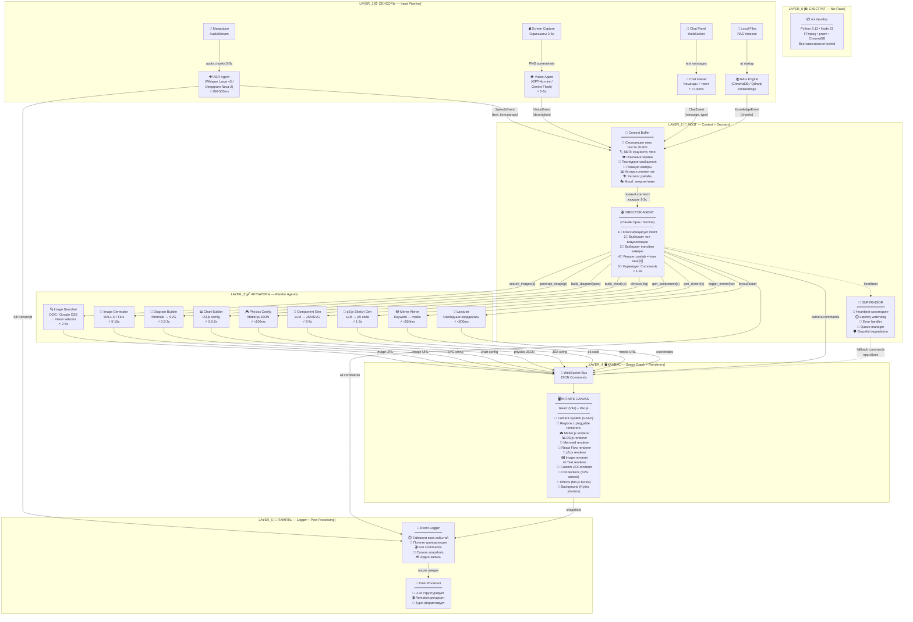

# 🎭🌌⚡ SYNESTHESIA ENGINE ⚡🌌🎭
### Real-Time AI-Driven Infinite Canvas Presentation System
### Архитектурное исследование v2 — Концептуальная заметка

---

## 🗺️ Легенда символов (прочитай ОДИН раз — далее читаешь в 3× быстрее)

> Каждый символ ниже — это **семантический якорь**. Он появляется одинаково по всему документу. Мозг запомнит привязки за ~2 минуты, после чего можно СКАНИРОВАТЬ текст по символам, минуя буквы.

| 🏷️ Группа | Символы → Значение |
|---|---|
| 👂 **Входы** | 🎤 голос · 👁️ экран · 💬 чат · 📂 файлы/RAG |
| 🧠 **Мозг** | 🎬 Director · 👑 Supervisor · 🔮 Context Buffer |
| 🖌️ **Рендер** | 🎮 физика · 📊 графики · 📐 диаграммы · 🖼️ картинки · ✏️ текст · 🎨 генеративное · 💥 эффекты · 🌈 шейдеры/фон |
| 🎥 **Камера** | 🔍 zoom in · 🔭 zoom out · ↩️ return · 🎥 pan · ✂️ cut · 💫 dissolve |
| 💎 **Качество** | 🏎️ скорость · 💎 красота · 🔧 хакабельность · 🤖 AI-friendly · 📏 сложность |
| 🏆 **Тиры** | 🏆 S-тир · 🥇 A-тир · 🥈 B-тир · 🥉 C-тир · 🔮 D-тир |
| ✅ **Оценки** | 🟢 плюс · 🔴 минус · 🟡 нюанс · 💡 идея · ⚠️ предупреждение |
| 📦 **Контент** | 🏗️ prefab · 🆕 новый · ↩️ callback · 🔄 update |

---

## 📑 Содержание

```
⚡ Часть 0 — ЯДРО: Одна строка                                     [стр.1]
🌌 Часть I — Три метафоры, которые объясняют всё                    [стр.2]
🏛️ Часть II — Архитектура: 5 слоёв, 6 примитивов, 1 шина           [стр.3]
🌀 Часть III — Бесконечный холст: пространство мысли                [стр.4]
🧠 Часть IV — Мозг Director Agent: как он думает                    [стр.5]
🔌 Часть V — Плагины: бесконечная расширяемость                     [стр.6]
🧰 Часть VI — Каталог технологий по тирам                           [стр.7]
⚗️ Часть VII — Связки: идеальные, допустимые, антипаттерны          [стр.8]
🗃️ Часть VIII — Отвергнутые, но великолепные                        [стр.9]
📼 Часть IX — Post-Lecture: запись → артефакт                        [стр.10]
🔗 Часть X — Все ссылки и awesome-списки                            [стр.11]
📎 Приложения: JSON-протокол, Nix Flake, Quick Card                 [стр.12]
```

---

# ⚡ Часть 0 — ЯДРО

## Одна строка

> **Events → Director → Commands → Canvas**

Четыре слова. Вся система.

- **Events** 👂 — микрофон, экран, чат, файлы порождают поток событий
- **Director** 🧠🎬 — единственный агент, который ПРИНИМАЕТ РЕШЕНИЯ; превращает события в команды
- **Commands** 📤 — JSON-инструкции: «создай элемент», «перемести камеру», «запусти физику»
- **Canvas** 🖥️ — бесконечный холст в браузере, который исполняет команды и рисует 60fps

Всё остальное — детали реализации. Сенсоры производят Events. Director конвертирует Events в Commands. Canvas исполняет Commands. **Точка.**

---

# 🌌 Часть I — Три метафоры, которые объясняют ВСЁ

Метафоры нужны не для красоты — они задают **архитектурные решения**. Каждая метафора подсвечивает свой аспект системы и диктует, как этот аспект проектировать.

---

## 🎧🎛️ Метафора 1: «AI Visual DJ»

**Что делает DJ:**

| 🎧 DJ | 🖥️ Наша система |
|---|---|
| 👂 Слушает энергию зала | 🎤 Слушает голос спикера |
| 🎵 Выбирает следующий трек | 🎬 Выбирает следующую визуализацию |
| 🎛️ Крутит эквалайзер, фильтры | 🌈 Меняет mood: фон, скорость анимаций, палитру |
| 🔄 Микширует переходы между треками | 🎥 Анимирует переходы камеры (pan, zoom, dissolve) |
| 📦 Имеет ящики с пластинками (crates) | 🏗️ Имеет prefabs, RAG, интернет |
| 🎤 Иногда импровизирует live | 🎨 Генерирует кастомные визуалы на лету |
| 🎚️ Управляет несколькими деками одновременно | 🖌️ Управляет несколькими рендерерами (физика + диаграммы + картинки) |
| 📼 Записывает сет | 📼 Логирует всё для post-production |

**🏗️ Архитектурное следствие:** Система должна быть **реактивной и event-driven**, как DJ-пульт. Никаких блокирующих операций. Каждый «трек» (визуал) может быть прерван следующим, если спикер сменил тему.

---

## 📦➡️📺 Метафора 2: «Семантический декомпрессор»

Речь — это **сжатый формат** знания:
- ~150 слов/мин = ~2.5 слов/сек
- Один кадр канваса = ~2 млн пикселей при 60fps

Коэффициент «распаковки» — **миллионы к одному**. AI — это **кодек**, который берёт низкополосный сигнал (речь) и декомпрессирует его в высокополосный (визуал), используя:

| 📚 Источник «справочных кадров» | 🎯 Аналог в видеокодеке |
|---|---|
| 🔮 Контекст (что сказано ранее) | 🔙 Предыдущие кадры (P-frame reference) |
| 📂 RAG файлы | 💿 Словарь кодека |
| 🏗️ Prefabs | 🖼️ **I-кадры** (полные, независимые) |
| 🌐 Интернет | ☁️ CDN с ассетами |
| 🧠 Знания LLM | 🧬 Обученная нейросеть кодека |

**🏗️ Архитектурное следствие → контентная стратегия:**

| 📹 Видеокодек | 🖥️ Наш канвас | 📝 Пояснение |
|---|---|---|
| **I-кадр** (ключевой) | 🏗️ **Prefab** | Полная, самодостаточная область. Начало новой темы. |
| **P-кадр** (предсказанный) | 🆕 **Инкрементальное обновление** | Добавить элемент, подвинуть, обновить. Дёшево. |
| **B-кадр** (двунаправленный) | ↩️ **Callback** | «Как мы обсуждали ранее...» — ссылка на прошлое. |
| **GOP** (группа кадров) | 🎬 **Сцена** | Группа действий об одной теме. Логическая единица. |

**💡 Практический вывод:** Director должен **начинать каждую тему с I-кадра** (prefab или полная layout-команда), затем **достраивать P-кадрами** (добавляя элементы по одному), и **использовать B-кадры** (возвраты камеры к ранее показанному) для связывания тем.

---

## 🎮🕹️ Метафора 3: «Knowledge Game Engine»

Система — это **игровой движок**, где:

| 🎮 Компонент игрового движка | 🖥️ Наш аналог |
|---|---|
| 🗺️ Scene Graph | 🌀 Элементы на бесконечном канвасе |
| 🖥️ Renderer | 🖌️ Pluggable рендереры (Pixi, D3, Mermaid, Matter...) |
| ⚛️ Physics Engine | 🎮 Matter.js / Rapier |
| 🎮 Input System | 👂 Голос + Экран + Чат (вместо клавиатуры) |
| 🎥 Camera System | 🎥 Бесконечный канвас-камера с кинематографическими переходами |
| 📡 Event System | 🔌 WebSocket message bus |
| 📦 Asset Pipeline | 🏗️ Prefabs + RAG + Интернет + AI-генерация |
| 🤖 Game Logic / AI | 🎬 Director Agent |
| 💾 Save System | 📼 Logger → Post-processor |

**🏗️ Архитектурное следствие:** Проектировать как **ECS (Entity-Component-System)**, а не как «React-приложение с графикой». Canvas = World. Elements = Entities. Renderers = Systems. Properties = Components.

---

## 🎭 Синтез трёх метафор

| 🧩 Аспект системы | 🎧 Visual DJ | 📦 Декомпрессор | 🎮 Game Engine |
|---|---|---|---|
| Что определяет? | **Реактивность и flow** | **Контентная стратегия** | **Техническая архитектура** |
| Ключевой вопрос | «Что показать СЕЙЧАС?» | «Какой ТИП контента?» | «КАК это рендерить?» |
| Главный принцип | Никогда не блокировать | I/P/B кадры | Entity-Component-System |

Три метафоры — три линзы. Через DJ-линзу проектируем **поведение**, через кодек-линзу проектируем **контент**, через игровую линзу проектируем **код**.

---

# 🏛️ Часть II — Архитектура: 5 Слоёв, 6 Примитивов, 1 Шина

## 🧬 Нервная система: Sensors → Brain → Actuators

Вся архитектура — биологическая аналогия:

```
👂 SENSORS (органы чувств)    →    🧠 BRAIN (обработка)    →    🖌️ ACTUATORS (действия)
   🎤 Голос                         🔮 Context Buffer            🖥️ Canvas
   👁️ Экран                         🎬 Director Agent            🎮 Physics
   💬 Чат                           👑 Supervisor                📊 Charts
   📂 Файлы                                                      📐 Diagrams
                                                                  🎨 Generative
                                                                  💥 Effects
                                                                  📼 Logger
```

Связь — через **единую шину сообщений**: `Events` от сенсоров, `Commands` к актуаторам. Формат — JSON через WebSocket.

## 🏗️ 5 Слоёв системы

### 🪨 Слой 0 → Субстрат (Nix Flake)

**Задача:** Детерминированное, воспроизводимое окружение. Одна команда → всё работает.

```
📦 nix develop → Python 3.12 + Node 22 + FFmpeg + pnpm
                  Все зависимости зафиксированы
                  Работает на любой машине с Nix
```

---

### 👂 Слой 1 → Сенсоры (Input Pipeline)

Четыре **параллельных** потока, каждый — независимый event producer:

| 👂 Сенсор | ⚡ Латентность | 📡 Протокол | 📤 Выход |
|---|---|---|---|
| 🎤 **ASR** (Whisper / Deepgram) | 300-500ms | Streaming WebSocket, chunks ~2-3с | `SpeechEvent {text, timestamps, lang}` |
| 👁️ **Vision** (GPT-4o-mini / Gemini Flash) | 2-5с | HTTP, скриншот каждые 3-5с | `VisionEvent {description, screenshot}` |
| 💬 **Chat** | <100ms | WebSocket | `ChatEvent {message, type}` |
| 📂 **RAG** (ChromaDB / Qdrant) | 200-500ms | Локальный API | `KnowledgeEvent {chunks, relevance}` |

🔑 **Ключевой принцип:** Каждый сенсор — **отдельный процесс**. Если один упал, остальные продолжают. Supervisor перезапустит упавший.

---

### 🧠 Слой 2 → Мозг (Context + Director + Supervisor)

**🔮 Context Buffer** — «рабочая память» системы:

```
🔮 Context Buffer (обновляется каждые 1-2с):
┌─────────────────────────────────────────────────┐
│ 📝 Скользящее окно транскрипта (30-60с)         │
│ 🏷️ Активные теги/темы (NER: сущности, понятия) │
│ 👁️ Последний скриншот + описание экрана         │
│ 💬 Последние N сообщений чата                    │
│ 📍 Текущая позиция камеры на канвасе             │
│ 📊 История показанных элементов (последние 20)   │
│ 🏗️ Каталог доступных prefabs с описаниями        │
│ 📂 Topically relevant RAG chunks                 │
│ 🎭 Текущий «mood» (энергия, темп, тема)         │
└─────────────────────────────────────────────────┘
```

**🎬 Director Agent** — единственный, кто принимает решения. Подробно в [Часть IV](#-часть-iv--мозг-director-agent-как-он-думает).

**👑 Supervisor** — watchdog:

| 🔧 Задача | 📝 Механизм |
|---|---|
| 💓 Heartbeat | Каждый агент пингует каждые 5с, тишина >15с → restart |
| ⏱️ Latency guard | Director >5с → fallback (показать простой текст) |
| 🚨 Error handler | Рендерер упал → placeholder + retry |
| 📊 Metrics | Средняя задержка, количество ошибок, queue depth |
| 🔄 Queue manager | >10 необработанных команд → drop старые, приоритизировать |
| 🛡️ Graceful degradation | API недоступен → локальная модель / кэш |

---

### 🖌️ Слой 3 → Актуаторы (Render Agents)

Специализированные исполнители. Каждый умеет одну вещь, но делает её хорошо:

| 🖌️ Agent | ⚡ Латентность | 🔌 Вход | 📤 Выход |
|---|---|---|---|
| 🔍 **Image Searcher** | 2-5с | `search_images(query)` | URL лучшей картинки |
| 🎨 **Image Generator** | 5-15с | `generate_image(prompt)` | URL сгенерированной картинки |
| 📐 **Diagram Builder** | 0.5-3с | `build_diagram(mermaid_spec)` | SVG |
| 📊 **Chart Builder** | 0.5-2с | `build_chart(type, data)` | SVG / Canvas config |
| 🎮 **Physics Configurator** | <100мс | `physics_config(entities)` | Matter.js JSON |
| 🧩 **Component Generator** | 2-8с | `generate_component(prompt)` | JSX / SVG string |
| 🎨 **p5 Sketch Generator** | 1-3с | `generate_sketch(prompt)` | p5.js код |
| 😂 **Meme Alerter** | <500мс | `trigger_meme(keyword)` | Media URL + position |
| 📐 **Canvas Layouter** | <200мс | Текущее состояние канваса | Свободные координаты, layout |

🔍 **Image Searcher** — подробнее:
1. 🔎 Поиск 10 картинок (DuckDuckGo / Google CSE)
2. 🖼️ Сборка 10 превью в grid с номерами
3. 👁️ Vision-модель (GPT-4o-mini): «Контекст: [текст]. Какая картинка (1-10) лучше? Ответь цифрой.»
4. 📤 URL выбранной картинки → Canvas

---

### 🖥️ Слой 4 → Канвас (Scene Graph + Renderers)

**React (Vite) + Pixi.js** — единое fullscreen-приложение, которое исполняет Commands.

Подробно в [Часть III](#-часть-iii--бесконечный-холст-пространство-мысли).

---

### 📼 Слой 5 → Память (Logger + Post-Processor)

Параллельно со всем остальным, **Logger** 📼 записывает абсолютно всё. Запись — фоновый процесс, не влияющий на латентность основного pipeline.

| 📋 Данные | 🕐 Частота | 💾 Формат |
|---|---|---|
| 🎤 Полная транскрипция + word timestamps | Continuous | JSONL |
| 🎬 Все команды Director | Каждая команда | JSONL |
| 📸 Скриншоты канваса | Каждые 5с + при transition | PNG |
| 🖥️ Скриншоты экрана спикера | Каждые 10с | PNG |
| 📊 Все сгенерированные элементы | По событию | SVG/JSON |
| 📦 Полный state канваса | Каждые 15с | JSON snapshot |
| 🔊 Аудио | Continuous | OGG |

Подробно о post-processing в [Часть IX](#-часть-ix--post-lecture-запись--артефакт).

---

## 🔷 6 Примитивов канваса

**Всё**, что существует на канвасе, является одним из шести примитивов. Шесть — и ни одним больше. Это API-контракт между Director и Canvas.

| # | 🔷 Примитив | 📝 Описание | 🔧 Аналог |
|---|---|---|---|
| 1 | 🎥 **Viewport** | Положение камеры: `{x, y, zoom, rotation}` | Камера в Unity |
| 2 | 🔲 **Region** | Прямоугольная область на канвасе с содержимым и pluggable renderer | GameObject |
| 3 | 🔹 **Element** | Атомарная визуальная единица внутри Region (текст, картинка, шейп) | Sprite |
| 4 | 🔗 **Connection** | Визуальная связь между Region/Element (стрелка, линия, кривая) | Edge |
| 5 | ✨ **Effect** | Временный визуальный оверлей (burst, glow, confetti, highlight) | Particle System |
| 6 | 🌈 **Background** | Амбиентный фоновый слой (шейдер, градиент, паттерн) | Skybox |

**🎬 У каждого примитива — 4 анимационных слота:**

| 🎬 Слот | 📝 Когда срабатывает | 💡 Пример |
|---|---|---|
| 💫 **Entrance** | При создании | Fly-in, scale-bounce, typewriter, vivus-draw |
| ⭐ **Emphasis** | При акценте / подсветке | Pulse-glow, shake, color-flash |
| 🔄 **Active** | Пока видим | Idle breathing, subtle float, particle emit |
| 💨 **Exit** | При удалении | Fade-out, shrink, dissolve, fly-away |

Анимация — **декоратор**, не часть логики рендерера. Ты можешь заменить анимационный движок (GSAP → Anime.js) не трогая рендереры. Ты можешь добавить новый рендерер не трогая анимации.

---

## 🔷📐 Как примитивы маппятся на команды Director

Director не знает про Pixi.js, GSAP, Matter.js. Он оперирует **только примитивами**:

```
Director:  "Нужно показать физическую симуляцию мяча и стены"
           ↓
           SpawnRegion {
             type: "physics",
             position: {x: 3000, y: 800},
             config: { entities: [...], gravity: {...} },
             entrance: "scale_bounce"
           }
           ↓
Canvas:    Создаёт Region → подключает Matter.js renderer → GSAP анимирует entrance
```

```
Director:  "Надо вернуться к схеме NixOS и подсветить модуль flakes"
           ↓
           MoveViewport {
             target_region: "prefab_nix_arch",
             transition: "smooth_pan",
             duration: 1200
           }
           +
           EmphasisElement {
             element_id: "nix_flakes_block",
             animation: "pulse_glow"
           }
           ↓
Canvas:    GSAP двигает камеру → GSAP пульсирует подсветку на элементе
```

---

## 🏛️📊 Полная архитектурная схема

Это **главная диаграмма всей системы**. Каждый прямоугольник — отдельный процесс/компонент. Каждая стрелка — реальный поток данных.



---

# 🌀 Часть III — Бесконечный Холст: Пространство Мысли

## 🧠💭 Канвас как расширенная рабочая память

Рабочая память человека — **7±2 элемента**. Канвас убирает это ограничение: все идеи **существуют одновременно**, но камера показывает только релевантные. Это **пространственная организация знания**, где:

- 📍 **Позиция** = тематическая близость (похожие темы рядом)
- 📏 **Размер** = важность (ключевые концепции — крупнее)
- 🔗 **Связи** = отношения (стрелки, линии, визуальные мосты)
- 🔍 **Масштаб** = уровень абстракции (zoom out = обзор, zoom in = детали)
- 🎨 **Цвет** = категория (см. Визуальный Словарь ниже)

## 🎥📹 Система камеры

Камера — это `{x, y, zoom, rotation}` на бесконечном 2D-пространстве. **Director управляет камерой как кинооператором**, выбирая переход исходя из семантики речи:

| 🎬 Transition | 🖼️ Визуально | 🧠 Когда Director выбирает | ⏱️ ms |
|---|---|---|---|
| 🎥 `smooth_pan` | Плавный полёт камеры к цели | Продолжение мысли, «далее...» | 800-1500 |
| 🏎️ `fast_pan` | Резкий перелёт | Смена темы, «а теперь совсем другое» | 300-500 |
| 🔍 `zoom_in` | Приближение | «Давайте разберём детальнее...» | 600-1000 |
| 🔭 `zoom_out` | Отдаление | «В общей картине...», обобщение | 600-1000 |
| ↩️ `return_to` | Перелёт к ранее показанному + подсветка | «Как мы обсуждали ранее...» | 800-1200 |
| 🔲 `zoom_to_fit` | Масштаб подстраивается под группу Region-ов | Сравнение: «Посмотрим на оба...» | 1000-1500 |
| 🌀 `spiral_zoom` | Спиральное приближение с вращением | Драматичное раскрытие, кульминация | 1500-2500 |
| ✂️ `hard_cut` | Мгновенная телепортация | Контраст, шок, «НО!» | 0 |
| 💫 `dissolve` | Перекрёстное растворение (alpha crossfade) | Плавная связь контекстов | 800-1200 |
| 🔃 `rotate_reveal` | 3D-поворот (имитация через scale+skew) | «С другой стороны...» | 1000-1500 |
| 📱 `split_view` | Канвас делится (1→2 или 1→4 viewport) | «Сравним бок о бок» | 600-800 |
| 🪞 `mirror_flip` | Зеркальный переворот | «А теперь наоборот...» | 800-1000 |
| 🎢 `cinematic_dolly` | Медленное движение + zoom одновременно (эффект Vertigo/Dolly Zoom) | Переосмысление, «подождите...» | 2000-3000 |
| 📸 `snapshot_freeze` | Камера замирает, элемент «фотографируется» (белая вспышка + рамка) | Фиксация важного момента | 400-600 |

**🔑 Важно:** Director выбирает transition через поле `transition` в Command. На Canvas-стороне это маппится на предзаготовленную GSAP-анимацию. Добавить новый переход = написать одну GSAP-функцию и добавить в маппинг.

## 🏗️📦 Система Prefabs

Prefabs — **заранее размещённые Region-ы** на канвасе. До начала лекции ты (или скрипт):

1. 📐 Размещаешь Region-ы на канвасе с координатами
2. 📝 Заполняешь `description` и `tags`
3. 💾 Сохраняешь как `prefabs.json`
4. 🧠 Director получает каталог prefabs в контексте и может обращаться к ним по тегам/описанию

```json
{
  "prefabs": [
    {
      "id": "pf_nix_arch",
      "position": {"x": 0, "y": 0},
      "size": {"w": 1920, "h": 1080},
      "description": "Архитектура NixOS: модули, flakes, store, derivations",
      "tags": ["nix", "architecture", "os", "modules"],
      "content": { "type": "diagram", "mermaid": "graph LR; ..." },
      "locked": false
    },
    {
      "id": "pf_dist_compare",
      "position": {"x": 2200, "y": 0},
      "size": {"w": 1920, "h": 1080},
      "description": "Сравнительная таблица Linux-дистрибутивов",
      "tags": ["linux", "distros", "comparison"],
      "content": { "type": "table", "data": [...] },
      "locked": false
    }
  ]
}
```

**🎬 Что Director может делать с prefabs:**
- 🎥 Переместить камеру к нему → `MoveViewport {target_region: "pf_nix_arch"}`
- ⭐ Подсветить конкретный элемент внутри → `EmphasisElement {...}`
- ✏️ Модифицировать (добавить элементы, обновить данные) → `UpdateRegion {...}`
- 🔲 Показать несколько prefabs одновременно → `ZoomToFit {targets: ["pf_nix_arch", "pf_dist_compare"]}`
- 🔗 Нарисовать связь между prefabs → `SpawnConnection {from: "pf_nix_arch", to: "pf_dist_compare"}`
- 🆕 Создать новый Region рядом с prefab → `SpawnRegion {position: nearby(pf_nix_arch)}`

## 🎨🌈 Визуальный Словарь и Система Настроения (Mood)

### 🎨 Визуальный Словарь — постоянные правила

Канвас имеет **консистентный визуальный язык**, который аудитория усваивает за первые минуты:

| 🎨 Сигнал | 🧠 Значение | 💡 Пример |
|---|---|---|
| 🔵 Синий | Данные, факты, доказательства | Графики, таблицы, цитаты |
| 🟢 Зелёный | Позитив, успех, решение | «Вот как это решается» |
| 🔴 Красный | Проблема, ошибка, опасность | «Вот в чём проблема» |
| 🟣 Фиолетовый | Абстракция, творчество, гипотеза | «Представим, что...» |
| 🟡 Жёлтый | Внимание, ключевое, выделение | Подсветка важного |
| ⬜ Белый / Серый | Структура, нейтральное, контекст | Заголовки, рамки, фон |
| ⬜ Прямоугольник | Контейнер, группа, концепция | Область темы |
| ⭕ Круг | Сущность, актор, объект | Участник процесса |
| 🔷 Ромб | Точка решения | If/else в процессе |
| ➡️ Стрелка | Поток, причинность, зависимость | A → B |

**Director получает этот словарь в системном промпте** и использует его для консистентного выбора стилей.

### 🌈🎭 Mood System — синестезия в действии

Система отслеживает «настроение» лекции и адаптирует визуальное окружение:

| 🎭 Параметр Mood | 📡 Как определяется | 🖥️ Что меняется |
|---|---|---|
| ⚡ **Энергия** | Скорость речи, громкость, восклицания | Скорость анимаций, размер burst-эффектов |
| 🎯 **Фокус** | Технический жаргон, конкретные факты | Контрастность фона, чёткость элементов |
| 🌊 **Спокойствие** | Медленная речь, паузы, рефлексия | Мягкие переходы, пастельные цвета, медленный Hydra-фон |
| 🎉 **Восторг** | «Ура!», «это гениально!», смех | Burst-эффекты, confetti, яркие цвета |
| 🤔 **Задумчивость** | Вопросы, «хм...», долгие паузы | Затемнение фона, spotlight на текущий элемент |

**🌈 Фоновые шейдеры по настроению (Hydra iframe):**

| 🎭 Mood | 🌈 Hydra-шейдер (описание) |
|---|---|
| ⚡ Энергичный | `osc(20,0.2,2).color(1,0.5,0.2).rotate(0.5).out()` — быстрые пульсирующие оранжевые волны |
| 🎯 Технический | `noise(5,0.1).color(0.1,0.2,0.4).out()` — тёмно-синий статичный шум, «матрица» |
| 🌊 Спокойный | `osc(3,0.01,0.5).color(0.1,0.3,0.5).modulate(noise(1)).out()` — медленные синие волны |
| 🎉 Восторженный | `osc(40,0.5,3).color(1,0,1).kaleid(6).rotate(1).out()` — яркий калейдоскоп |
| 🤔 Задумчивый | `solid(0.03,0.03,0.08).diff(osc(2,0.01)).out()` — почти чёрный фон с лёгким движением |

## 🤐 Обработка тишины

Когда спикер замолкает (пауза >5с):

| ⏱️ Длительность паузы | 🖥️ Реакция Canvas |
|---|---|
| 3-5с | 🔮 Ничего — нормальная пауза |
| 5-10с | 🌊 Фон плавно затемняется, текущий элемент получает мягкую ⭐ подсветку |
| 10-20с | 🔭 Камера медленно zoom_out → показать «карту всего обсуждённого» |
| >20с | 💬 На экране мягко появляется подсказка: «Продолжаем?» |

---

# 🧠 Часть IV — Мозг: Director Agent — Как Он Думает

## 🎬 Director — единственный настоящий «ум» системы

Все остальные агенты — исполнители. Director — **единственный, кто принимает творческие решения**. Он — режиссёр, монтажёр и оператор в одном лице.

## 🎬🔀 Иерархия принятия решений

Director думает на **трёх уровнях одновременно**, как киномонтажёр:

| 🎬 Уровень | 📝 Аналог в кино | 🧠 Что решает Director |
|---|---|---|
| 🎞️ **Beat** (такт) | Один кадр / одно действие | «Добавить вот этот элемент вот так» |
| 🎬 **Scene** (сцена) | Логическая группа кадров | «Сейчас мы в теме X, используем эту область канваса» |
| 📖 **Arc** (арка) | Акт / часть фильма | «Общая структура лекции, что уже было, куда идём» |

При каждом вызове Director получает контекст и **принимает решение по двухфазному процессу**:

```
ФАЗА 1 — CLASSIFY (что происходит?)
├── 🏷️ Intent: continuation / new_topic / reference_back / emphasis / 
│              question / analogy / metaphor / example / comparison / conclusion
├── 🎭 Mood: energy_level, focus_level
└── 📍 Context: текущая сцена, позиция на канвасе

ФАЗА 2 — ACT (что делать?)
├── 🎥 Camera: нужно ли двигать? куда? каким переходом?
├── 🔲 Region: создать новый? использовать prefab? модифицировать существующий?
├── 🔹 Elements: какие элементы добавить? какого типа? каким рендерером?
├── 🔗 Connections: связать с чем-то ранее показанным?
├── ✨ Effects: нужен ли акцент/burst?
└── 🌈 Background: нужно ли обновить mood/фон?
```

## 🎬🔀📊 Полная диаграмма решений Director

Это вторая сложная диаграмма — она показывает **как Director классифицирует intent и выбирает действие**:

```mermaid
graph TD
    INPUT["🔮 Context Buffer<br/>обновлён новым событием"] --> CLASSIFY

    subgraph "ФАЗА 1: CLASSIFY"
        CLASSIFY["🏷️ Intent Classification<br/>Что спикер делает прямо сейчас?"]

        CLASSIFY --> CONT["🔄 Continuation<br/>Продолжает текущую мысль"]
        CLASSIFY --> NEW["🆕 New Topic<br/>Начинает новую тему"]
        CLASSIFY --> REF["↩️ Reference Back<br/>Ссылается на прошлое"]
        CLASSIFY --> EMPH["⭐ Emphasis<br/>Подчёркивает важное"]
        CLASSIFY --> ANALOGY["🎮 Analogy/Metaphor<br/>Физическая аналогия<br/>или абстрактная метафора"]
        CLASSIFY --> COMPARE["⚖️ Comparison<br/>Сравнивает A vs B"]
        CLASSIFY --> EXAMPLE["📋 Example<br/>Приводит конкретный пример"]
        CLASSIFY --> QUESTION["❓ Question<br/>Задаёт вопрос аудитории"]
        CLASSIFY --> DATA["📊 Data<br/>Называет числа, статистику"]
        CLASSIFY --> CONCLUSION["🏁 Conclusion<br/>Подводит итог"]
        CLASSIFY --> SILENCE["🤐 Silence<br/>Пауза >5с"]
    end

    subgraph "ФАЗА 2: ACT — Camera"
        CONT --> CAM_NONE["🎥 Камера: не двигать<br/>или мелкий pan к свободному месту"]
        NEW --> CAM_PAN["🎥 Камера: fast_pan / smooth_pan<br/>к новой пустой области<br/>или к подходящему prefab"]
        REF --> CAM_RETURN["🎥 Камера: return_to<br/>ранее показанный Region"]
        COMPARE --> CAM_SPLIT["🎥 Камера: zoom_to_fit<br/>два Region-а рядом"]
        CONCLUSION --> CAM_ZOOM_OUT["🎥 Камера: zoom_out<br/>обзор всего обсуждённого"]
        SILENCE --> CAM_SLOW_OUT["🎥 Камера: медленный zoom_out"]
    end

    subgraph "ФАЗА 2: ACT — Content"
        CONT --> ELEM_ADD["🔹 Добавить элемент<br/>в текущий Region<br/>(текст / иконка / стрелка)"]
        NEW --> REG_NEW["🔲 Создать новый Region<br/>Тип зависит от контента"]
        EMPH --> EFF_BURST["✨ Burst + Emphasis<br/>на текущем элементе"]
        QUESTION --> EFF_SPOT["✨ Spotlight<br/>затемнить всё кроме вопроса"]
        DATA --> CHART["📊 SpawnRegion<br/>type: chart (D3.js)"]
        EXAMPLE --> IMAGE_OR_CUSTOM["🖼️🧩 Поиск картинки<br/>или генерация компонента"]
    end

    subgraph "ФАЗА 2: ACT — Analogy Router"
        ANALOGY --> ANALOGY_TYPE{"Тип аналогии?"}
        ANALOGY_TYPE -->|"Физика: 'мячик',<br/>'столкнулись', 'орбита'"| PHYSICS["🎮 SpawnRegion<br/>type: physics<br/>Matter.js config"]
        ANALOGY_TYPE -->|"Процесс: 'поток',<br/>'этапы', 'конвейер'"| DIAGRAM["📐 SpawnRegion<br/>type: diagram<br/>Mermaid / React Flow"]
        ANALOGY_TYPE -->|"Абстракция: 'представьте',<br/>'как будто бы'"| GENERATIVE["🎨 SpawnRegion<br/>type: p5sketch / custom_svg<br/>AI генерит визуал"]
        ANALOGY_TYPE -->|"Реальность: конкретный<br/>объект/место/вещь"| SEARCH_IMG["🔍 Image Searcher<br/>→ лучшая картинка"]
    end

    subgraph "FALLBACK"
        EFF_BURST -.->|"если API таймаут"| FALLBACK_TEXT["✏️ Fallback: простой<br/>текстовый элемент"]
        PHYSICS -.->|"если рендерер сбой"| FALLBACK_TEXT
        CHART -.->|"если данных нет"| FALLBACK_TEXT
    end
```



## 🎼 Визуальный ритм

Хорошая лекция = хорошая **визуальная музыка** 🎵. Director должен чередовать типы визуалов, как композитор чередует тихие и громкие части:

| 🎼 Паттерн | 📝 Описание | 💡 Зачем |
|---|---|---|
| 🔄 **Чередование типов** | Не 5 диаграмм подряд; после диаграммы → картинка → физика → текст | Удержание внимания |
| 📐 **Масштабные пульсации** | Zoom in → zoom in → zoom out → zoom in | Ритм «погружение-всплытие» |
| ⏸️ **Визуальные паузы** | Пустой экран (или только фон) на 2-3с | Дать мозгу усвоить |
| 💥 **Акценты** | Burst-эффект на самом важном 1 раз в 2-3 минуты | Маркирует ключевые моменты |
| 📐 **Финальный zoom-out** | В конце каждой темы → zoom out, показать «карту» | Закрепление пространственной памяти |

## ✋ Override: как спикер корректирует AI

| 💬 Команда | 🎬 Реакция Director |
|---|---|
| 💬 `/back` или голосом «вернись назад» | ↩️ Камера return_to к предыдущему Region |
| 💬 `/zoom out` | 🔭 Камера zoom_out |
| 💬 `/show prefab:nix_arch` | 🎥 Камера к указанному prefab |
| 💬 `/clear` | 💨 Все элементы fade out, чистый canvas |
| 💬 `/pause` | ⏸️ Director прекращает генерацию, canvas замирает |
| 💬 `/mood calm` | 🌊 Mood переключается на спокойный |
| 💬 `/image <url>` | 🖼️ Вставка указанной картинки |

---

# 🔌 Часть V — Плагины: Бесконечная Расширяемость

## 🔌💡 Философия: система — платформа, не продукт

Ядро системы **не знает**, какие именно рендереры, сенсоры или агенты существуют. Оно знает только протокол взаимодействия. Всё остальное — **плагины**.

Хочешь добавить Three.js для 3D? Напиши плагин-рендерер.
Хочешь добавить MIDI-контроллер? Напиши плагин-сенсор.
Хочешь добавить генерацию музыки? Напиши плагин-агент.

## 🔌📐 Три типа плагинов

### 1️⃣ 🖌️ Renderer Plugin — «как рисовать»

```typescript
interface RendererPlugin {
  type: string                           // "physics" | "diagram" | "chart" | ...
  
  // 🏗️ Lifecycle
  mount(container: PixiContainer,        // Pixi.js контейнер для рисования
        config: any): void               // Конфиг от Director
  update(newConfig: any): void           // Обновление (новые данные, стиль)
  destroy(): void                        // Очистка ресурсов
  
  // 📐 Geometry
  getSize(): {w: number, h: number}      // Размер для layout
  
  // 🎬 Animation
  getAnimatableProps(): string[]          // Что можно анимировать ("opacity", "scale", ...)
}
```

**📦 Встроенные рендереры:**

| 🖌️ Renderer | 📦 Использует | 🎯 Рисует |
|---|---|---|
| `PhysicsRenderer` | 🎮 Matter.js | Физические симуляции |
| `ChartRenderer` | 📊 D3.js | Графики, чарты |
| `DiagramRenderer` | 📐 Mermaid → SVG | Flowcharts, sequence diagrams |
| `GraphRenderer` | 🔀 React Flow | Node-based диаграммы |
| `ImageRenderer` | 🖼️ Pixi.Sprite | Картинки из интернета / сгенерированные |
| `TextRenderer` | ✏️ Pixi.Text + GSAP | Заголовки, подписи, списки |
| `SketchRenderer` | 🎨 p5.js (iframe) | Генеративная графика |
| `CustomRenderer` | 🧩 @babel/standalone | AI-генерированный JSX/SVG в sandbox iframe |
| `LottieRenderer` | 🎞️ dotLottie SDK | Pre-made анимированные ассеты |
| `VideoRenderer` | 📹 HTML5 Video | Видеоклипы, GIF |

**💡 Чтобы добавить новый тип визуализации:**
1. Реализуй `RendererPlugin` интерфейс
2. Зарегистрируй в `RendererRegistry`
3. Добавь описание в системный промпт Director
4. Готово — Director может теперь генерировать команды для этого типа

---

### 2️⃣ 👂 Input Plugin — «как слушать»

```typescript
interface InputPlugin {
  type: string                              // "asr" | "vision" | "chat" | "midi" | ...
  
  start(): Promise<void>                    // Запуск
  stop(): void                              // Остановка
  onEvent(cb: (event: InputEvent) => void): void  // Подписка на события
  
  getHealth(): { ok: boolean, latency_ms: number } // Для Supervisor
}
```

**📦 Встроенные и потенциальные:**

| 👂 Input | 📝 Тип события | 🏷️ Статус |
|---|---|---|
| 🎤 ASR (Whisper) | `SpeechEvent` | ✅ Встроенный |
| 👁️ Vision (GPT-4o-mini) | `VisionEvent` | ✅ Встроенный |
| 💬 Chat WebSocket | `ChatEvent` | ✅ Встроенный |
| 📂 RAG (ChromaDB) | `KnowledgeEvent` | ✅ Встроенный |
| 🎹 MIDI Controller | `MIDIEvent` | 🔌 Плагин |
| ❤️ Heart Rate Sensor | `BiometricEvent` | 🔌 Плагин |
| 👐 Gesture (MediaPipe) | `GestureEvent` | 🔌 Плагин |
| 🎵 Audio Analysis | `AudioFeatureEvent` | 🔌 Плагин |

---

### 3️⃣ 🤖 Agent Plugin — «что уметь»

```typescript
interface AgentPlugin {
  type: string                              // "image_search" | "diagram_build" | ...
  capabilities: string[]                    // ["search_images", "select_best_image"]
  
  execute(command: AgentCommand): Promise<AgentResult>
  
  getHealth(): { ok: boolean, latency_ms: number }
}
```

**📦 Встроенные и потенциальные:**

| 🤖 Agent | 🎯 Capabilities | 🏷️ Статус |
|---|---|---|
| 🔍 Image Searcher | `search_images`, `select_best` | ✅ Встроенный |
| 🎨 Image Generator | `generate_image` | ✅ Встроенный |
| 📐 Diagram Builder | `build_mermaid`, `build_reactflow` | ✅ Встроенный |
| 📊 Chart Builder | `build_d3_chart` | ✅ Встроенный |
| 🧩 Component Generator | `generate_jsx`, `generate_svg` | ✅ Встроенный |
| 🎨 Sketch Generator | `generate_p5_sketch` | ✅ Встроенный |
| 😂 Meme Alerter | `search_meme`, `play_sound` | ✅ Встроенный |
| 🎵 Music Generator | `generate_ambient`, `generate_sting` | 🔌 Плагин |
| 🗣️ Voice Synth | `narrate_text`, `speak_annotation` | 🔌 Плагин |
| 📝 Summary Agent | `summarize_last_5min` | 🔌 Плагин |

---

# 🧰 Часть VI — Каталог Технологий по Тирам

> 📐 **Формат карточки:** Компактный, сканируемый. Все карточки одинаковые по структуре. Emoji в заголовке = роль в системе.

---

## 🏆 Тир S — Ядро. Без них системы нет.

---

### 🏆🎬 GSAP — GreenSock Animation Platform
🔗 [greensock.com/gsap](https://greensock.com/gsap/) · ⭐ 20k+ · 📦 `npm i gsap`

> Индустриальный стандарт веб-анимации. Движок ВСЕХ анимаций на канвасе.

| 🟢 Суперсилы | 🔴 Слабости |
|---|---|
| 🏎️ Лучшая производительность среди всех anim-движков | 💰 MorphSVG, DrawSVG, SplitText — платные плагины |
| 🔄 **Flip Plugin** — автоматическая анимация layout-изменений | 📏 Бандл может быть большим если тянуть всё |
| ⏱️ **Timeline** — цепочки анимаций с лейблами, вложенность | |
| 🎭 **Stagger** — каскадные анимации для массивов элементов | |
| 🌐 Framework-agnostic: React, Vue, Canvas, SVG, WebGL, Pixi | |
| 📖 Безупречная документация и community | |

🎯 **Роль:** Движок transition-ов камеры 🎥 + entrance/exit/emphasis анимаций 💫💨⭐ для ВСЕХ элементов
💡 **Замена:** Anime.js (легче, но нет Flip/Timeline мощи)

---

### 🏆🖥️ Pixi.js — WebGL 2D Renderer
🔗 [pixijs.com](https://pixijs.com/) · ⭐ 44k+ · 📦 `npm i pixi.js`

> Самый быстрый 2D-рендерер для браузера. Основа бесконечного канваса.

| 🟢 Суперсилы | 🔴 Слабости |
|---|---|
| 🏎️ **Лучшая 2D-производительность** — WebGL, автобатчинг draw calls | 📈 Кривая обучения (спрайты, текстуры, не DOM) |
| 🖼️ Спрайты, текстуры, частицы, фильтры, маски, blend modes | 📝 Текст рендерится в текстуры (менее удобно чем DOM) |
| 📐 Container-иерархия — группировка, трансформация поддеревьев | 🚫 Нет встроенных анимаций (нужен GSAP) |
| 🎮 Проверен играми → 60fps при тысячах объектов | |
| 🔌 `@pixi/react` для интеграции с React | |

🎯 **Роль:** Render engine бесконечного канваса 🌀. Root Container = canvas. Camera = transform root.
💡 **Замена:** Konva (проще, но медленнее), Three.js (если нужен 3D)

---

### 🏆🧩 React + Vite
🔗 [react.dev](https://react.dev/) + [vite.dev](https://vite.dev/) · ⭐ 230k + 70k · 📦 `npm create vite@latest`

> Каркас приложения. Управление состоянием, DOM-оверлей, интеграция всего.

| 🟢 Суперсилы | 🔴 Слабости |
|---|---|
| 🧩 Компонентная архитектура = модульные рендереры | 🐌 Virtual DOM reconciliation при >1000 DOM-элементах |
| 🔥 Vite — мгновенный HMR | 📦 Overhead зависимостей |
| 🤖 LLM отлично генерят React-код | |
| 🌐 Экосистема: React Flow, Framer Motion, @pixi/react... | |
| 🔌 Zustand/Jotai → WebSocket → state → re-render | |

🎯 **Роль:** Каркас 🏠. State management, DOM-оверлей (тексты, UI), монтирование плагинов-рендереров.
💡 **Замена:** Svelte (легче, но меньше экосистема)

---

### 🏆🐍 FastAPI + WebSocket (Python)
🔗 [fastapi.tiangolo.com](https://fastapi.tiangolo.com/) · ⭐ 78k+ · 📦 `pip install fastapi uvicorn`

> Python-бэкенд. Сердце оркестрации. Все AI-агенты живут здесь.

| 🟢 Суперсилы | 🔴 Слабости |
|---|---|
| 🐍 Python = все ML/AI библиотеки | 🐌 Медленнее Node.js для I/O (но async компенсирует) |
| ⚡ Async native, WebSocket из коробки | 🧵 GIL при CPU-bound (решение: multiprocessing) |
| 📖 Автодокументация (Swagger/OpenAPI) | |
| 🔌 Whisper, LangChain, ChromaDB — всё на Python | |

🎯 **Роль:** Центральный сервер 📡. WebSocket хаб, координация агентов, API к LLM.
💡 **Замена:** Node.js (если хочешь единый стек JS)

---

## 🥇 Тир A — Рекомендовано. Значительно усиливает систему.

---

### 🥇🎮 Matter.js — 2D Physics
🔗 [brm.io/matter-js](https://brm.io/matter-js/) · ⭐ 17k+ · 📦 `npm i matter-js`

> Физические симуляции «на лету». Мячики, стены, гравитация, столкновения.

| 🟢 | 🔴 |
|---|---|
| 🎮 Полная rigid-body физика | 🚫 Только rigid body, нет жидкостей |
| 🤖 **Управляется чистым JSON** — идеально для AI | 📉 >500 тел → тормоза |
| 📖 Простой API | 🔧 Менее активная разработка |

🎯 **Роль:** Renderer Plugin для физических метафор 🎮. AI описывает сцену JSON → Matter.js симулирует → Pixi.js рисует.
💡 **Альтернативы:** Rapier 🦀 (WASM, быстрее, сложнее) · Planck.js (Box2D порт) · LiquidFun 🌊 (жидкости)

---

### 🥇📊 D3.js — Data Visualization
🔗 [d3js.org](https://d3js.org/) · ⭐ 109k+ · 📦 `npm i d3`

> Графики любого типа с анимированными переходами.

| 🟢 | 🔴 |
|---|---|
| 🏆 Золотой стандарт dataviz | 📈 Высокий порог входа |
| 🔄 Enter/Update/Exit = анимированные обновления данных | 🐌 SVG тормозит при >5000 элементов |
| 📊 Bar, line, pie, scatter, treemap, sankey, force, chord... | 🔄 Конфликт с React за DOM |

🎯 **Роль:** Renderer Plugin для графиков и data-viz 📊. Director передаёт данные → D3 строит анимированную визуализацию.
💡 **Альтернатива:** Recharts (проще, но ограниченнее), Observable Plot (новый, декларативный)

---

### 🥇📐 Mermaid — Text-to-Diagram
🔗 [mermaid.js.org](https://mermaid.js.org/) · ⭐ 73k+ · 📦 `npm i mermaid`

> Текст → SVG-диаграмма за миллисекунды. Самый AI-friendly инструмент.

| 🟢 | 🔴 |
|---|---|
| 🏎️ Мгновенный рендер | 🎨 Ограниченная стилизация |
| 🤖 **Самый AI-friendly** — LLM обучены на огромном корпусе | 🚫 Статические SVG (нет анимации — внешняя через GSAP/Vivus) |
| 📊 Flowchart, sequence, class, state, ER, Gantt, mindmap, timeline | 📐 Непредсказуемый layout для сложных графов |
| 📝 Текстовый DSL = минимальный трафик WebSocket | |

🎯 **Роль:** Renderer Plugin для быстрых диаграмм 📐. AI генерит Mermaid-текст → мгновенный SVG → GSAP анимирует появление (или Vivus «рисует»).
💡 **Альтернатива:** React Flow (если нужна интерактивность и кастомные ноды)

---

### 🥇🔀 React Flow — Node-Based Diagrams
🔗 [reactflow.dev](https://reactflow.dev/) · ⭐ 26k+ · 📦 `npm i @xyflow/react`

> Архитектурные диаграммы, процессы, графы зависимостей.

| 🟢 | 🔴 |
|---|---|
| 🧩 React-native: ноды = React-компоненты | 🐌 >500 нод → тормоза (DOM-based) |
| 🔗 Анимированные edges, animated dots | 📐 Auto-layout нужен отдельно (dagre, elkjs) |
| 🤖 JSON-based: `{nodes, edges}` — AI легко генерит | 💰 Некоторые features только в pro |
| 🔄 Drag-and-drop, zoom, minimap | |

🎯 **Роль:** Renderer Plugin для node-based диаграмм 🔀. Архитектуры, процессы, графы.
💡 **Альтернатива:** Cytoscape.js (>1000 узлов, но менее красив)

---

### 🥇💫 Framer Motion — Declarative React Animation
🔗 [motion.dev](https://motion.dev/) · ⭐ 25k+ · 📦 `npm i framer-motion`

> Магия layout-анимаций для React DOM.

| 🟢 | 🔴 |
|---|---|
| 🪄 Layout animations — элементы перетекают при смене props | ⚖️ Менее мощный чем GSAP для timeline |
| 🌊 Spring physics — натуральное движение | 🚫 Только React |
| 🎭 AnimatePresence — анимация mount/unmount | 🐌 Медленнее GSAP на сложных анимациях |
| ✋ Gesture support (drag, tap, hover) | |

🎯 **Роль:** Анимация DOM-оверлея 💫. Тексты, карточки, UI поверх Pixi.js canvas. В паре с GSAP: Framer Motion для React-компонентов, GSAP для Pixi.js/SVG.
💡 **Альтернатива:** React Spring (hooks API, spring physics)

---

### 🥇🎨 p5.js — Creative Coding
🔗 [p5js.org](https://p5js.org/) · ⭐ 22k+ · 📦 `npm i p5`

> Генеративная графика. AI генерит визуалы напрямую как p5-код.

| 🟢 | 🔴 |
|---|---|
| 🎨 Генеративное искусство нативно (шум Перлина, частицы, паттерны) | 🎨 Эстетика «creative coding» — менее corporate |
| 🤖 **LLM идеально генерят p5.js код** | 🚫 Нет компонентной архитектуры |
| 🔄 `draw()` loop = стейт-машина 60fps | ⚡ Производительность ниже Pixi.js |
| 📐 Встроенные векторы, силы, ускорение | 🔧 Нужна обёртка для React |
| 🌐 P5LIVE — hot-reload draw() без перезапуска | |

🎯 **Роль:** Renderer Plugin для генеративных визуализаций 🎨. Когда нужно что-то уникальное: абстрактные процедурные визуалы, аналогии, «вау»-графика.
💡 **Альтернатива:** Shader (WebGL raw) — красивее, но значительно сложнее для AI

---

## 🥈 Тир B — Полезные усиления.

---

### 🥈💥 Mo.js — Motion Graphics Effects
🔗 [mojs.github.io](https://mojs.github.io/) · ⭐ 18k+ · 📦 `npm i @mojs/core`

| 🟢 💥 Burst, ShapeSwirl, particles — идеально для акцентов | 🔴 🔧 Менее активная разработка |
|---|---|
| 🟢 ⏱️ Timeline для оркестрации эффектов | 🔴 📏 Niche — только для спецэффектов |

🎯 **Роль:** Генератор ✨ Effect примитивов — burst при акценте, confetti при завершении, sparkles при «вау».

---

### 🥈🎹 Theatre.js — Visual Animation Editor
🔗 [theatrejs.com](https://www.theatrejs.com/) · ⭐ 12k+ · 📦 `npm i @theatre/core @theatre/studio`

| 🟢 🎹 Визуальный timeline editor прямо в браузере | 🔴 ⚖️ AGPL 3.0 на Studio (dev-only, production = Apache 2.0) |
|---|---|
| 🟢 🤝 Код + визуальный тюнинг | 🔴 📈 Overhead для простых анимаций |
| 🟢 🔌 Three.js, React, HTML, SVG, любой JS-объект | |
| 🟢 💾 Экспорт анимации как JSON | |

🎯 **Роль:** Предварительная настройка entrance/exit анимаций для prefabs 🏗️. Тюнишь визуально → экспортируешь → Director использует.

---

### 🥈🌸 Anime.js — Lightweight Animation
🔗 [animejs.com](https://animejs.com/) · ⭐ 50k+ · 📦 `npm i animejs`

| 🟢 🪶 Лёгкий (~17KB gzipped) | 🔴 🆚 Менее мощный чем GSAP |
|---|---|
| 🟢 🌀 SVG morphing, path animation | 🔴 🔄 Дублирует GSAP |
| 🟢 🎯 Простой API | |

🎯 **Роль:** Fallback/альтернатива GSAP если лицензия не устраивает.

---

### 🥈🎞️ Lottie / dotLottie — Pre-Made Animated Assets
🔗 [lottiefiles.com](https://lottiefiles.com/) · ⭐ 30k+ · 📦 `npm i @lottiefiles/dotlottie-wc`

| 🟢 🎨 1000+ бесплатных анимированных ассетов | 🔴 🚫 AI не может генерить .lottie на лету |
|---|---|
| 🟢 🔄 State Machine (dotLottie) — интерактивные анимации | 🔴 🎨 Кастомные ассеты нужен After Effects / Lottie Creator |
| 🟢 🏎️ Маленький размер, GPU рендер | |

🎯 **Роль:** Renderer Plugin для pre-made micro-animations 🎞️. Loading, иконки с анимацией, декор. AI выбирает по тегам.

---

### 🥈🌐 Three.js — WebGL 3D
🔗 [threejs.org](https://threejs.org/) · ⭐ 103k+ · 📦 `npm i three`

| 🟢 🎲 Полноценный 3D в браузере | 🔴 📈 Тяжёлый (200KB+), высокий порог |
|---|---|
| 🟢 🌐 Самая большая WebGL экосистема | 🔴 🔋 GPU-нагрузка |
| 🟢 📦 @react-three/fiber + @react-three/drei | 🔴 🤖 AI хуже генерит 3D-код |

🎯 **Роль:** Опциональный Renderer Plugin для 3D-визуализаций 🌐. 3D-модели, объёмные диаграммы, эффектный фон.

---

## 🥉 Тир C — Специализированные.

| 🧩 Технология | 🔗 | ⭐ | 🎯 Для чего | 🟢 Сила | 🔴 Слабость |
|---|---|---|---|---|---|
| 🥉🦀 **Rapier** | [rapier.rs](https://rapier.rs/) | 4k | Высокопроизводительная физика | Rust→WASM, 2D+3D, детерминизм | Сложнее API |
| 🥉🌊 **LiquidFun** | [google/liquidfun](https://google.github.io/liquidfun/) | — | Жидкости, мягкие тела | Впечатляющий визуал | Тяжёлый, заброшен |
| 🥉✍️ **Vivus** | [GitHub](https://github.com/maxwellito/vivus) | 15k | SVG drawing animation | Эффект «рисования» SVG | Только stroke |
| 🥉🕸️ **Cytoscape.js** | [js.cytoscape.org](https://js.cytoscape.org/) | 10k | Огромные графы (1000+ узлов) | Оптимизирован, алгоритмы layout | Менее красив |
| 🥉🎨 **Konva / react-konva** | [konvajs.org](https://konvajs.org/) | 11k | Декларативный 2D Canvas | React-компоненты для Canvas | Медленнее Pixi.js |
| 🥉🔷 **Snap.svg / SVG.js** | [snapsvg.io](http://snapsvg.io/) / [svgjs.dev](https://svgjs.dev/) | 14k/5k | SVG-манипуляция | Полный контроль над SVG | Масштабируется хуже Canvas |

---

## 🔮 Тир D — Экспериментальные и вдохновляющие.

Технологии отсюда **не входят в основной стек**, но у каждой есть **уникальная суперсила**, которая может быть интегрирована через хак. Подробнее в [Часть VIII](#-часть-viii--отвергнутые-но-великолепные).

| 🧩 Технология | 🔗 | 🌟 Уникальная суперсила | 🚫 Почему не основной стек | 🔧 Потенциал хака |
|---|---|---|---|---|
| 🔮🎬 **Motion Canvas** | [motioncanvas.io](https://motioncanvas.io/) ⭐16k | Красивейшие programmatic анимации, LaTeX | Нет real-time API (Issue #213) | `@motion-canvas/player` embed; pre-render; вдохновение стилем |
| 🔮⚙️ **Rive** | [rive.app](https://rive.app/) | 120fps GPU, State Machine | Нужен Rive Editor, нет code-gen | Библиотека .riv ассетов; AI управляет state через SDK |
| 🔮🐍 **Manim** | [manim.community](https://www.manim.community/) ⭐23k | Лучшая математика, 3Blue1Brown стиль | Offline FFmpeg рендер | ManimGL (OpenGL); pre-render клипы; post-production |
| 🔮🎥 **Remotion** | [remotion.dev](https://www.remotion.dev/) ⭐21k | React = видео, полная экосистема | Рендер в файл, не live | Post-production: лог → Remotion → видео |
| 🔮🆓 **Revideo** | [GitHub](https://github.com/redotvideo/revideo) ⭐4k | MIT fork Motion Canvas, headless rendering | Тоже не real-time | Post-production + headless API |
| 🔮🌈 **Hydra** | [hydra.ojack.xyz](https://hydra.ojack.xyz/) | Шейдерные визуалы за 1 строку, audio-reactive | Абстрактная, не информационная | iframe background; AI выбирает preset по mood |
| 🔮🎛️ **cables.gl** | [cables.gl](https://cables.gl/) | Нодовый WebGL, real-time, браузерный | Не code-first, сложно AI управлять | Экспорт патчей как WebGL-компоненты для фонов |
| 🔮🎛️ **TouchDesigner** | [derivative.ca](https://derivative.ca/) | Лучший real-time визуальный движок | Десктопный, проприетарный | NDI/Spout → OBS; вдохновение стилем |

---

# ⚗️ Часть VII — Связки: Идеальные, Допустимые, Антипаттерны

## 💎 Идеальные связки

### 💎🏗️ "Production Powerhouse" — максимум красоты и контроля

```
React + Vite + Pixi.js + GSAP + Matter.js + D3 + Mermaid + React Flow + Mo.js
+ FastAPI + WebSocket + Whisper + ChromaDB
```

| 🧩 | 🎯 За что отвечает | 🔌 Как связаны |
|---|---|---|
| React+Vite | 🏠 Каркас, state, HMR | Root level |
| Pixi.js | 🌀 Infinite Canvas | `@pixi/react` |
| GSAP | 🎬 ВСЕ анимации + камера | Управляет Pixi.js объектами + DOM |
| Matter.js | 🎮 Физика | Расчёт → Pixi.js рендерит |
| D3.js | 📊 Графики | SVG → текстура Pixi.js |
| Mermaid | 📐 Диаграммы | SVG → текстура Pixi.js |
| React Flow | 🔀 Node-графы | React-компонент в DOM-оверлее |
| Mo.js | 💥 Спецэффекты | DOM-оверлей |
| Framer Motion | 💫 DOM анимации | React-компоненты |
| p5.js | 🎨 Генеративное | iframe внутри Region |

⏱️ Setup: ~2-3 недели · 💎 Результат: уровень Apple Keynote + AI + интерактивность

---

### 💎⚡ "Creative Lightning" — быстрый старт, генеративность

```
p5.js (основной canvas) + GSAP (DOM overlay) + Mo.js (effects) + Mermaid (diagrams)
+ FastAPI + WebSocket + Whisper
```

⏱️ Setup: ~3-5 дней · 💎 Результат: creative coding эстетика, AI генерит p5-код напрямую

---

### 💎🌐 "3D Immersive" — пространственный опыт

```
React + Three.js (@react-three/fiber) + Theatre.js + Rapier
+ FastAPI + WebSocket
```

⏱️ Setup: ~3-4 недели · 💎 Результат: 3D-мир, камера летает в пространстве
⚠️ Сложность ×10, GPU-нагрузка, AI хуже генерит 3D-код

---

## ⚠️ Антипаттерны

| ⚠️ Связка | 🔴 Почему плохо |
|---|---|
| 🧟 Remotion + Manim + Motion Canvas | Три offline-рендерера для одной задачи. Ни один не real-time. |
| 😵 React + Framer Motion + D3 + Konva + SVG.js | Всё через DOM. Framer + D3 конфликтуют. >200 элементов = лаги. |
| 🤯 Three.js + Babylon.js + PlayCanvas | Три конкурирующих 3D-движка. Выбери один. |
| 🐌 GSAP + Anime.js + Motion One + Velocity | Четыре анимационных движка. Выбери один (GSAP). |

---

## 🏆 Матрица: лучшее для каждой задачи

| 🎯 Задача | 🥇 Лучшее | 🥈 Альтернатива |
|---|---|---|
| 🌀 Infinite Canvas | **Pixi.js** | Three.js (3D) · Konva (проще) |
| 🎬 Все анимации | **GSAP** | Framer Motion (React DOM) · Anime.js (легче) |
| 🎮 Физика «мячик» | **Matter.js** | Rapier (>500 тел) · Planck (Box2D) |
| 📊 Графики/charts | **D3.js** | Recharts (проще) · Observable Plot (декларативнее) |
| 📐 Быстрые диаграммы | **Mermaid** | React Flow (интерактивнее) |
| 🔀 Node-based графы | **React Flow** | Cytoscape.js (огромные графы) |
| 🎨 Генеративная графика | **p5.js** | Shader (красивее, сложнее) |
| 💥 Спецэффекты | **Mo.js** | GSAP (имитация, сложнее) |
| ✍️ SVG drawing | **Vivus** | GSAP DrawSVG (платный) |
| 🎞️ Pre-made анимации | **Lottie** | Rive (если state machine) |
| 🎹 Тюнинг анимаций | **Theatre.js** | Motion Canvas editor |
| 🌊 Жидкости | **LiquidFun** | Pixi.js Particles (проще) |
| 🌈 Шейдерные фоны | **Hydra** (iframe) | cables.gl · WebGL shaders |
| 📐 Post-production видео | **Remotion** | Manim (математика) · Revideo (MIT) |
| 🤖 AI-friendliness | **p5.js** > SVG > Mermaid > React+Tailwind | |
| 🏎️ 2D производительность | **Pixi.js** > Canvas API > Konva > SVG | |

---

# 🗃️ Часть VIII — Отвергнутые, но Великолепные

Детальный разбор каждой «отвергнутой» технологии: почему крута, почему не в основном стеке, как интегрировать через хак, и стоит ли.

| 🔮 | 🌟 Суперсила | 🚫 Причина отказа | 🔧 Хак | ⚡ Сложность | 💎 Стоит ли? |
|---|---|---|---|---|---|
| **Motion Canvas** | 🎬 Красивейшие анимации, LaTeX, CodeBlock, editor | Нет real-time API (generators != state machine) | `@motion-canvas/player` embed; pre-render сцены; вдохновляться стилем | 🟡 Средняя | 💎💎💎 Да, для prefabs |
| **Rive** | ⚙️ 120fps GPU, State Machine, один .riv файл | Нужен Rive Editor — AI не генерит .riv | Библиотека .riv ассетов; AI меняет state: `rive.setBool("active", true)` | 🟢 Легко | 💎💎 Для декора |
| **Manim** | 🐍 Лучшая математика, 3Blue1Brown | Offline FFmpeg, каждая сцена = секунды | ManimGL (OpenGL real-time); pre-render библиотеку; post-production | 🔴 Сложно | 💎💎💎 Для мат. контента |
| **Remotion** | 🎥 React = видео, полная экосистема | Рендер в файл через Puppeteer | Post-production: лог → Remotion проект → финальное видео | 🟢 Легко | 💎💎💎 Для артефакта |
| **Revideo** | 🆓 MIT, headless render API | Тоже offline | Post-production с headless API на Cloud Run | 🟢 Легко | 💎💎 Альт. Remotion |
| **Hydra** | 🌈 Шейдерная красота за 1 строку, audio-reactive | Абстрактная, не для информации | iframe background layer; AI меняет preset по mood | 🟢 Легко | 💎💎💎 Для фонов! |
| **cables.gl** | 🎛️ Нодовый WebGL, standalone | Не code-first | Экспорт патчей → WebGL-компоненты | 🟡 Средняя | 💎 Для спец-эффектов |
| **TouchDesigner** | 🎨 Индустриальный real-time визуал | Десктопный, проприетарный | NDI/Spout → OBS capture; вдохновение | 🔴 Сложно | 💎 Только для вдохновения |

---

# 📼 Часть IX — Post-Lecture: Запись → Артефакт

## 📼📋 Что записывается

Logger работает **параллельно** и **не влияет** на латентность основного pipeline:

```
📼 JSONL Log File (event_log.jsonl):
  {"t": 0.0,   "type": "speech",      "text": "Привет, сегодня поговорим о..."}
  {"t": 0.5,   "type": "vision",      "description": "Экран: IDE с Python..."}
  {"t": 1.2,   "type": "command",     "action": "spawn_region", "config": {...}}
  {"t": 1.8,   "type": "command",     "action": "move_viewport", "config": {...}}
  {"t": 2.0,   "type": "canvas_snap", "snapshot": "snap_001.png"}
  ...
```

## 🎬📄 Pipeline генерации артефакта

```
📼 Raw Data (event_log.jsonl + audio.ogg + snapshots/)
                    │
                    ▼
        🧠 Structuring Agent (LLM)
        ├── 📝 Транскрипцию → разбивает на главы/секции
        ├── 🏷️ Извлекает ключевые термины, определения
        ├── 📊 Связывает визуалы с текстом по таймкодам
        ├── 🔗 Создаёт cross-references между секциями
        └── 📑 Генерирует summary + оглавление
                    │
              ┌─────┴─────┐
              ▼           ▼
    📄 HTML SPA        📄 Typst → PDF
    (основной)         (формальный)
```

## 📄 Два артефакта

### 📄🌐 HTML SPA (основной) — живой артефакт

Сгенерированный React (или Astro) сайт:
- 📝 Полный текст лекции (из транскрипции, отредактированный LLM)
- 🎬 Встроенные анимированные визуализации (Lottie, GSAP, p5.js embed)
- 📸 Скриншоты ключевых моментов канваса
- 🎥 Видео-фрагменты (рендер через Remotion/Revideo)
- 📊 Интерактивные графики (D3.js)
- 🔗 Оглавление, навигация, поиск
- ▶️ Аудио-плеер с синхронизацией (клик на абзац → аудио этого момента)
- 🌀 Миникопия канваса с навигацией (read-only)

### 📄📝 Typst → PDF (формальный) — для скачивания

- 📝 Текст лекции
- 📸 Скриншоты визуализаций
- 📊 Графики как изображения
- 📚 Список источников

---

# 🔗 Часть X — Все Ссылки и Awesome-Списки

## 📚 Исследованные Awesome-списки

| 🏷️ | 📦 Репозиторий | ⭐ | 🔗 |
|---|---|---|---|
| 🎬 Web Animation | `sergey-pimenov/awesome-web-animation` | ~1.3k | [GitHub](https://github.com/sergey-pimenov/awesome-web-animation) |
| 🎨 Creative Coding | `terkelg/awesome-creative-coding` | ~14.4k | [GitHub](https://github.com/terkelg/awesome-creative-coding) |
| 🖥️ Canvas | `raphamorim/awesome-canvas` | ~1.6k | [GitHub](https://github.com/raphamorim/awesome-canvas) |
| 🌐 WebGL | `sjfricke/awesome-webgl` | ~1.3k | [GitHub](https://github.com/sjfricke/awesome-webgl) |
| 🖼️ Web Graphics | `taenykim/awesome-web-graphics` | ~500+ | [GitHub](https://github.com/taenykim/awesome-web-graphics) |
| 🔷 SVG | `willianjusten/awesome-svg` | ~4.5k | [GitHub](https://github.com/willianjusten/awesome-svg) |
| 📊 Data Viz | `hal9ai/awesome-dataviz` | ~3.8k | [GitHub](https://github.com/hal9ai/awesome-dataviz) |
| 🎨 Generative Art | `camilleroux/awesome-generative-art` | ~2k | [GitHub](https://github.com/camilleroux/awesome-generative-art) |
| 🎵 Live Coding | `toplap/awesome-livecoding` | ~2.5k | [GitHub](https://github.com/toplap/awesome-livecoding) |
| 🔄 Motion UI | `fliptheweb/motion-ui-design` | ~700+ | [GitHub](https://github.com/fliptheweb/motion-ui-design) |
| 🧰 Design Tools | `goabstract/Awesome-Design-Tools` | ~33k | [GitHub](https://github.com/goabstract/Awesome-Design-Tools) |
| 📈 Charting | `zingchart/awesome-charting` | ~1.9k | [GitHub](https://github.com/zingchart/awesome-charting) |
| 🎬 Video Production | `ad-si/awesome-video-production` | — | [GitHub](https://github.com/ad-si/awesome-video-production) |
| 🎮 JS Game Engines | GitHub collection | — | [GitHub](https://github.com/collections/javascript-game-engines) |
| 🧪 WebGL/WebGPU | gist by dmnsgn | — | [Gist](https://gist.github.com/dmnsgn/76878ba6903cf15789b712464875cfdc) |

## 🔗 Прямые ссылки на все технологии

### 🏆 Тир S
| 🧩 | 🔗 Сайт | 🔗 GitHub |
|---|---|---|
| GSAP | [greensock.com/gsap](https://greensock.com/gsap/) | [GitHub](https://github.com/greensock/GSAP) |
| Pixi.js | [pixijs.com](https://pixijs.com/) | [GitHub](https://github.com/pixijs/pixijs) |
| React | [react.dev](https://react.dev/) | [GitHub](https://github.com/facebook/react) |
| Vite | [vite.dev](https://vite.dev/) | [GitHub](https://github.com/vitejs/vite) |
| FastAPI | [fastapi.tiangolo.com](https://fastapi.tiangolo.com/) | [GitHub](https://github.com/tiangolo/fastapi) |

### 🥇 Тир A
| 🧩 | 🔗 Сайт | 🔗 GitHub |
|---|---|---|
| Matter.js | [brm.io/matter-js](https://brm.io/matter-js/) | [GitHub](https://github.com/liabru/matter-js) |
| D3.js | [d3js.org](https://d3js.org/) | [GitHub](https://github.com/d3/d3) |
| Mermaid | [mermaid.js.org](https://mermaid.js.org/) | [GitHub](https://github.com/mermaid-js/mermaid) |
| React Flow | [reactflow.dev](https://reactflow.dev/) | [GitHub](https://github.com/xyflow/xyflow) |
| Framer Motion | [motion.dev](https://motion.dev/) | [GitHub](https://github.com/framer/motion) |
| p5.js | [p5js.org](https://p5js.org/) | [GitHub](https://github.com/processing/p5.js) |

### 🥈 Тир B
| 🧩 | 🔗 Сайт | 🔗 GitHub |
|---|---|---|
| Mo.js | [mojs.github.io](https://mojs.github.io/) | [GitHub](https://github.com/mojs/mojs) |
| Theatre.js | [theatrejs.com](https://www.theatrejs.com/) | [GitHub](https://github.com/theatre-js/theatre) |
| Anime.js | [animejs.com](https://animejs.com/) | [GitHub](https://github.com/juliangarnier/anime) |
| Lottie | [lottiefiles.com](https://lottiefiles.com/) | [GitHub](https://github.com/airbnb/lottie-web) |
| Three.js | [threejs.org](https://threejs.org/) | [GitHub](https://github.com/mrdoob/three.js) |

### 🥉 Тир C
| 🧩 | 🔗 |
|---|---|
| Rapier | [rapier.rs](https://rapier.rs/) · [GitHub](https://github.com/dimforge/rapier) |
| LiquidFun | [google.github.io/liquidfun](https://google.github.io/liquidfun/) |
| Vivus | [GitHub](https://github.com/maxwellito/vivus) |
| Cytoscape.js | [js.cytoscape.org](https://js.cytoscape.org/) · [GitHub](https://github.com/cytoscape/cytoscape.js) |
| Konva | [konvajs.org](https://konvajs.org/) · [GitHub](https://github.com/konvajs/konva) |
| SVG.js | [svgjs.dev](https://svgjs.dev/) · [GitHub](https://github.com/svgdotjs/svg.js) |

### 🔮 Тир D
| 🧩 | 🔗 |
|---|---|
| Motion Canvas | [motioncanvas.io](https://motioncanvas.io/) · [GitHub](https://github.com/motion-canvas/motion-canvas) |
| Rive | [rive.app](https://rive.app/) |
| Manim | [manim.community](https://www.manim.community/) · [GitHub](https://github.com/ManimCommunity/manim) |
| Remotion | [remotion.dev](https://www.remotion.dev/) · [GitHub](https://github.com/remotion-dev/remotion) |
| Revideo | [GitHub](https://github.com/redotvideo/revideo) |
| Hydra | [hydra.ojack.xyz](https://hydra.ojack.xyz/) · [GitHub](https://github.com/hydra-synth/hydra) |
| cables.gl | [cables.gl](https://cables.gl/) |
| TouchDesigner | [derivative.ca](https://derivative.ca/) |

---

# 📎 Приложение A — JSON-протокол: примеры команд

## 🔲🆕 Создать Region с физикой

```json
{
  "command": "spawn_region",
  "id": "phys_ball_wall_01",
  "type": "physics",
  "position": {"x": 3400, "y": 800},
  "size": {"w": 800, "h": 600},
  "entrance": {"type": "scale_bounce", "duration_ms": 500},
  "config": {
    "engine": "matter_js",
    "gravity": {"x": 0, "y": 1},
    "entities": [
      {"id": "ground", "shape": "rect", "x": 400, "y": 580, "w": 800, "h": 40, "isStatic": true},
      {"id": "wall", "shape": "rect", "x": 700, "y": 300, "w": 40, "h": 400, "isStatic": true, "style": "neon_blue"},
      {"id": "ball", "shape": "circle", "r": 25, "x": 50, "y": 200, "velocity": {"x": 12, "y": -3}, "restitution": 0.8, "style": "glow_orange"}
    ]
  }
}
```

## 🎥↩️ Вернуть камеру к прошлому + подсветить элемент

```json
{
  "commands": [
    {
      "command": "move_viewport",
      "target_region": "pf_nix_arch",
      "transition": {"type": "smooth_pan", "duration_ms": 1200, "easing": "power2.inOut"}
    },
    {
      "command": "emphasis",
      "target_element": "nix_flakes_block",
      "animation": {"type": "pulse_glow", "duration_ms": 2000, "color": "#a855f7"}
    }
  ]
}
```

## 🔲📐 Mermaid-диаграмма с vivus-draw entrance

```json
{
  "command": "spawn_region",
  "id": "diagram_data_flow",
  "type": "diagram",
  "position": {"x": 0, "y": 3000},
  "entrance": {"type": "vivus_draw", "duration_ms": 2000},
  "config": {
    "engine": "mermaid",
    "spec": "graph LR\n  A[Input] -->|parse| B[Context]\n  B -->|decide| C[Director]\n  C -->|command| D[Canvas]",
    "theme": "dark"
  }
}
```

## 🔲📊 Animated D3 chart

```json
{
  "command": "spawn_region",
  "id": "chart_distros",
  "type": "chart",
  "position": {"x": 1200, "y": 2400},
  "entrance": {"type": "fly_in_bottom", "duration_ms": 800},
  "config": {
    "engine": "d3",
    "chart_type": "bar",
    "data": [
      {"label": "NixOS", "value": 85, "color": "#5277C3"},
      {"label": "Chimera", "value": 72, "color": "#E94560"},
      {"label": "Void", "value": 65, "color": "#53A8B6"}
    ],
    "animate_bars": true,
    "title": "Сравнение дистрибутивов"
  }
}
```

## 🔲🔲 Zoom-to-fit нескольких Region-ов для сравнения

```json
{
  "command": "move_viewport",
  "mode": "zoom_to_fit",
  "target_regions": ["pf_nix_arch", "pf_chimera_arch"],
  "transition": {"type": "spring_zoom", "duration_ms": 1500},
  "padding": 120
}
```

## 🌈 Сменить фоновый mood

```json
{
  "command": "set_background",
  "type": "hydra_shader",
  "config": {
    "code": "osc(10, 0.1, 1.2).color(0.2, 0.5, 0.8).rotate(0.1).modulate(noise(3)).out()",
    "mood": "calm_tech",
    "transition_ms": 3000
  }
}
```

## ✨💥 Burst-эффект на акцент

```json
{
  "command": "effect",
  "type": "mojs_burst",
  "position": {"canvas_x": 960, "canvas_y": 540},
  "config": {
    "count": 20,
    "radius": {"from": 0, "to": 200},
    "children": {"shape": "circle", "fill": ["#E94560", "#533483", "#53A8B6"]},
    "duration": 700
  }
}
```

---

# 📎 Приложение B — Nix Flake: скелет окружения

```nix
{
  description = "Synesthesia Engine — Live Neural Presentation System";

  inputs = {
    nixpkgs.url = "github:NixOS/nixpkgs/nixos-unstable";
    flake-utils.url = "github:numtide/flake-utils";
  };

  outputs = { self, nixpkgs, flake-utils }:
    flake-utils.lib.eachDefaultSystem (system:
      let pkgs = nixpkgs.legacyPackages.${system};
      in {
        devShells.default = pkgs.mkShell {
          buildInputs = with pkgs; [
            # 🐍 Python Backend
            python312
            python312Packages.fastapi
            python312Packages.uvicorn
            python312Packages.websockets
            python312Packages.openai
            python312Packages.chromadb
            python312Packages.pillow

            # 🖥️ Node.js Frontend
            nodejs_22
            pnpm

            # 🎬 Media
            ffmpeg

            # 🔧 Tools
            jq
            ripgrep
          ];

          shellHook = ''
            echo "🎭🌌 Synesthesia Engine"
            echo "────────────────────────"
            echo "📡 Backend:  cd backend && uvicorn main:app --reload"
            echo "🖥️ Frontend: cd frontend && pnpm dev"
            echo "📂 RAG:      cd backend && python index_files.py ./data"
          '';
        };
      });
}
```

---

# 📎 Приложение C — Quick Reference Card

```
┌──────────────────────────────────────────────────────────────────┐
│  🎭🌌 SYNESTHESIA ENGINE — Quick Reference                      │
├──────────────────────────────────────────────────────────────────┤
│                                                                  │
│  ⚡ ЯДРО: Events → Director → Commands → Canvas                │
│                                                                  │
│  👂 ВХОДЫ:                                                      │
│    🎤 Голос → Whisper → SpeechEvent                             │
│    👁️ Экран → Vision API → VisionEvent                          │
│    💬 Чат → Parser → ChatEvent                                  │
│    📂 Файлы → RAG → KnowledgeEvent                             │
│                                                                  │
│  🧠 МОЗГ:                                                       │
│    🔮 Context Buffer (всё агрегировано)                         │
│    🎬 Director Agent (Opus/Sonnet) → Commands                   │
│    👑 Supervisor (heartbeat, errors, fallback)                   │
│                                                                  │
│  🖥️ 6 ПРИМИТИВОВ КАНВАСА:                                     │
│    🎥 Viewport · 🔲 Region · 🔹 Element                        │
│    🔗 Connection · ✨ Effect · 🌈 Background                    │
│                                                                  │
│  🖌️ РЕНДЕРЕРЫ (pluggable):                                     │
│    🎮 Matter.js · 📊 D3.js · 📐 Mermaid · 🔀 React Flow       │
│    🎨 p5.js · 🖼️ Image · ✏️ Text · 🧩 Custom JSX              │
│    🎞️ Lottie · 📹 Video                                        │
│                                                                  │
│  🎬 4 АНИМАЦИОННЫХ СЛОТА:                                      │
│    💫 Entrance · ⭐ Emphasis · 🔄 Active · 💨 Exit              │
│                                                                  │
│  📼 ЗАПИСЬ → 📄 HTML SPA + 📄 Typst PDF                        │
│                                                                  │
│  🔌 СТЕК:                                                       │
│    Python (FastAPI) ←WebSocket→ React (Vite) + Pixi.js          │
│    GSAP анимирует · Nix Flake собирает                          │
│                                                                  │
│  🔌 РАСШИРЯЕМОСТЬ: 3 типа плагинов                              │
│    🖌️ Renderer · 👂 Input · 🤖 Agent                            │
│                                                                  │
└──────────────────────────────────────────────────────────────────┘
```

---

> 🧠💡 **Финальная мысль:**
>
> Эта система — **не презентационный софт**. Это **нейро-визуальный инструмент мышления**.
>
> Канвас 🌀 — расширение рабочей памяти.
> Director 🎬 — ассистент визуализации.
> Голос 🎤 — интерфейс управления.
> Mood 🌈 — синестетический мост между речью и цветом.
>
> Результат — не лекция.
> Результат — **пространственный артефакт знания** 📐,
> где каждая идея имеет место 📍, форму 🔷, цвет 🎨 и движение 🔄.

---

*📅 Создано: 2026-04-13*
*🔄 v2 — концептуальная переработка*
*🏷️ #synesthesia-engine #live-presentation #ai-driven #infinite-canvas #real-time #animation #creative-coding #knowledge-engine*
